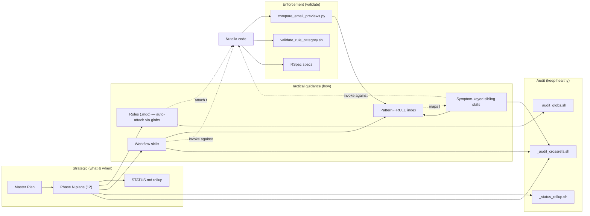

# Semantic Email Migration — Artifact Catalog

**Audience:** engineers contributing to the Nutella semantic email migration, reviewers of related PRs, anyone wanting to understand which agent-guidance file governs which part of the system.

**Scope:** every plan, rule, skill, and validation script that the migration depends on. The catalog is an index — see the source files for full prose.

**Last regenerated:** 2026-05-18.

---

## TL;DR

| Artifact category | Count | Where | Source of truth |
|---|---|---|---|
| Plans (`*.plan.md`) | 20 (16 project-relevant) | `~/.cursor/plans/` + synced copy in `cursor-worklog/unified_notifications/` | Plan front-matter + `STATUS.md` rollup |
| Cursor rules (`*.mdc`) | 19 (14 nutella + 5 user-level) | `nutella/.cursor/rules/` + `~/.cursor/rules/` | The rule file itself |
| Cursor skills (`SKILL.md`) | 18 (13 ai-plugins + 5 nutella repo-local) | `ai-plugins/nutella-semantic-email-migration/` + `nutella/.cursor/skills/` | The skill file itself |
| Validation / audit scripts | 5 | `nutella/web/scripts/notifications-migration/` + `~/.cursor/plans/` + `~/.cursor/rules/` | The script + its README |

The migration has 12 named phases (Phase 0 through Phase 12). Phases 0–3 are shipped; Phase 5 is in progress; Phase 4 and 6–12 are not started. See `STATUS.md` for the live snapshot.

---

## 1. Plans

Plans are markdown files capturing **architectural decisions, phase decompositions, and strategic roadmaps**. They live in `~/.cursor/plans/` and are synced to `cursor-worklog/unified_notifications/` via the `sync-unified-notifications-plans.mdc` rule.

### 1.1 Plan inventory (project-relevant subset of 16)

| Phase | Status | Plan | PRs |
|---|---|---|---|
| 0 | 🟡 in_progress | [Semantic Email E2E Plan](../unified_notifications/semantic_email_e2e_plan_057e0eb7.plan.md) | — |
| 0 | 🟡 in_progress | [Semantic Email Test Plan](../unified_notifications/semantic_email_test_plan_0fe90847.plan.md) | — |
| 0 | 🟢 complete | [Separate semantic email commands](../unified_notifications/separate_semantic_email_commands_a7292c5c.plan.md) | — |
| 1 | 🟢 complete | [Notification rule schema and seeding](../unified_notifications/notification_rule_schema_and_seeding.plan.md) | highspot/nutella#69976, #70041, #70323 |
| 2 | 🟢 complete | [Phase 2 NotificationEngine](../unified_notifications/phase_2_notificationengine_a8edc09e.plan.md) | highspot/nutella#70320 |
| 3 | 🟢 complete | [Phase 3: REST API – Manage Rules](../unified_notifications/phase_3_rest_api_manage_rules.plan.md) | highspot/nutella#70329, highspot/magma#8831 |
| 4 | ⚪ not_started | [Phase 4: REST API – Send](../unified_notifications/phase_4_rest_api_send.plan.md) | — |
| 5 | 🟡 in_progress | [Phase 5: Admin UI (Magma)](../unified_notifications/phase_5_admin_ui.plan.md) | highspot/magma#8831, #8894 |
| 6 | ⚪ not_started | [Phase 6: Group-Based Rules](../unified_notifications/phase_6_groups.plan.md) | — |
| 7 | ⚪ not_started | [Phase 7: Email Content Overrides](../unified_notifications/phase_7_email_content_overrides.plan.md) | — |
| 8 | ⚪ not_started | [Phase 8: Delivery Guards & Batching](../unified_notifications/phase_8_delivery_guards_batching.plan.md) | — |
| 9 | ⚪ not_started | [Phase 9: Non-Email Content Overrides](../unified_notifications/phase_9_non_email_content_overrides.plan.md) | — |
| 10 | ⚪ not_started | [Phase 10: Slim Config & Universal Records](../unified_notifications/phase_10_slim_config_universal_records.plan.md) | — |
| 11 | ⚪ not_started | [Phase 11: Performance](../unified_notifications/phase_11_performance.plan.md) | — |
| 12 | ⚪ not_started | [Phase 12: Test Automation](../unified_notifications/phase_12_test_automation.plan.md) | — |
| — | 🟡 in_progress | [Master plan](../unified_notifications/notification_rules_master_plan.plan.md) | (index of the above) |
| — | 🟢 complete | [Detailed Phase Plans 3–12](../unified_notifications/detailed_phase_plans_3-12_3bfed232.plan.md) | — |

Live status: [`unified_notifications/STATUS.md`](../unified_notifications/STATUS.md).

### 1.2 Plan front-matter contract

Each plan carries machine-readable metadata so the rollup script can aggregate it:

```yaml
---
name: Phase 2 NotificationEngine
overview: "Implement Phase 2 of the master plan: ..."
phase: 2
status: complete            # one of: not_started | in_progress | complete | blocked
prs:
  - highspot/nutella#70320
related_skills: []          # skill names from ai-plugins/nutella-semantic-email-migration
---
```

Update the front-matter (not the prose body) when a phase advances. The rollup re-reads it on demand.

### 1.3 Plan rollup tooling

| Script | Purpose | How to run |
|---|---|---|
| `~/.cursor/plans/_status_rollup.sh` | Regenerate `STATUS.md` from all plan front-matter | `bash ~/.cursor/plans/_status_rollup.sh` |

### 1.4 Plan-related rules

| Rule | Auto-attaches when editing | What it enforces |
|---|---|---|
| `~/.cursor/rules/notification-rules-plans.mdc` | a notification-rules `.plan.md` file | Keep references to other phase plans valid; surface the master plan |
| `~/.cursor/rules/sync-unified-notifications-plans.mdc` | any of the synced plan/skill/RULE-index files | Copy local plan/skill changes into the `cursor-worklog` repo so the public worklog stays current |

---

## 2. Cursor rules

Rules are `.mdc` files with YAML front-matter that **auto-attach to the agent's context** when a file matching their `globs:` is opened. They're advisory — they don't enforce anything; they just feed the agent guidance.

### 2.1 User-level rules (`~/.cursor/rules/`, 5 files)

| Rule | Attaches when editing | What it enforces |
|---|---|---|
| `effective-cursor-rules.mdc` | any `.cursor/rules/*.mdc` or `.cursor/skills/*/SKILL.md` | Rule-and-skill authoring conventions (imperative description, single topic, real globs, verification command inline). The companion to `docs/effective-cursor-rules-and-skills.md`. |
| `concise-code-comments.mdc` | any source file | Forbid elaborate "what does this do" comments — keep them why-not-what, single-line, no opaque internal taxonomy in primary explanations |
| `notification-rules-plans.mdc` | any notification-rules `.plan.md` | Plan formatting + reference hygiene |
| `sync-unified-notifications-plans.mdc` | plans, the rollup script, `STATUS.md`, the new skills, the RULE-code index | Copy local changes into `cursor-worklog` |
| `run-specs-without-asking.mdc` | (always) | Stop pre-confirming `rspec` / `python -m pytest` invocations; just run them |

### 2.2 Nutella repo-local rules (`nutella/.cursor/rules/`, 14 files)

> **Why repo-local is correct for these.** Cursor reads both `~/.cursor/rules/` and `<repo>/.cursor/rules/` and auto-attaches any `.mdc` whose `globs:` match the open file. These 14 rules are nutella-specific (MJML escaping, `KIND_PREFERS_SEMANTIC_BODY`, semantic-email builder conventions, …); lifting them to `~/.cursor/rules/` would either misfire on every other repo or have to be re-globbed so narrowly they'd never fire. The discoverability gap that applies to repo-local *skills* (§3.2) does NOT apply to rules.

| Rule | Topic | One-line mandate |
|---|---|---|
| `i18n-keys.mdc` | i18n key generation | MUST use `./iidgen` for every `Hspt::Intl.t` key; 8 alphanumeric chars; never hand-craft |
| `semantic-email-content.mdc` | content rules | No soft fallbacks for missing entities; body-vs-card separation; hard line breaks |
| `semantic-email-builders.mdc` | builder conventions | Path 1 (alert-based) and Path 2 (direct-send) registration & multi-kind patterns |
| `semantic-email-migration-guide.mdc` | migration workflow | Field mapping (`:subject`, `:preheader`, `:messages`, `:action` → `email_data`) |
| `semantic-email-safety.mdc` | safety / quality | Validation, MJML escaping, `ALERT_CONFIG` protection, code-review checklist |
| `semantic-email-entity-parity.mdc` | entity parity | Comments → reply cards; entity links → item/spot cards |
| `semantic-email-previews.mdc` | preview files | Mock data conventions; preview ↔ runtime separation |
| `semantic-email-action-url.mdc` | CTA URL contract | Consume `config_defaults[:action_url]`; never dig `alert.data` |
| `semantic-email-preheader-derivation.mdc` | preheader source | First section's `body_copy` overrides; routing requirement; Group A/B/C inventory |
| `semantic-email-typed-data.mdc` | typed wrappers | `Hashie::Trash` w/ `IgnoreUndeclared` silently drops keys — declare every nested property |
| `semantic-email-kind-precedence.mdc` | semantic-body opt-in | `KIND_PREFERS_SEMANTIC_BODY` + `SECTION_TITLE_OVERRIDES` semantics |
| `rspec-semantic-email-specs.mdc` | RSpec patterns | Builder/registry tests, action_url contract, preheader derivation, `legacy_defaults` |
| `codeowners-update.mdc` | CODEOWNERS hygiene | Update CODEOWNERS when adding/renaming files |
| `update-all-references.mdc` | rename hygiene | When renaming, update all references across the codebase |

### 2.3 Glob freshness

Two of the original four globs in `semantic-email-content.mdc` were stale at session start (pointed at directories renamed in a past refactor). That one incident triggered the audit script `~/.cursor/rules/_audit_globs.sh` — current snapshot: **5 user-level rules, 12 globs, 0 dead**.

Run on demand:

```bash
bash ~/.cursor/rules/_audit_globs.sh             # human-readable
bash ~/.cursor/rules/_audit_globs.sh --strict    # exit 1 if any dead (CI-friendly)
```

For the long-form incident story, see [`effective-cursor-rules-and-skills.md`](effective-cursor-rules-and-skills.md).

---

## 3. Cursor skills

Skills are `SKILL.md` files **invoked by trigger phrases or matched via their imperative-voice `description:`**. Unlike rules, they're not bound to file globs — Cursor surfaces them in the agent's `<available_skills>` block when the description matches the conversation.

### 3.1 ai-plugins bundle: `nutella-semantic-email-migration` (13 skills)

Lives in `~/Codebase/ai-plugins/nutella-semantic-email-migration/`, surfaced to Cursor via symlinks under `~/.cursor/skills/`. Each user with the bundle installed sees all 13.

#### Workflow skills (when to use, full process)

| Skill | When to use |
|---|---|
| `migrate-notification-kind` | Migrating an existing kind from legacy (Velocity) to semantic (MJML) |
| `add-notification-kind` | Adding a brand-new kind with semantic email support from day one |
| `migrate-semantic-email-body-copy` | Post-migration PM-review copy fixes (Patterns A–D location classification) |
| `email-migration-validation` | Validating a migrated kind against legacy via the preview + compare scripts |
| `analyze-compare-report` | Reading and acting on `compare_email_previews.py` output |
| `debug-email-rendering` | Diagnosing why a semantic email isn't rendering or shows wrong content |
| `semantic-email-review` | Code review checklist for semantic email PRs |

#### Symptom-keyed sibling skills (split out 2026-05-18 from the original mega-skill)

Each one resolves a specific `[RULE:*]` validator code. Picked up automatically when the validation report matches.

| Skill | Pattern | RULE codes resolved |
|---|---|---|
| `body-copy-card-anchor` | E + G | `body_after_following_reference`, `following_missing_colon` |
| `entity-card-validity` | F | `semantic_card_without_legacy_link` |
| `body-copy-link-preservation` | H | `secondary_link_lost` |
| `entity-card-enrichment` | I | (cosmetic card enrichment via Mongo lookup) |
| `entity-card-thumbnails` | J | (canonical presenter chain + Ruby `extend` gotcha) |

Canonical lookup mapping every `[RULE:*]` validator code to the pattern that owns it: [`analyze-compare-report/pattern-rule-index.md`](https://github.com/highspot/ai-plugins/blob/add-nutella-semantic-email-migration/nutella-semantic-email-migration/analyze-compare-report/pattern-rule-index.md).

### 3.2 Nutella repo-local skills (`nutella/.cursor/skills/`, 5 files)

These exist as documentation but are **not surfaced** in the agent's available-skills block (Cursor product behavior — only `~/.cursor/skills/` and plugin skills are advertised).

| Skill | What it covers | Mitigation status |
|---|---|---|
| `nutella-intl-strings` | i18n string workflow (translation files, `iidgen`, key reuse rules) | Critical mandate lifted into `i18n-keys.mdc` rule (which IS surfaced via globs); skill kept as deeper workflow reference |
| `nutella-pre-commit-quality-check` | RuboCop pre-commit hook quirks (known `Layout/MultilineMethodCallIndentation` bug) | Not lifted yet — open question whether to surface |
| `nutella-polar-ui-usage` | Polar UI conventions | Not lifted (not migration-relevant) |
| `nutella-client-unit-tests` | Client-side test patterns | Not lifted |
| `nutella-client-feature-workflow` | Feature flag conventions | Partially relevant given LaunchDarkly migration; not lifted |

### 3.3 Archived skill

`~/.cursor/skills-archive/migrate-semantic-email-body-copy_v1-A-thru-J/` holds the original 2,827-line mega-skill with Patterns A–J in one file. Replaced by the bundle above; preserved for reference until each new sibling has been independently PM-review-validated. See its README for the removal criteria.

---

## 4. Validation & audit scripts

### 4.1 Migration validation (in `nutella/web/scripts/notifications-migration/`)

| Script | Purpose |
|---|---|
| `compare_email_previews.py` | Render legacy and semantic previews for every kind, diff body/subject/preheader/CTA/cards, emit `[RULE:*]` violations |
| `validate_rule_category.sh` | Verify each kind's `NotificationRule.category` matches the LaunchDarkly `semantic_email_enabled_categories` allowlist |

### 4.2 Agent-guidance audits (in `~/.cursor/rules/` and `~/.cursor/plans/`)

| Script | Purpose |
|---|---|
| `~/.cursor/plans/_status_rollup.sh` | Aggregate plan front-matter into `STATUS.md` (summary, table, Mermaid Gantt) |
| `~/.cursor/rules/_audit_globs.sh` | Check every glob in `~/.cursor/rules/*.mdc` resolves to ≥1 file |
| `~/.cursor/rules/_audit_crossrefs.sh` | Check every skill/plan reference (markdown link, `related_skills:` front-matter) resolves to a real target |

Run all four periodically:

```bash
bash ~/.cursor/plans/_status_rollup.sh        # regenerate STATUS.md
bash ~/.cursor/rules/_audit_globs.sh          # find dead globs
bash ~/.cursor/rules/_audit_crossrefs.sh      # find broken cross-references
```

Current state: 0 dead globs, 1 dangling cross-ref (`extract_alert_config_f6a45394.plan.md` referenced from the master plan — never created, flagged for cleanup).

---

## 5. How the artifacts compose



The flow: plans drive what gets built and in what order. Rules and skills tell the agent how to build it correctly. Validation scripts verify the output. Audits keep the agent-guidance layer (plans / rules / skills) healthy as the project evolves.

---

## 6. Maintenance pointers

When you change one artifact, the others that depend on it may need updates:

| If you change … | Also update … |
|---|---|
| A plan's status / phase | Re-run `_status_rollup.sh` (regenerates `STATUS.md`) |
| A skill's `description:` front-matter | Check `_audit_crossrefs.sh` — `related_skills:` references may now mismatch |
| A directory of source files (rename) | Audit `nutella/.cursor/rules/*.mdc` globs in the same PR; run `_audit_globs.sh` |
| A `[RULE:*]` code in `compare_email_previews.py` | Update `analyze-compare-report/pattern-rule-index.md`; check sibling skill resolutions |
| A user-level skill or plan | The sync rule (`sync-unified-notifications-plans.mdc`) auto-copies it to `cursor-worklog` — verify the commit lands |
| The split skills (`body-copy-*`, `entity-card-*`) | Re-symlink under `~/.cursor/skills/` if you install on a new machine; the master `README.md` in the ai-plugins bundle lists install commands |

---

## 7. See also

| Doc | Audience | Topic |
|---|---|---|
| [`effective-cursor-rules-and-skills.md`](effective-cursor-rules-and-skills.md) | rule/skill authors | Post-mortem of why rules and skills fail silently + the authoring patterns that prevent it |
| [`semantic-email-agentic-coding.pptx`](semantic-email-agentic-coding.pptx) | leadership / cross-team talks | 17-slide overview of benefits, challenges, and lessons learned |
| [`semantic-email-agentic-coding-15min.pptx`](semantic-email-agentic-coding-15min.pptx) | shorter venues | 8-slide condensed version |
| [Worklog](../cursor-ai-assisted-work-sessions-worklog.md) | session-by-session detail | All AI-assisted work sessions feeding the project |
| [Weekly summary](../weekly-summary-worklog.md) | weekly / YTD rollups | Generated by the `weekly-review` skill |
