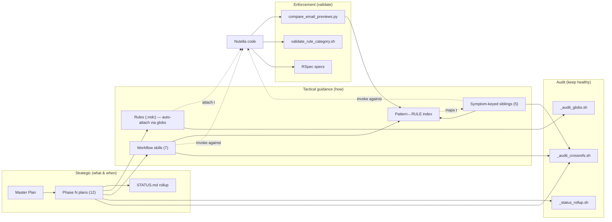

# Semantic Email Migration — Artifact Catalog

**Audience:** engineers contributing to the Nutella semantic email migration, reviewers of related PRs, anyone needing a one-stop reference for which agent-guidance file governs which part of the system.

**Scope:** every plan, rule, skill, and validation script that the migration depends on. Each entry is summarized at quick-reference depth — see the source files for full prose.

**Last regenerated:** 2026-05-18.

---

## TL;DR

| Artifact category | Count | Where | Source of truth |
|---|---|---|---|
| Plans (`*.plan.md`) | 20 (16 project-relevant) | `~/.cursor/plans/` + synced copy in `cursor-worklog/unified_notifications/` | Plan front-matter + `STATUS.md` rollup |
| Cursor rules (`*.mdc`) | 19 (14 nutella + 5 user-level) | `nutella/.cursor/rules/` + `~/.cursor/rules/` | The rule file itself |
| Cursor skills (`SKILL.md`) | 18 (13 ai-plugins + 5 nutella repo-local) | `ai-plugins/nutella-semantic-email-migration/` + `nutella/.cursor/skills/` | The skill file itself |
| Validation / audit scripts | 5 | `nutella/web/scripts/notifications-migration/` + `~/.cursor/plans/` + `~/.cursor/rules/` | The script + its README |

The migration has 13 named phases (Phase 0 through Phase 12). Phases 0–3 are shipped; Phase 5 is in progress; Phase 4 and 6–12 are not started. See `STATUS.md` for the live snapshot.

**Known gaps and limitations:** see [§7](#7-limitations-and-gaps).

---

## 1. Plans

Plans are markdown files capturing **architectural decisions, phase decompositions, and strategic roadmaps**. They live in `~/.cursor/plans/` and are synced to `cursor-worklog/unified_notifications/` via the `sync-unified-notifications-plans.mdc` rule.

### 1.1 Plan inventory (project-relevant subset, 16 of 20)

| Phase | Status | Plan | PRs |
|---|---|---|---|
| 0 | 🟡 in_progress | [Semantic Email E2E Plan](../unified_notifications/semantic_email_e2e_plan_057e0eb7.plan.md) | — |
| 0 | 🟡 in_progress | [Semantic Email Test Plan](../unified_notifications/semantic_email_test_plan_0fe90847.plan.md) | — |
| 0 | 🟢 complete | [Separate semantic email commands](../unified_notifications/separate_semantic_email_commands_a7292c5c.plan.md) | — |
| 1 | 🟢 complete | [Notification rule schema and seeding](../unified_notifications/notification_rule_schema_and_seeding.plan.md) | highspot/nutella#69976, #70041, #70323 |
| 2 | 🟢 complete | [Phase 2 NotificationEngine](../unified_notifications/phase_2_notificationengine_a8edc09e.plan.md) | highspot/nutella#70320 |
| 3 | 🟢 complete | [Phase 3: REST API – Manage Rules](../unified_notifications/phase_3_rest_api_manage_rules.plan.md) | highspot/nutella#70329, highspot/magma#8831 |
| 4 | ⚪ not_started | [Phase 4: REST API – Send](../unified_notifications/phase_4_rest_api_send.plan.md) | — |
| 5 | 🟡 in_progress | [Phase 5: Admin UI (Magma)](../unified_notifications/phase_5_admin_ui.plan.md) | highspot/magma#8831, #8894 |
| 6 | ⚪ not_started | [Phase 6: Group-Based Rules](../unified_notifications/phase_6_groups.plan.md) | — |
| 7 | ⚪ not_started | [Phase 7: Email Content Overrides](../unified_notifications/phase_7_email_content_overrides.plan.md) | — |
| 8 | ⚪ not_started | [Phase 8: Delivery Guards & Batching](../unified_notifications/phase_8_delivery_guards_batching.plan.md) | — |
| 9 | ⚪ not_started | [Phase 9: Non-Email Content Overrides](../unified_notifications/phase_9_non_email_content_overrides.plan.md) | — |
| 10 | ⚪ not_started | [Phase 10: Slim Config & Universal Records](../unified_notifications/phase_10_slim_config_universal_records.plan.md) | — |
| 11 | ⚪ not_started | [Phase 11: Performance](../unified_notifications/phase_11_performance.plan.md) | — |
| 12 | ⚪ not_started | [Phase 12: Test Automation](../unified_notifications/phase_12_test_automation.plan.md) | — |
| — | 🟡 in_progress | [Master plan](../unified_notifications/notification_rules_master_plan.plan.md) | (index of the above) |

Live status: [`unified_notifications/STATUS.md`](../unified_notifications/STATUS.md).

### 1.2 Per-plan summaries (quick reference)

#### Pre-Phase / cross-cutting (Phase 0)

- **Separate semantic email commands** — Extract all semantic-email logic from `email_commands.rb` into a new `SemanticEmailCommands` class so the legacy flow stays clean and untouched when the feature flag is off, and cleanly routes through semantic when on. ✅ shipped.
- **Semantic Email Test Plan** — Comprehensive test plan covering all semantic-email workflows with both unit tests (isolated, mocked) and integration tests (end-to-end through real code paths), delivered as a document and implemented RSpec spec files.
- **Semantic Email E2E Plan** — Live-environment E2E test plan via Mailinator covering rendered email content, link integrity, visual correctness, and fallback behavior.

#### Foundation (Phases 1–2)

- **Phase 1 — Notification rule schema and seeding** — `NotificationRule` schema definition aligned with the tech spec, legacy-to-schema field mappings from `ALERT_CONFIG` / `EmailCommands::SETTINGS` / call-site code, and the mapping scripts + rake task that seed rules into MongoDB. ✅ shipped via 3 PRs.
- **Phase 2 — NotificationEngine** — Introduce `NotificationEngine.notify()` as the single entry point for alert creation, with `NotificationRuleResolver` for rule lookup and `NotificationChannelRouter` for channel dispatch (including digest cross-rule check). ✅ shipped.

#### REST APIs (Phases 3–4)

- **Phase 3 — REST API: Manage Rules** — Resource-oriented REST API for notification-rule CRUD, listing, filtering, and domain/user override management; Padrino controller following existing codebase patterns. ✅ shipped.
- **Phase 4 — REST API: Send** — Allow trusted callers (integrations, workflow engines, external systems) to trigger notification delivery via HTTP. Strong auth, rate limits, idempotency, async processing. ⚪ not started.

#### UI and targeting (Phases 5–6)

- **Phase 5 — Admin UI (Magma)** — Enhance the existing Magma admin entities page for notification-rule browsing. Collections already registered; this phase adds richer filtering, cross-collection navigation, and optionally edit capabilities. 🟡 in progress.
- **Phase 6 — Group-Based Rules** — Allow notification-rule overrides scoped to groups of users (not just individuals). Leverages existing `GroupQueries` and `UserQueries.active_users_for_group` to resolve group membership at notification time. ⚪ not started.

#### Content customization (Phases 7–9)

- **Phase 7 — Email Content Overrides** — Domain/user-level customization of email notification content (subject lines, body text, templates, branding) through notification-rule overrides, powered by the `content_overrides` passthrough established in Phase 2.
- **Phase 8 — Delivery Guards & Batching** — Throttling, deduplication, quiet hours, and configurable digest batching windows. Rules define guard conditions; the engine evaluates them before delivery.
- **Phase 9 — Non-Email Content Overrides** — Extend Phase 7's override mechanism to push notifications, Slack messages, and MS Teams messages. Each channel gets its own override namespace and presenter integration.

#### Cleanup, perf, automation (Phases 10–12)

- **Phase 10 — Slim Config & Universal Records** — Remove legacy `ALERT_CONFIG` / `SETTINGS` duplication by having runtime read from rules. Ensure every notification (including direct emails) creates a notification record in MongoDB for audit, analytics, and troubleshooting.
- **Phase 11 — Performance** — Replace in-memory TTL caches with Redis, add MongoDB indexes, instrument key paths with New Relic, load-test the notification pipeline at scale.
- **Phase 12 — Test Automation** — End-to-end test suite using Playwright (UI flows) and Mailinator (email verification). Validates the full pipeline from trigger to delivery across all channels.

#### Index plan

- **Notification rules master plan** — Master deliverable plan: target architecture, phased delivery (Phases 0–12) with release criteria, migration strategy. The single document that links to every phase plan and tracks scope.

### 1.3 Plan front-matter contract

Each plan carries machine-readable metadata so the rollup script can aggregate it:

```yaml
---
name: Phase 2 NotificationEngine
overview: "Implement Phase 2 of the master plan: ..."
phase: 2
status: complete            # one of: not_started | in_progress | complete | blocked
prs:
  - highspot/nutella#70320
related_skills: []          # skill names from ai-plugins/nutella-semantic-email-migration
---
```

Update the front-matter (not the prose body) when a phase advances. The rollup re-reads it on demand.

### 1.4 Plan rollup tooling

| Script | Purpose | How to run |
|---|---|---|
| `~/.cursor/plans/_status_rollup.sh` | Regenerate `STATUS.md` from all plan front-matter | `bash ~/.cursor/plans/_status_rollup.sh` |

### 1.5 Plan-related rules

| Rule | Auto-attaches when editing | What it does |
|---|---|---|
| `~/.cursor/rules/notification-rules-plans.mdc` | a notification-rules `.plan.md` file | Enforces plan formatting + reference hygiene; surfaces the master plan to the agent |
| `~/.cursor/rules/sync-unified-notifications-plans.mdc` | any of the synced plan/skill/RULE-index files | Tells the agent to copy local plan/skill changes into the `cursor-worklog` repo so the public worklog stays current |

---

## 2. Cursor rules

Rules are `.mdc` files with YAML front-matter that **auto-attach to the agent's context** when a file matching their `globs:` is opened. They're advisory — they don't enforce anything; they just feed the agent guidance.

> Cursor reads BOTH `~/.cursor/rules/` and `<repo>/.cursor/rules/`. The repo-local discoverability gap that applies to skills (§3) does NOT apply to rules.

### 2.1 User-level rules (`~/.cursor/rules/`, 7 files)

| Rule | Attaches when editing | What it enforces |
|---|---|---|
| `effective-cursor-rules.mdc` | any `.cursor/rules/*.mdc` or `.cursor/skills/*/SKILL.md` | Rule/skill authoring conventions: imperative `description:`, single-topic, real globs, verification command inline. The local companion to [`effective-cursor-rules-and-skills.md`](effective-cursor-rules-and-skills.md). |
| `concise-code-comments.mdc` | any source file | Forbids "what does this do" comments — keep them why-not-what, single-line, no opaque internal taxonomy (pattern letters, `[RULE:*]` tags, skill names) as the primary explanation |
| `notification-rules-plans.mdc` | any notification-rules `.plan.md` | Plan formatting + reference hygiene; surfaces the master plan to the agent |
| `sync-unified-notifications-plans.mdc` | plans, the rollup script, `STATUS.md`, the new skills, the RULE-code index | Copies local plan/skill changes into `cursor-worklog` (advisory — not enforced) |
| `run-specs-without-asking.mdc` | (always) | Tells the agent to stop pre-confirming `rspec` / `python -m pytest` invocations; just run them |
| `codeowners-update.mdc` | any source file | Reminds the agent to update CODEOWNERS when adding/renaming files (rescued from `nutella/.cursor/rules/` 2026-05-18) |
| `update-all-references.mdc` | any source file | Reminds the agent that when renaming a function/method/module/file, ALL references must be updated across the codebase (rescued from `nutella/.cursor/rules/` 2026-05-18) |

### 2.2 Nutella repo-local rules (`nutella/.cursor/rules/`, 14 files)

> **Why repo-local is correct for these.** They're nutella-specific (MJML escaping, `KIND_PREFERS_SEMANTIC_BODY`, semantic-email builder conventions, …). Cursor auto-attaches them when their globs match files in this repo. Lifting them to `~/.cursor/rules/` would either misfire on every other repo or have to be re-globbed so narrowly they'd never fire.
>
> ⚠️ But: `nutella/.gitignore` has `.cursor/**`, so these rules live in individual working copies, not in `git`. See [§7.2](#72-sync--drift-gaps) for the implications.

| Rule | Topic | What it enforces (one-line mandate) |
|---|---|---|
| `i18n-keys.mdc` | i18n key generation | MUST use `./iidgen` for every `Hspt::Intl.t` key; 8 alphanumeric chars; never hand-craft. Backstop for the i18n incident. (Also published in the ai-plugins bundle as of 2026-05-18.) |
| `semantic-email-content.mdc` | content rules | No soft fallbacks for missing entities; body-vs-card separation; hard line breaks |
| `semantic-email-builders.mdc` | builder conventions | Path 1 (alert-based) and Path 2 (direct-send) builder registration patterns; multi-kind handling |
| `semantic-email-migration-guide.mdc` | migration workflow | Field mapping (`:subject`, `:preheader`, `:messages`, `:action` → `email_data`); per-kind step list |
| `semantic-email-safety.mdc` | safety / quality | Validation, MJML escaping, `ALERT_CONFIG` protection, code-review checklist |
| `semantic-email-entity-parity.mdc` | entity parity | Comments → reply cards; entity links → item/spot cards (no "lost" entities between legacy and semantic) |
| `semantic-email-previews.mdc` | preview files | Mock data conventions; preview-vs-runtime separation; preview-mock shape rules |
| `semantic-email-action-url.mdc` | CTA URL contract | Consume `config_defaults[:action_url]`; NEVER dig `alert.data` for presenter-computed URLs |
| `semantic-email-preheader-derivation.mdc` | preheader source | `SemanticEmailRegistry` derives preheader from first section's `body_copy` when present; routing requirement; Group A/B/C inventory |
| `semantic-email-typed-data.mdc` | typed wrappers | `*AlertEmailData` (Hashie::Trash with `IgnoreUndeclared`) silently drops un-declared keys — declare every nested property the builder reads |
| `semantic-email-kind-precedence.mdc` | semantic-body opt-in | `KIND_PREFERS_SEMANTIC_BODY` opt-in flip and `SECTION_TITLE_OVERRIDES`: when the semantic builder's `body_copy` must win over legacy text |
| `rspec-semantic-email-specs.mdc` | RSpec patterns | Builder/registry tests; action_url contract; preheader derivation; `legacy_defaults` patterns |
| `codeowners-update.mdc` | CODEOWNERS hygiene | Remind to update CODEOWNERS when adding/renaming files (also lifted to user-level; the nutella copy still works) |
| `update-all-references.mdc` | rename hygiene | When renaming, update all references across the codebase (also lifted to user-level) |

### 2.3 Glob freshness

Two of the original four globs in `semantic-email-content.mdc` were stale at session start (pointed at directories renamed in a past refactor). That incident triggered the audit script `~/.cursor/rules/_audit_globs.sh` — current snapshot: **7 user-level rules, 12 globs, 0 dead**.

```bash
bash ~/.cursor/rules/_audit_globs.sh             # human-readable
bash ~/.cursor/rules/_audit_globs.sh --strict    # exit 1 if any dead (CI-friendly)
```

For the long-form incident story, see [`effective-cursor-rules-and-skills.md`](effective-cursor-rules-and-skills.md).

---

## 3. Cursor skills

Skills are `SKILL.md` files **invoked by trigger phrases or matched via their imperative-voice `description:`**. Unlike rules, they're not bound to file globs — Cursor surfaces them in the agent's `<available_skills>` block when the description matches the conversation.

### 3.1 ai-plugins bundle: `nutella-semantic-email-migration` (13 skills)

Lives in `~/Codebase/ai-plugins/nutella-semantic-email-migration/`, surfaced to Cursor via symlinks under `~/.cursor/skills/`. Install: `./install.sh nutella-semantic-email-migration`.

#### Workflow skills (7) — full process / when to use

| Skill | Trigger | What it does (recipe summary) |
|---|---|---|
| `migrate-notification-kind` | "migrate the X notification", new kind appearing in `ALERT_CONFIG` | Migrate an EXISTING kind from legacy (Velocity / `AlertPresenter`) to semantic (MJML / builder). 8-step recipe: pre-flight checks, Velocity template review, field mapping, builder creation, ALERT_CONFIG preservation, unit tests, preview comparison, capture learnings into rules |
| `add-notification-kind` | "add a notification for X", brand-new alert | Add a BRAND-NEW kind with semantic-email support from day one. Smaller scope than `migrate-` since there's no legacy template to mirror; includes builder, registration in `SemanticEmailRegistry`, ALERT_CONFIG entry |
| `migrate-semantic-email-body-copy` (slim — Patterns A–D) | "the body copy for X is wrong" / PM review of copy | Post-migration body-copy fixes — **location classification only** for Patterns A–D. Identifies WHERE the body copy lives for a kind: `KIND_PREFERS_SEMANTIC_BODY` opt-in vs `SECTION_TITLE_OVERRIDES` vs direct body rewrite. Patterns E–J live in the symptom-keyed siblings below |
| `email-migration-validation` | "validate the X kind" / after a builder edit | Run `compare_email_previews.py` against a kind. Identifies `[RULE:*]` failures, ENTITY-mismatch issues, body/subject/preheader/CTA divergences |
| `analyze-compare-report` | output of `compare_email_previews.py` is in context | Interpret the compare report. **Prioritizes builder fixes over preview fixes** (preview-only fixes hide real bugs). References [`pattern-rule-index.md`](https://github.com/highspot/ai-plugins/blob/add-nutella-semantic-email-migration/nutella-semantic-email-migration/analyze-compare-report/pattern-rule-index.md) for per-RULE-code recipe routing |
| `debug-email-rendering` | "the email isn't rendering" / "preview returns blank" | Diagnose render failures: fallback to legacy, missing builder, MJML template errors, mock-data shape mismatch. Production lambda parity checks |
| `semantic-email-review` | reviewing an email-migration PR | Code-review checklist: ALERT_CONFIG preservation, builder registration, action_url contract, preheader derivation, typed-data declarations, mock parity |

#### Symptom-keyed sibling skills (5) — each resolves a specific `[RULE:*]`

Auto-attached when the validation report mentions the RULE code in their description. Extracted 2026-05-18 from the original 2,827-line mega-skill (Patterns E–J).

| Skill | RULE codes | Fix strategy |
|---|---|---|
| `body-copy-card-anchor` | `[RULE:body_after_following_reference]`, `[RULE:following_missing_colon]` | Split the body across `primary_section` (ending with "the following <noun>:") and `footer_section` (the trailing sentence). Rotate the card-anchor i18n key |
| `entity-card-validity` | `[RULE:semantic_card_without_legacy_link]` | Drop the entity card entirely (the entity is subject-only metadata, not body-anchored). If a `:comment` exists on the legacy `ALERT_CONFIG`, render it as a standalone user-only card instead |
| `body-copy-link-preservation` | `[RULE:secondary_link_lost]` | Emit `html_body_copy` with `<a>` anchors via `Hspt::Intl.t` substitution. Skip the inline anchor when the entity already has card-level representation. Fall back to plain `body_copy` when no anchor resolves at render time |
| `entity-card-enrichment` | (no RULE code — proactive cosmetic enrichment) | Add card rows (Host / Meeting Date / Duration / Opportunity / Account / Attendees) via a render-time projection-scoped `Mongo.find_one` against the sibling list-record collection (e.g. `engagement_meeting_list_records`), wrapped in `rescue nil`. Use when the alert payload only carries `{id, title, url}` and end-to-end plumbing is too invasive |
| `entity-card-thumbnails` | (no RULE code — presenter-chain correctness) | Wire entity-card thumbnails via the canonical presenter chain: `entity → get_<entity>_thumbnail_url (base.rb) → ThumbnailPresenter#url_for_email → UrlPresenter#to_output`. NEVER hardcode URLs in previews. Includes the Ruby `extend`-doesn't-bring-constants gotcha (qualify `THUMBNAIL_*` as `EmailContentBuilder::Base::THUMBNAIL_*`) |

#### Index file (alongside the bundle)

| File | Purpose |
|---|---|
| `analyze-compare-report/pattern-rule-index.md` | Canonical mapping of every `[RULE:*]` code emitted by `compare_email_previews.py` → which Pattern (A–J) owns the fix → which sibling skill carries the recipe. The single source of truth for the taxonomy |

### 3.2 Nutella repo-local skills (`nutella/.cursor/skills/`, 5 files)

> ⚠️ **Not surfaced** in the agent's available-skills block. Cursor only advertises `~/.cursor/skills/` and plugin skills. Repo-local skills exist as documentation for humans only unless the critical mandate is lifted into a user-level rule or skill (Pattern B in [`effective-cursor-rules-and-skills.md`](effective-cursor-rules-and-skills.md)).

| Skill | What it covers | Mitigation status |
|---|---|---|
| `nutella-intl-strings` | Full i18n workflow: translation-file updates, `iidgen` invocation, key-reuse rules, fallback-text handling | ✅ Critical mandate lifted into `i18n-keys.mdc` rule (now both user-level AND in the ai-plugins bundle). The skill itself is still invisible to the agent but the rule covers the load-bearing part |
| `nutella-pre-commit-quality-check` | RuboCop pre-commit hook quirks; the known `Layout/MultilineMethodCallIndentation` cop crash and the inlining workaround | ❌ Not lifted. Open question whether to surface |
| `nutella-polar-ui-usage` | Polar UI library usage patterns | ❌ Not lifted (not migration-relevant) |
| `nutella-client-unit-tests` | Client-side test patterns (Jest / Vitest conventions, shared mocks) | ❌ Not lifted |
| `nutella-client-feature-workflow` | Feature flag conventions, LaunchDarkly usage | ❌ Not lifted. Partially relevant given the LaunchDarkly migration in commit `a8ee013a6d0` |

### 3.3 Archived skill

`~/.cursor/skills-archive/migrate-semantic-email-body-copy_v1-A-thru-J/` holds the original 2,827-line mega-skill with Patterns A–J in one file. Replaced by the bundle above; preserved for verbatim sub-recipe reference until each new sibling has been independently PM-review-validated. See its `README.md` for the removal criteria.

---

## 4. Validation & audit scripts

### 4.1 Migration validation (`nutella/web/scripts/notifications-migration/`)

| Script | Purpose | Run when |
|---|---|---|
| `compare_email_previews.py` | Render legacy and semantic previews for every kind; diff body / subject / preheader / CTA / cards; emit `[RULE:*]` violations + `[FAIL:*]` errors | After any builder edit; before PR merge |
| `validate_rule_category.sh` | Verify each kind's `NotificationRule.category` matches the LaunchDarkly `semantic_email_enabled_categories` allowlist | Before changing the LD flag value; before changing a rule's `category` |

### 4.2 Agent-guidance audits

| Script | Purpose | Run when |
|---|---|---|
| `~/.cursor/plans/_status_rollup.sh` | Aggregate plan front-matter into `STATUS.md` (summary, table, Mermaid Gantt) | After advancing a phase, closing a phase-level PR, or editing plan front-matter |
| `~/.cursor/rules/_audit_globs.sh` | Check every glob in `~/.cursor/rules/*.mdc` matches ≥1 file | After renaming a source directory; weekly |
| `~/.cursor/rules/_audit_crossrefs.sh` | Check every skill/plan reference (markdown link, `related_skills:` front-matter) resolves to a real target | After editing skill `description:` or `related_skills:`; weekly |

Portable, generically-configurable versions of the two audit scripts are published in [`cursor-worklog/scripts/`](../scripts/) for community use.

Run all four periodically:

```bash
bash ~/.cursor/plans/_status_rollup.sh
bash ~/.cursor/rules/_audit_globs.sh
bash ~/.cursor/rules/_audit_crossrefs.sh
# (compare_email_previews.py runs as part of CI / pre-merge for nutella migration PRs)
```

---

## 5. How the artifacts compose



The flow: **plans** drive what gets built and in what order. **Rules** and **skills** tell the agent how to build it correctly. **Validation scripts** verify the output. **Audits** keep the agent-guidance layer healthy as the project evolves.

---

## 6. Maintenance pointers

When you change one artifact, the others that depend on it may need updates:

| If you change … | Also update … |
|---|---|
| A plan's status / phase | Re-run `_status_rollup.sh` (regenerates `STATUS.md`) |
| A skill's `description:` front-matter | Check `_audit_crossrefs.sh` — `related_skills:` references may now mismatch |
| A directory of source files (rename) | Audit `nutella/.cursor/rules/*.mdc` globs in the same PR; run `_audit_globs.sh` |
| A `[RULE:*]` code in `compare_email_previews.py` | Update `analyze-compare-report/pattern-rule-index.md`; check sibling skill resolutions |
| A user-level skill or plan | The sync rule (`sync-unified-notifications-plans.mdc`) auto-copies it to `cursor-worklog` — verify the commit lands |
| The split skills (`body-copy-*`, `entity-card-*`) | Re-symlink under `~/.cursor/skills/` if installing on a new machine; the bundle's `README.md` lists install commands |
| The plugin's `.install.sh SKILLS=` array | Currently stale — see §7.4. Add the 7 missing names OR switch to auto-discovery |

---

## 7. Limitations and gaps

The migration's agent-guidance layer is solid where it covers ground but has known gaps. These are organized by category and severity. **None of these block the migration; all of them are tracked as follow-ups.**

### 7.1 Discoverability gaps

| # | Gap | Impact | Mitigation status |
|---|---|---|---|
| 7.1.1 | **4 of 5 nutella repo-local skills not surfaced** (`nutella-pre-commit-quality-check`, `nutella-polar-ui-usage`, `nutella-client-unit-tests`, `nutella-client-feature-workflow`) | Agent doesn't see them; they exist as human-only docs | Open. Per-skill triage needed: which are critical enough to lift into a user-level rule or a new plugin? |
| 7.1.2 | Cursor product behavior: only `~/.cursor/skills/` and plugin skills appear in `<available_skills>` | Architectural limit. No workaround except lifting | Not actionable here; raise as a Cursor feature request |
| 7.1.3 | The bundle's 5 new sibling skills don't have RULE codes for Patterns I and J | `entity-card-enrichment` and `entity-card-thumbnails` only fire on conversational triggers, not on validator output | Open. Possible enhancement: add `[RULE:card_missing_enrichment_rows]` / `[RULE:thumbnail_chain_violation]` to `compare_email_previews.py` |

### 7.2 Sync / drift gaps

| # | Gap | Impact | Mitigation status |
|---|---|---|---|
| 7.2.1 | **`nutella/.gitignore: .cursor/**`** blocks the dir from git; team-shared rules must be `git add -f`'d individually | Easy to author a rule and forget to share it. Three orphaned rules (`i18n-keys`, `codeowners-update`, `update-all-references`) discovered 2026-05-18 | 🟡 Partial. The three were rescued (commit `80cc1a7` on ai-plugins). The gitignore policy itself is unchanged. Open: narrow `.cursor/**` to `.cursor/_local/**` and adopt that as the experimental-rules convention |
| 7.2.2 | The 11 semantic-email `.mdc` rules now exist in TWO tracked locations (nutella working copy + ai-plugins bundle). No enforcement they stay in sync | A drift between them is invisible until someone notices identical rules with different content | Open. Cleanest fix: treat the bundle as source-of-truth, refresh nutella via `./install.sh nutella-semantic-email-migration ~/Codebase/.../nutella`. Or write a `_audit_rule_drift.sh` companion to the existing audits |
| 7.2.3 | The plugin's `.install.sh SKILLS=` array hardcodes 6 names but the bundle has 13 directories (5 sibling skills + `migrate-semantic-email-body-copy` missing from the list) | Anyone running `./install.sh nutella-semantic-email-migration` today gets 6/13 skills | Open. Fix: either add the 7 missing names OR switch to directory auto-discovery (`for d in $PLUGIN_DIR/*/; do [ -f "$d/SKILL.md" ] && SKILLS+=("$(basename $d)"); done`) |
| 7.2.4 | The `sync-unified-notifications-plans.mdc` rule is advisory — if you forget to sync, the public `cursor-worklog` drifts from local | Public-facing artifacts (plans, STATUS.md, skill changes) silently lag | Open. Convert to a post-commit hook or a CI job that syncs on push |
| 7.2.5 | One pre-existing dangling reference: `notification_rules_master_plan.plan.md` references `extract_alert_config_f6a45394.plan.md` (never created) | Cosmetic — flagged by `_audit_crossrefs.sh` on every run | Open. Remove the reference from the master plan, or create the missing plan stub |

### 7.3 Coverage gaps

| # | Gap | Impact | Mitigation status |
|---|---|---|---|
| 7.3.1 | **No commit-time enforcement for any rule** — `iidgen` key length / descriptiveness check, mock-data drift check, `Hashie::Trash` typed-data declaration check | Rules backstop the check; without one they're advisory only | Open. Highest-leverage follow-up. Author per-rule pre-commit hooks or RuboCop cops |
| 7.3.2 | **No framework-reload rule for Padrino autoloader pitfalls** — top-level lambda registration doesn't reload in dev | Already cost hours of debugging during the migration; will recur | Open. Author an `alwaysApply: true` Ruby rule with a one-line MUST |
| 7.3.3 | Recurring PM-review feedback hasn't been swept into rules proactively | The session built `[RULE:following_missing_colon]` reactively after the issue surfaced; the next few are still latent | Open. Periodic sweep of past PM-review threads → rule-shaped feedback → new `[RULE:*]` codes |
| 7.3.4 | Mock-data drift between `compare_email_previews.py`'s `EXPECTED_MOCK_ENTITIES` and `PreviewMockData::DEFAULTS` has no rule mandating co-update | Drift causes false positives that take investigation to triage | Open. Either share a source-of-truth file or add a rule mandating co-update |
| 7.3.5 | Phases 4 and 6–12 are `not_started` — no agent guidance authored yet for their domains (REST API send, group-based rules, content overrides, delivery guards, slim config, performance, test automation) | Each phase will need its own rules and skills authored as work begins | Expected. Not a "gap" so much as remaining scope |
| 7.3.6 | Validation harness only checks STATIC differences between legacy and semantic previews — no test for end-to-end delivery, deliverability, anti-spam, or open-tracking parity | False sense of completeness when `compare_email_previews.py` passes | Open. Phase 12 (Playwright + Mailinator) will close this; until then, manual E2E is the only signal |

### 7.4 Operational gaps

| # | Gap | Impact | Mitigation status |
|---|---|---|---|
| 7.4.1 | **No CI integration of `_audit_globs.sh` / `_audit_crossrefs.sh`** | Bugs caught at developer-machine run time, not at PR time | Open. Add a CI job that runs both with `--strict` against the repo on every PR |
| 7.4.2 | **No `_audit_untracked.sh` script** to detect on-disk `.cursor/` files that aren't in `git ls-files .cursor/` | The orphaned-rules case (§7.2.1) would have been caught earlier | Open. Add `cursor-worklog/scripts/_audit_untracked.sh` — would have flagged the 3 rescued rules in seconds |
| 7.4.3 | `_status_rollup.sh` is manual — not auto-run on plan changes | `STATUS.md` can become stale if the regen step is forgotten | Open. Convert to a pre-commit hook or a CI job that regenerates and amends |
| 7.4.4 | The worklog entry-type field (`milestone` / `mid-session` / `investigation` / `post-mortem`) is opt-in. Existing pre-2026-05-18 entries don't carry the field | Inconsistent parsing for the weekly-review skill | Open. Either backfill (large) or accept the asymmetry going forward |
| 7.4.5 | No standard "this rule attached to this file" debugging affordance from Cursor | Hard to verify a glob is actually firing without writing a test | Cursor product limit; raise as feature request |

### 7.5 Severity matrix

| Severity | Gaps |
|---|---|
| 🔴 **High** — silent data loss or recurring incident risk | §7.2.1 (gitignore), §7.2.3 (stale SKILLS array), §7.3.1 (no commit-time enforcement) |
| 🟡 **Medium** — operational friction, eventual inconsistency | §7.1.1, §7.2.2, §7.2.4, §7.3.2, §7.3.4, §7.4.1, §7.4.2 |
| 🟢 **Low** — cosmetic or future-scope | §7.1.3, §7.2.5, §7.3.3, §7.3.5, §7.3.6, §7.4.3, §7.4.4 |
| ⚫ **Not actionable** (Cursor product) | §7.1.2, §7.4.5 |

The **highest-leverage next action** is closing one of the 🔴 gaps — most likely §7.2.3 (fix the SKILLS array, ~5 minutes) or §7.3.1 (the first pre-commit hook for `iidgen` key validation, ~2 hours).

---

## 8. See also

| Doc | Audience | Topic |
|---|---|---|
| [`effective-cursor-rules-and-skills.md`](effective-cursor-rules-and-skills.md) | rule/skill authors anywhere | Generalized post-mortem of why rules and skills fail silently + the authoring patterns that prevent it. Lives alongside this catalog as the "why" companion to this "what" |
| [`semantic-email-agentic-coding.pptx`](semantic-email-agentic-coding.pptx) | leadership / cross-team talks | 17-slide overview of benefits, challenges, and lessons learned |
| [`semantic-email-agentic-coding-15min.pptx`](semantic-email-agentic-coding-15min.pptx) | shorter venues | 8-slide condensed version |
| [`scripts/`](../scripts/) | community readers / other teams | Portable reference implementations of `_audit_globs.sh` and `_audit_crossrefs.sh` |
| [Worklog](../cursor-ai-assisted-work-sessions-worklog.md) | session-by-session detail | All AI-assisted work sessions feeding the project |
| [Weekly summary](../weekly-summary-worklog.md) | weekly / YTD rollups | Generated by the `weekly-review` skill |
