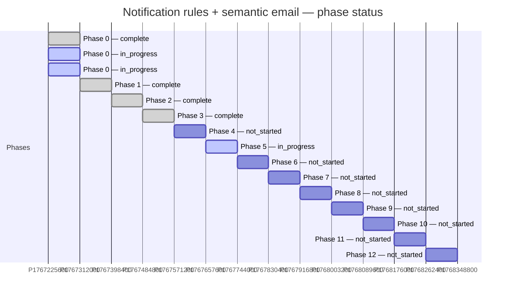

# Plan Status Rollup

Generated by `_status_rollup.sh` at 2026-05-19 00:11:02 UTC.

Source of truth: front-matter (`status:`, `phase:`, `prs:`, `related_skills:`) inside each `*.plan.md` in this directory.

## Summary

| State | Count |
|---|---|
| 🟢 complete | 5 |
| 🟡 in_progress | 4 |
| 🔴 blocked | 0 |
| ⚪ not_started | 8 |
| ❔ unannotated | 3 |
| **Total** | **20** |

## Plans

| | Phase | Status | Name | File | PRs | Related skills |
|---|---|---|---|---|---|---|
| 🟡 | 0 | `in_progress` | Semantic Email E2E Plan | `semantic_email_e2e_plan_057e0eb7.plan.md` | email-migration-validation, debug-email-rendering | — |
| 🟡 | 0 | `in_progress` | Semantic Email Test Plan | `semantic_email_test_plan_0fe90847.plan.md` | email-migration-validation, semantic-email-review | — |
| 🟢 | 0 | `complete` | Separate semantic email commands | `separate_semantic_email_commands_a7292c5c.plan.md` | migrate-notification-kind | — |
| 🟢 | 1 | `complete` | Notification rule schema and seeding | `notification_rule_schema_and_seeding.plan.md` | highspot/nutella#69976, highspot/nutella#70041, highspot/nutella#70323 | migrate-notification-kind |
| 🟢 | 2 | `complete` | Phase 2 NotificationEngine | `phase_2_notificationengine_a8edc09e.plan.md` | highspot/nutella#70320 | — |
| 🟢 | 3 | `complete` | Phase 3: REST API - Manage Notification Rules | `phase_3_rest_api_manage_rules.plan.md` | highspot/nutella#70329, highspot/magma#8831 | — |
| ⚪ | 4 | `not_started` | Phase 4: REST API - Send Notifications | `phase_4_rest_api_send.plan.md` | — | — |
| 🟡 | 5 | `in_progress` | Phase 5: Admin UI (Magma Entities Page) | `phase_5_admin_ui.plan.md` | highspot/magma#8831, highspot/magma#8894 | — |
| ⚪ | 6 | `not_started` | Phase 6: Group-Based Notification Rules | `phase_6_groups.plan.md` | — | — |
| ⚪ | 7 | `not_started` | Phase 7: Email Content Overrides | `phase_7_email_content_overrides.plan.md` | — | — |
| ⚪ | 8 | `not_started` | Phase 8: Delivery Guards and Configurable Batching Windows | `phase_8_delivery_guards_batching.plan.md` | — | — |
| ⚪ | 9 | `not_started` | Phase 9: Non-Email Content Overrides (Push, Slack, MS Teams) | `phase_9_non_email_content_overrides.plan.md` | — | — |
| ⚪ | 10 | `not_started` | Phase 10: Slim Legacy Config and Universal Notification Records | `phase_10_slim_config_universal_records.plan.md` | — | — |
| ⚪ | 11 | `not_started` | Phase 11: Performance Optimization | `phase_11_performance.plan.md` | — | — |
| ⚪ | 12 | `not_started` | Phase 12: Test Automation (Playwright + Mailinator) | `phase_12_test_automation.plan.md` | — | — |
| ❔ | — | `(none)` | Align Nutella MCP Proposal with Security Guidelines | `align_nutella_mcp_proposal_with_security_guidelines_5c0a512b.plan.md` | — | — |
| 🟢 | — | `complete` | Detailed Phase Plans 3-12 | `detailed_phase_plans_3-12_3bfed232.plan.md` | — | — |
| ❔ | — | `(none)` | MCP Synthetic Data Seed | `mcp_synthetic_data_seed_c7d6044b.plan.md` | — | — |
| 🟡 | — | `in_progress` | Notification rules master plan | `notification_rules_master_plan.plan.md` | migrate-semantic-email-body-copy, migrate-notification-kind, add-notification-kind, analyze-compare-report, email-migration-validation, debug-email-rendering, semantic-email-review | — |
| ❔ | — | `(none)` | Weekly Review Automation | `weekly_review_automation_2a005cc7.plan.md` | — | — |

## Phase Gantt (status snapshot)



## Regenerate

```bash
bash /Users/kiran.bachu/.cursor/plans/_status_rollup.sh
```
