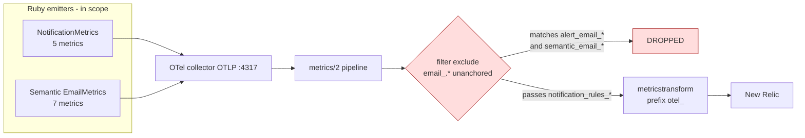

# Email Metrics Normalization (first step: new-systems only)

## Scope

This plan covers metrics emitted by the **brand-new** unified-notifications subsystems only:

| Subsystem | Source file(s) | Metrics it owns today |
|---|---|---|
| Notification rules engine | `common/notifications/rules/notification_engine.rb` | `notification_rules_alert_total`, `alerts_create_count`, `notification_rules_engine_delivered_total` |
| Notification channel router | `common/notifications/rules/notification_channel_router.rb` | (delegates emits to the metrics above) |
| Rules-engine email gate | `common/email/email_commands.rb` (rule-gating path) | `notification_rules_email_total`, `notification_rules_condition_eval_error_total` |
| Semantic email rendering | `common/email/semantic_email_commands.rb`, `common/email/semantic/builders/**` | `email_render_duration_ms`, `email_render_fallback_total`, `email_batch_capped_out_total`, `email_send_total`, `semantic_email_flag_check_total`, `email_base_url_fallback_total` |

**12 metrics in scope.** Everything else — `EmailCommands.send_email` legacy instrumentation, `sendgrid_activity` StatsD gauges, `bulk_pitch_*`, `email_event_count` webhook ingestion — is **out of scope** for this first step. See the "Deferred follow-up" appendix at the bottom.

## Goal

Four operator-facing signals must be queryable in New Relic for the unified-notifications rollout. The plan is structured around shipping those signals first; the rest is cardinality/cleanup on the same 12 metrics.

| # | Signal | Today | Target |
|---|---|---|---|
| 1 | **Engine throughput** per rule × channel × delivery mode | `notification_rules_engine_delivered_count{kind, rule, channels="email,push,toast"}` — comma-joined string, no delivery mode | `notification_rules_engine_delivered_total{kind, rule, channel, delivery_mode}` where `delivery_mode ∈ {immediate, batched, direct}` |
| 2 | **MJML render → HTML latency** | `alert_email_render_latency{pipeline, delivery_mode, kind}` — alert-only name, blocked from NR by Phase 1 | `email_render_duration_ms{pipeline, delivery_mode, kind}` — direct builders fold in |
| 3 | **Fallback to legacy** | `alert_email_immediate_fallback_count` + `alert_email_digest_fallback_count` — split, awkward `kind="all"` sentinel for digest-envelope failures, no direct-builder emit, blocked from NR | `email_render_fallback_total{kind, reason, delivery_mode, scope?}` |
| 4 | **Batch email cap drops** | `alert_email_digest_capped_out_count{pipeline, kind}` — correctly shaped but blocked from NR, off-namespace | `email_batch_capped_out_total{pipeline, kind}` |

## Motivation

This work was triggered by a NR error log on 2026-05-26:

```
NoMethodError: undefined method 'title' for an instance of Pitch
  at /common/email/semantic/builders/base.rb:224
  via EmailContentBuilder::SendFailedBuilder.build_send_failed_email
  kind=gmail_digital_room_send_failed
  cluster=stdplat-a-1-latest0-su0  commit=4da4a5ec
```

The Ruby rescue caught it, logged the fallback, and `EmailMetrics.emit_alert_immediate_fallback("gmail_digital_room_send_failed", "exception")` fired correctly. The log reached New Relic via Fluent Bit. **The metric did not** — i.e. signal #3 above was silently invisible.

Investigation found two compounding bugs:

1. **The immediate bug.** `otel-collector-ops`'s `metrics/2` (NR) pipeline excludes `email_(.*)`. The regex is unanchored, so it substring-matches `email_immediate_fallback_count` inside `alert_email_immediate_fallback_count` and drops it. Same shape as [HS-180590](https://highspot.atlassian.net/browse/HS-180590) (`pipeline_jobs` → `^pipeline_jobs$` anchor fix, [PR #217](https://github.com/highspot/otel-collector-ops/pull/217), 2026-04-15).
2. **The Prometheus mirror.** `observability-prometheus-config-ops` `keep` regex includes `otel_email_.*`, but Prometheus relabel regexes are implicitly anchored. So it matches `otel_email_send_request_count` but NOT `otel_alert_email_*`. The metrics are dead in Prometheus too, not just NR.

Phase 1 fixes both. Phases 2-4 are cardinality / post-rollout cleanup that follows once the signals are validated in NR.

## Implementation status

| Phase | Status | Notes |
|---|---|---|
| 1.0 otel-collector-ops exclude removal | **shipped (local diff)** | One-line removal in `otel-collector-ops/overlays/latest/latest0/su0/stdplat-a-1-latest0-su0/config_map.yaml`. PR not yet opened. |
| 1.1 Signal #1 — engine throughput reshape | **shipped (local diff)** | `nutella/web/common/notifications/rules/{notification_metrics,notification_engine}.rb` + 1 spec file updated. |
| 1.2 Signal #2 — render latency rename | **shipped (local diff)** | `nutella/web/common/email/{email_metrics.rb,semantic_email_commands.rb}` updated. |
| 1.3 Signal #3 — fallback counter merge | **shipped (local diff)** | 9 call sites in `semantic_email_commands.rb` updated to the new keyword signature. |
| 1.4 Signal #4 — batch cap drops rename | **shipped (local diff)** | Single call site in `send_semantic_digest` updated. |
| 2.0 `domain_id` strip on 3 new-engine counters | **shipped (local diff)** | NR audit pre-clearance (no dashboards, no log-text matches, `su0`-only rollout); 3 method signatures + ~15 call sites + 3 spec files + README updated. |
| 2.1 Recipient gauges → histogram | **shipped (local diff)** | `email_total/to/cc/bcc_recipients` (4 gauges) → `email_dispatch_recipients{type, header}` (1 histogram). |
| 1.5 Counter-suffix normalization | **shipped (local diff)** | 6 in-scope counters renamed to `_total` per OTel convention; 2 of them also drop the misleading `alert_email_*` prefix. `alerts_create_count` deliberately untouched (retires in Phase 3.3). |
| Spec + README updates | **shipped (local diff)** | 5 spec files + `README_SEMANTIC_EMAIL.md` + `PROJECT.md` Metrics tables + Troubleshooting rows updated. 250/250 affected specs pass. |
| Phase 3 — post-rollout retirements | not started | Gated on `unified_notification_system` reaching 100%. |
| Phase 4 — direct-builder dispatch instrumentation | not started | Requires deciding `rule: nil`, `channel: "email"`, `delivery_mode: "direct"` shape. |

## Architecture (current state)



`notification_rules_*` (5 metrics) reach NR today. `alert_email_*` + `semantic_email_*` (7 metrics) are silently dropped.

## Architecture (after Phase 1, as shipped)

```mermaid
flowchart LR
  OTLP[OTel collector OTLP] --> M2[metrics/2]
  M2 --> FILTER{filter exclude<br/>no email_* entry<br/>(parity with 11 other overlays)}
  FILTER -->|all email_*, alert_email_*,<br/>semantic_email_*, notification_rules_*<br/>flow through| MT[metricstransform]
  MT --> NR[New Relic]

  classDef ok fill:#dfd,stroke:#090
  class FILTER ok
```

The original `email_(.*)` exclude existed to mirror these metrics to Prometheus instead of NR, but the Prometheus mirror has been broken for `alert_email_*` since the OTel cutover (its anchored `keep` regex was never expanded). The cardinality audit cleared the 7 legacy `email_*` gauges (none carry `domain_id`; all attributes are closed-enum). With the rationale gone and cardinality not a concern, the cleanest fix was to delete the exclude line entirely — bringing `su0` to parity with the other 11 overlays. No explicit-list maintenance burden going forward.

## Phase 1 — Combined (otel exclude + four signal renames)

The exclude-regex unblock and the metric renames MUST land together because the four new signal names live in the `email_*` namespace and any anchored-wildcard exclude would catch them. Shipped as one coordinated change.

### 1.0 otel-collector-ops: exclude removal

One-line removal in `overlays/latest/latest0/su0/stdplat-a-1-latest0-su0/config_map.yaml` (only `su0` had the unanchored regex; the other 11 overlays already let `email_*` flow):

```diff
 filter:
   metrics:
     exclude:
       match_type: regexp
       metric_names:
         ...
         - ebl_(.*)
-        - email_(.*)
         - exp_service_metric
```

Why one-line removal (not the intermediate explicit-list approach): the cardinality audit cleared the 7 legacy `email_*` gauges (`email_bcc/cc/to/total_recipients`, `email_event_count`, `email_send_disabled_count`, `email_send_request_count`) — none carry `domain_id` and all attributes are closed-enum. The original rationale ("mirror to Prometheus instead of NR") is obsolete — the Prometheus mirror has been broken for `alert_email_*` since the OTel cutover. With the rationale gone and cardinality clean, deletion is preferable to an explicit-list maintenance burden. The intermediate explicit-list approach was implemented and then rolled back in favor of this.

### Verification (post-deploy)

NRQL after deploy (per HS-180590 pattern):

```sql
SELECT count(*) FROM Metric
WHERE metricName IN (
  'otel_email_render_duration_ms',
  'otel_email_render_fallback_total',
  'otel_email_batch_capped_out_total',
  'otel_notification_rules_engine_delivered_total',
  'otel_email_send_total',
  'otel_semantic_email_flag_check_total',
  'otel_notification_rules_alert_total',
  'otel_notification_rules_email_total',
  'otel_notification_rules_condition_eval_error_total',
  'otel_email_base_url_fallback_total'
)
FACET metricName, scale_unit
SINCE 1 hour ago
```

Expected: nonzero data points for `su0` (the SU where the rollout is active).

### Risk

Low. Same pattern as HS-180590 + explicit-list (safer than anchored wildcard). Cardinality analysis: the four new signals carry only closed-enum attributes (`kind` ~285, `reason` ~10, `pipeline`/`delivery_mode` ~3 each, `channel` ~5, `scope` ~1). Upper bound ~50k unique series for `su0` — about 0.5% of the `embedding_realtime_request_*` series count that motivated HS-184923.

### 1.1 Signal #1 — Engine throughput (reshaped) [SHIPPED]

`NotificationMetrics.emit_engine_delivered` switched from a comma-joined `channels` string to per-channel emit with `delivery_mode`:

```ruby
def self.emit_engine_delivered(kind:, rule:, channel:, delivery_mode:)
  OtelMetrics.counter(
    name: "notification_rules_engine_delivered_total",
    description: "Counter of NotificationEngine deliveries by channel and delivery mode",
    unit: "1"
  ).add(1, {
    kind: kind.to_s, rule: rule.to_s,
    channel: channel.to_s, delivery_mode: delivery_mode.to_s
  })
end
```

Caller in `notification_engine.rb` loops over `channels_delivered` and derives `delivery_mode` from `rule.aggregation_type` (`"time_based"` → `"batched"`, otherwise `"immediate"`). `"direct"` is reserved for the non-rule-backed direct-builder dispatch path (Phase 4 follow-up).

NRQL:

```sql
SELECT count(*) FROM Metric
WHERE metricName = 'otel_notification_rules_engine_delivered_total'
FACET rule, channel, delivery_mode
SINCE 1 day ago
```

### 1.2 Signal #2 — MJML render → HTML latency (renamed) [SHIPPED]

`EmailMetrics.emit_alert_render_latency` → `EmailMetrics.emit_render_duration` (metric `alert_email_render_latency` → `email_render_duration_ms`). Buckets `[10, 50, 100, 250, 500, 1000, 2000, 5000]` ms unchanged. The 3 call sites in `semantic_email_commands.rb` were updated; `delivery_mode` value `"digest"` was renamed to `"batched"` to match the `NotificationRule.aggregation_type` taxonomy.

### 1.3 Signal #3 — Fallback to legacy (merged) [SHIPPED]

Two counters merged into one. `EmailMetrics.emit_alert_immediate_fallback` + `EmailMetrics.emit_alert_digest_fallback` → `EmailMetrics.emit_render_fallback`:

```ruby
def self.emit_render_fallback(reason:, delivery_mode:, kind: nil, scope: nil)
  attrs = { reason: reason.to_s, delivery_mode: delivery_mode.to_s }
  attrs[:kind]  = kind.to_s  if kind
  attrs[:scope] = scope.to_s if scope
  OtelMetrics.counter(name: "email_render_fallback_total", ...).add(1, attrs)
end
```

- `delivery_mode ∈ {immediate, batched, direct}`.
- `scope: "digest"` replaces the `kind="all"` sentinel for batch-envelope failures; `kind` is omitted in that case (envelope failure has no per-entry kind).
- Per-entry digest failures emit `delivery_mode: "batched"` with the real `kind`, no `scope`.

All 9 call sites in `semantic_email_commands.rb` updated to the new keyword signature.

NRQL:

```sql
SELECT count(*) FROM Metric
WHERE metricName = 'otel_email_render_fallback_total'
FACET delivery_mode, kind, reason
SINCE 1 day ago
```

### 1.4 Signal #4 — Batch email cap drops (renamed) [SHIPPED]

`EmailMetrics.emit_alert_digest_capped_out(pipeline, kind)` → `EmailMetrics.emit_batch_capped_out(pipeline:, kind:)` (metric `alert_email_digest_capped_out_count` → `email_batch_capped_out_total`). Single call site in `send_semantic_digest`.

Pairs with signal #1 to compute drop rate per kind:

```sql
SELECT
  filter(count(*), WHERE metricName = 'otel_email_batch_capped_out_total') /
  filter(count(*), WHERE metricName = 'otel_notification_rules_engine_delivered_total'
                          AND delivery_mode = 'batched')
FROM Metric FACET kind SINCE 1 day ago
```

### Sign-off

The four signals are additive (new metric names; old ones can dual-emit during a 30-day window per the HS-185447 paired-pipeline pattern). No external dashboard breaks immediately; dashboards migrate to the new names as Phase 2 ships.

## Phase 2 — Strip `domain_id` from new-engine metrics + recipient histogram [SHIPPED]

Folded into the Phase 1 nutella PR. Three of the in-scope metrics carried `domain_id` and now don't:

| Metric | Before | After |
|---|---|---|
| `notification_rules_alert_total` *(renamed from `_count` in Phase 1.5)* | `emit_alert(outcome, kind:, domain_id:, rule:)` | `emit_alert(outcome, kind:, rule:)` |
| `alerts_create_count` | `emit_alert_created(kind:, domain_id:)` | `emit_alert_created(kind:)` |
| `notification_rules_email_total` *(renamed from `_count` in Phase 1.5)* | `emit_email(outcome, type:, reason:, domain_id:, rule:)` | `emit_email(outcome, type:, reason:, rule:)` |

### Audit (pre-strip clearance)

Pre-rollout audit signals at the time of strip:

```sql
SELECT count(*) FROM Log
 WHERE message LIKE '%notification_rules_alert_count%'
    OR message LIKE '%alerts_create_count%'
    OR message LIKE '%notification_rules_email_count%'
    OR message LIKE '%notification_rules_alert_total%'
    OR message LIKE '%notification_rules_email_total%'
 SINCE 7 days ago
-- → 0 (no logged NRQL queries reference these names)

SELECT * FROM NrDashboardWidget LIMIT 1
-- → table not queryable in account 450341 (no dashboard exposure to verify)
```

Combined with `notification_rules_alert_total` showing only 31 distinct `domain_id` values in 7 days (89% concentration in `highspot-test.com` + `highspot.com`) and the rollout still being at `su0`-only blast radius, the strip was deemed safe to land now rather than after a full audit. The alternative — leaving `domain_id` in place until 100% rollout — would inflate cardinality by ~150× (5,000+ tenants) before any cleanup PR could land.

### What shipped together

Production:
- `common/notifications/rules/notification_metrics.rb` — 3 method signatures
- `common/notifications/rules/notification_engine.rb` — 7 emits
- `common/models/commands/alerts/alert_commands.rb` — 2 emits
- `common/models/commands/alerts/alert_helpers.rb` — 2 emits
- `common/email/email_commands.rb` — `emit_rule_metric` wrapper + 5 call sites that propagated `domain_id`

Specs + docs:
- `spec/unit/common/notifications/rules/notification_metrics_spec.rb`
- `spec/unit/common/notifications/rules/notification_engine_spec.rb`
- `spec/unit/common/models/commands/alerts/alert_commands_notification_engine_spec.rb`
- `common/email/README_SEMANTIC_EMAIL.md` (3 metrics tables refreshed)

### Recipient gauges → histogram

Folded into the same PR for momentum (the audit surfaced these as an obvious simplification): four "last-write-wins" gauges in `EmailCommands.emit_send_recipients` collapsed to one histogram.

```diff
- OtelMetrics.gauge(name: "email_total_recipients", ...).record(total, { type: type })
- OtelMetrics.gauge(name: "email_to_recipients",    ...).record(to.length,  { type: type })
- OtelMetrics.gauge(name: "email_cc_recipients",    ...).record(cc.length,  { type: type })
- OtelMetrics.gauge(name: "email_bcc_recipients",   ...).record(bcc.length, { type: type })
+ histogram = OtelMetrics.histogram(
+   name: "email_dispatch_recipients", ...,
+   buckets: RECIPIENT_COUNT_BUCKETS  # [1, 2, 5, 10, 25, 50, 100, 500, 1000]
+ )
+ histogram.record(to.length,  { type: type, header: "to"  })
+ histogram.record(cc.length,  { type: type, header: "cc"  })
+ histogram.record(bcc.length, { type: type, header: "bcc" })
```

The gauge shape was semantically wrong for a per-send recipient count: gauges are point-in-time samples (last-write-wins), but the operator question is "what's the distribution of recipient counts per send?" — a histogram question. The four `total`/`to`/`cc`/`bcc` siblings collapse to a single histogram facetable on `header`.

## Phase 3 — Post-rollout cleanup

Gated on `unified_notification_system` reaching 100% (master plan Phase 10 exit).

### 3.1 Trim `semantic_email_flag_check_total` reasons (short-term)

Today the metric carries 11 `reason` enum values; only 4 are operationally useful long-term:

| Keep (operational) | Drop (move to `EventLogger.debug`) |
|---|---|
| `flag_not_enabled` (rollout %) | `kind_nil`, `renderer_unsupported`, `builder_unsupported` |
| `category_disabled` (allowlist coverage) | `to_user_enabled`, `to_recipients_enabled`, `resolved_user_enabled` |
| `enabled` (positive denom) | `alert_domain_enabled`, `from_user_enabled` |
| `error` (exception, renamed from `exception`) | |

### 3.2 Retire `semantic_email_flag_check_total` (long-term)

Once `unified_notification_system` reaches 100%, this counter is dead weight. Successor `notification_rules_alert_total{outcome="skipped_flag_disabled"}` already answers the rollout-percentage question.

### 3.3 Retire `alerts_create_count`

Once master plan Phase 10 ships and `notification_rules_alert_total{outcome="skipped_no_rule"}` is at zero, `alerts_create_count` becomes identical to `notification_rules_alert_total{outcome="routed"}`. Retire it. Until then, leave a TODO comment in `notification_metrics.rb`.

## Phase 4 — Direct-builder dispatch instrumentation (follow-up)

Today `delivery_mode: "direct"` is reserved in the cardinality contract but not emitted — only `"immediate"` and `"batched"` actually appear on `engine_delivered_total`, `email_render_duration_ms`, and `email_render_fallback_total`. Direct-builder dispatch paths (`EmailCommands.send_<kind>_email` family — Share, Comment, BulkPitch coordinator emails, etc.) need to be wrapped with the same `Benchmark.measure` + `emit_render_duration(..., "direct", ...)` and `emit_render_fallback(..., delivery_mode: "direct")` shape. Requires deciding what `rule` means for non-rule-backed direct sends (likely `rule: nil`, `channel: "email"`).

## Canonical metric set (in-scope end state)

After Phases 1-3, the 12 in-scope metrics consolidate to 11 (two retired post-rollout → 9 long-term). The four operator-facing signals are bolded.

### Routing layer (`NotificationMetrics`) — 4 metrics

| Metric | Type | Attributes |
|---|---|---|
| `notification_rules_alert_total` | counter | `outcome` (`routed`/`skipped_no_rule`/`skipped_user_opted_out`/`skipped_actor_suppressed`/`skipped_condition_not_met`/`skipped_flag_disabled`), `kind`, optional `rule` (no `domain_id`) |
| **`notification_rules_engine_delivered_total`** *(Signal #1)* | counter | `kind`, `rule`, **`channel`** (singular), **`delivery_mode`** (`immediate`/`batched`/`direct`) |
| `notification_rules_email_total` | counter | `outcome` (`allowed`/`blocked`/`skipped`/`error`), `type`, optional `reason`, optional `rule` (no `domain_id`) |
| `notification_rules_condition_eval_error_total` | counter | `stage` (`evaluate`/`recipient_context`) |

(`alerts_create_count` retired after Phase 3.3; `notification_rules_engine_delivered_count` removed in Phase 1.1; the three `_count` counters renamed to `_total` in Phase 1.5.)

### Semantic rendering layer (`EmailMetrics`) — 5 metrics

| Metric | Type | Attributes |
|---|---|---|
| **`email_render_duration_ms`** *(Signal #2)* | histogram | `pipeline`, `delivery_mode` (`immediate`/`batched`/`direct`), `kind` |
| **`email_render_fallback_total`** *(Signal #3)* | counter | `kind?`, `reason`, `delivery_mode`, `scope?` (`digest`) |
| **`email_batch_capped_out_total`** *(Signal #4)* | counter | `pipeline`, `kind` |
| `email_send_total` *(renamed in Phase 1.5)* | counter | `pipeline`, `delivery_mode`, `kind`, `outcome` *(deferred dispatch-counter merge in follow-up plan)* |
| `email_base_url_fallback_total` *(renamed in Phase 1.5)* | counter | `reason` (`nil_alert`/`nil_domain_id`/`domain_not_found`/`exception`) |

(`semantic_email_flag_check_total` retired after Phase 3.2; `alert_email_render_latency`, `alert_email_immediate_fallback_count`, `alert_email_digest_fallback_count`, `alert_email_digest_capped_out_count` removed in Phase 1.)

### Renamed / merged / retired

| Today | First-step disposition | Successor |
|---|---|---|
| `notification_rules_engine_delivered_count` | reshaped (Signal #1) | `notification_rules_engine_delivered_total` |
| `alert_email_render_latency` | renamed (Signal #2) | `email_render_duration_ms` |
| `alert_email_immediate_fallback_count` | merged (Signal #3) | `email_render_fallback_total{delivery_mode="immediate"}` |
| `alert_email_digest_fallback_count` | merged (Signal #3) | `email_render_fallback_total{delivery_mode="batched"}` (or `scope="digest"` for envelope failures) |
| `alert_email_digest_capped_out_count` | renamed (Signal #4) | `email_batch_capped_out_total` |
| `notification_rules_alert_count` | suffix-normalized (Phase 1.5) | `notification_rules_alert_total` |
| `notification_rules_email_count` | suffix-normalized (Phase 1.5) | `notification_rules_email_total` |
| `notification_rules_condition_eval_error_count` | suffix-normalized (Phase 1.5) | `notification_rules_condition_eval_error_total` |
| `alert_email_send_count` | renamed (Phase 1.5) | `email_send_total` (drops `alert_` prefix; cross-mode metric) |
| `alert_email_base_url_fallback_count` | renamed (Phase 1.5) | `email_base_url_fallback_total` (drops `alert_` prefix) |
| `semantic_email_flag_check_count` | renamed (Phase 1.5), retiring post-rollout (Phase 3.2) | `semantic_email_flag_check_total` → `notification_rules_alert_total{outcome="skipped_flag_disabled"}` |
| `alerts_create_count` | retired post-rollout (Phase 3.3) | `notification_rules_alert_total{outcome="routed"}` |

## Cardinality contract

Every metric in this scope MUST follow this attribute taxonomy.

### Allowed (closed enums)

`pipeline` (2: `semantic`/`legacy`), `delivery_mode` (3: `immediate`/`batched`/`direct`), `outcome` (~6 per metric), `channel` (~5: `email`/`push`/`toast`/`sms`/`in_app`), `scope` (~1: `digest`)

### Allowed (bounded but larger)

`kind` (~285 ALERT_CONFIG kinds + direct-builder kinds), `type` (~50 SETTINGS keys + ~285 alert kinds = ~350), `rule` (~100s of NotificationRule names, mostly steady), `stage` (~2)

### Allowed (per-metric closed enums)

`reason` (per-metric closed enum, 4-15 values)

### Banned (cardinality killers)

`domain_id` (stripped from the 3 new-engine counters in this plan; remaining 14 legacy emitters still carry it pending the follow-up plan), `user_id`, `alert_id`, `tracking_tag`, `message_id`, `email_tracking_id`, free-form route paths, error messages.

These belong in **logs** (which `EventLogger` already captures with full context) and **traces** (span attributes), NOT in metric attributes.

### Auto-applied via `MetricWithContext` (don't repeat in caller)

`crew`, `feature`, `application`, `route` (from `Observability::Context`); `scale_unit`, `environment`, `environment_type`, `k8s_cluster` (from `metricstransform` resource attrs).

## Risk and rollback

| Phase | Risk | Rollback |
|---|---|---|
| 1 | Low — direct rename (no dual-emit). Old metric names disappear from NR immediately; the four new names appear. No external dashboards depend on the old names yet (rollout is at su0 only). | Revert both PRs (otel-collector-ops + nutella); old methods + metric names reappear; new ones disappear. No data loss. |
| 2 | Medium — per-metric audit gates each `domain_id` strip. | Reversible via otel-collector-ops revert. |
| 3 | Low — gated on master plan Phase 10 exit. Retirement is additive on the consumer side only. | n/a (retirement only) |
| 4 | Low — additive; direct-builder paths gain instrumentation they don't have today. | Revert the wiring PR. |
| 5 | Low | Documentation only. |

## Related work

- [HS-110948](https://highspot.atlassian.net/browse/HS-110948) — Original NR OTLP integration ([otel-collector-ops PR #49](https://github.com/highspot/otel-collector-ops/pull/49), 2024-12-23).
- [HS-180590](https://highspot.atlassian.net/browse/HS-180590) — The `pipeline_jobs` anchor-fix precedent ([PR #217](https://github.com/highspot/otel-collector-ops/pull/217), 2026-04-15). Phase 1.0's exclude-list shape extends this pattern (explicit per-name rather than anchored wildcard).
- [HS-184923](https://highspot.atlassian.net/browse/HS-184923) — Sonali Goyal's "reduce NR ingest" master ticket. Phase 2 is a continuation under this program.
- [HS-184929](https://highspot.atlassian.net/browse/HS-184929) — `transform/drop_unused_attrs` precedent for stripping high-cardinality resource attrs.
- [HS-184956](https://highspot.atlassian.net/browse/HS-184956) / [HS-184957](https://highspot.atlassian.net/browse/HS-184957) — `domain_id` strip on `embedding_realtime_request_*` (139 GB/day saved). Template for Phase 2.
- [HS-185447](https://highspot.atlassian.net/browse/HS-185447) — Remove `otel_embedding_*` from exclude filter ([PR #294](https://github.com/highspot/otel-collector-ops/pull/294), 2026-05-21). Paired-pipeline change pattern.
- [HS-185865](https://highspot.atlassian.net/browse/HS-185865) — Parent ticket for the semantic-email batch work that surfaced this gap.

## Triggering NR error (for traceability)

```
NoMethodError: undefined method 'title' for an instance of Pitch
  at /common/email/semantic/builders/base.rb:224 (build_pitch_card)
  kind=gmail_digital_room_send_failed
  cluster=stdplat-a-1-latest0-su0
  commit=4da4a5ec (1.112-testing-4da4a5ec)
  date=2026-05-26T10:39:49Z
```

Application-level fix landed in [bf3b26447f3](https://github.com/highspot/nutella/commit/bf3b26447f3) (PR [#71757](https://github.com/highspot/nutella/pull/71757), branch `HS-185865/semantic-email-batch2`) — `pitch.title` → `pitch.name`. The `EmailMetrics.emit_alert_immediate_fallback` fired correctly but was invisible to NR; that invisibility is what Phase 1 of this plan addresses.

## Open questions

| # | Question | Owner | Resolution gate |
|---|---|---|---|
| 1 | Confirm `su0`-only Phase 1 deploy is enough — the other 11 overlays already let `email_*` flow (no exclude). | Observability team | Pre-Phase-1 deploy |
| 2 | Per-metric audit of `domain_id` dashboard usage before Phase 2 (3 metrics: `notification_rules_alert_count`, `notification_rules_email_count`, `alerts_create_count`). | This plan owner | Pre-Phase-2 NRQL audit |
| 3 | Master plan Phase 10 (legacy fallback removal) exit criteria met? Gates Phases 3.2 + 3.3. | Master plan owner | Master plan §2 Status |
| 4 | Direct-builder dispatch instrumentation (Phase 4) — confirm `rule: nil`, `channel: "email"`, `delivery_mode: "direct"` is the right shape for non-rule-backed sends. | Plan owner + notifications team | Pre-Phase-4 |

---

## Appendix: Deferred follow-up (NOT part of this first step)

The following normalization/deletion work touches **legacy** email-instrumentation paths in `EmailCommands.send_email`, `sendgrid_activity.rb`, `bulk_pitch_*`, and the webhook ingestion layer. None of these emit from the three new subsystems above. They were originally tiers 1-3 of an earlier draft and have been moved here pending a dedicated follow-up plan.

### Deferred normalization

| Today | Becomes | Saving |
|---|---|---|
| `email_send_request_count` + `alert_email_send_count` + `email_send_disabled_count` (3 counters — `alert_email_send_count` is in-scope today but the *merge* with the two legacy counters is deferred) | `email_dispatch_total{type, kind?, pipeline?, delivery_mode?, outcome}` | 3→1 |
| `sendgrid_activity.events.{total, unprocessed, batch_size}` (3 G.stats StatsD) | `email_delivery_sync_lag{provider}` OTel gauge | 3→1; last `G.stats` in `common/email/` retires |
| 5 `BulkPitchMetrics` success/failure pairs (11 names) | 5 `*_total{outcome}` counters | 11→5 |
| `email_event_count` | renamed to `email_delivery_event_total{event, provider, category?, bulk?}` | rename only |

(The recipient-gauges-to-histogram conversion that was originally listed here shipped as part of Phase 2; see §"Recipient gauges → histogram" above.)

### Deferred deletion

| Metric | Reason | Successor |
|---|---|---|
| `bulk_pitch_event_received_count` | Subset of `email_event_count`; both fire on same provider webhook for bulk pitches | `email_delivery_event_total` filtered by `type="pitch"` + `bulk=true` |
| `bulk_pitch_coordinator_job_started/completed/failed_count` + `bulk_pitch_send_disabled_count` | Implicit `_count` series of duration histogram covers it | `bulk_pitch_job_duration_ms{job_type="coordinator", status}` |
| `domain_id` attribute on ~14 legacy metrics | Cardinality strip per HS-184956/957 pattern (audit gate per metric) | Attribute deletion only |

### When to do the follow-up

After Phase 2 of this plan ships and the four signals are validated in NR. The legacy cleanup has no functional dependency on this plan, but bundling them together would have made this first step harder to review and slower to land. Split out for that reason.
