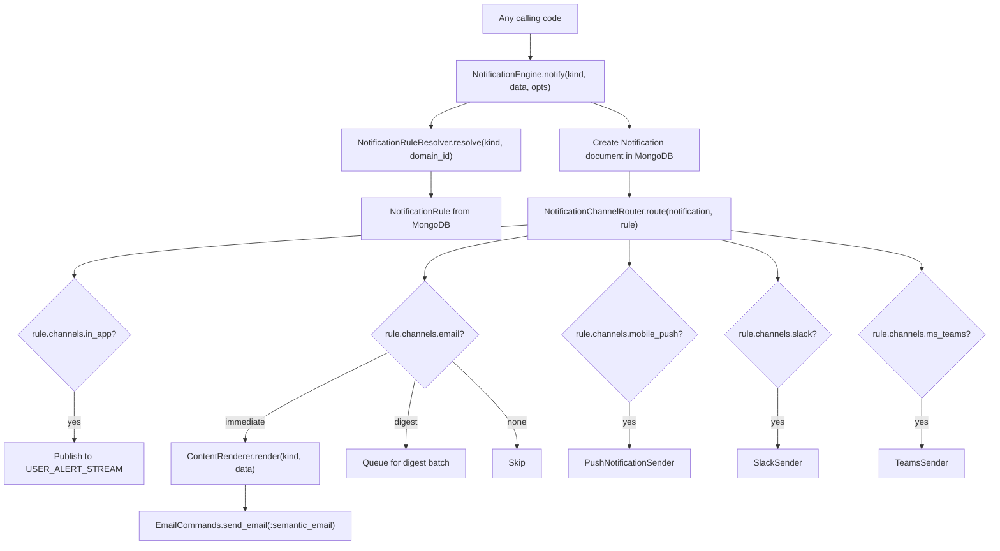

# Notification Rules and Semantic Email -- Master Plan

## Sub-plans

- [Notification rule schema and seeding](notification_rule_schema_and_seeding.plan.md) -- schema definition, legacy field mappings, mapping scripts, rake task
- [Semantic email E2E plan](semantic_email_e2e_plan_057e0eb7.plan.md) -- Mailinator / Playwright E2E verification
- [Semantic email test plan](semantic_email_test_plan_0fe90847.plan.md) -- unit and integration test coverage
- [Separate semantic email commands](separate_semantic_email_commands_a7292c5c.plan.md) -- SemanticEmailCommands extraction (completed)
- [Extract ALERT_CONFIG](extract_alert_config_f6a45394.plan.md) -- move config to alert_config.rb

---

## Target Architecture

**Single entry point, single document, rules-driven routing:**



### Core Principles

1. **Every notification creates a document** -- full traceability for all 377 types (310 alert kinds + 1 digest + 66 email types)
2. **Rules define destinations** -- `NotificationRule` per kind determines which channels receive the notification
3. **Notification links back to rule** -- every notification document records which rule was used to deliver it, enabling audit and debugging
4. **Content stays in code** -- semantic email builders, AlertPresenter templates, i18n strings remain in Ruby. Rules control routing, not content.
5. **Single entry point** -- `NotificationEngine.notify(kind, data, opts)` replaces both `AlertCommands.create` and `EmailCommands.send_*`

### What Exists Today vs What Changes

**Alert path (preserved, migrated):**

| Component | Today | After |
|-----------|-------|-------|
| `AlertCommands.create(kind, data)` | Creates Alert doc + inline routing | Thin wrapper calling `NotificationEngine.notify` |
| `ALERT_CONFIG[kind][:options]` | Routing config (send_immediately, no_email, etc.) | Replaced by `NotificationRule.channels` + `delivery_strategy` |
| `ALERT_CONFIG[kind][:category/level/urgent]` | Metadata | Replaced by `NotificationRule.category` + `priority` |
| `ALERT_CONFIG[kind][:message/messages/subject/...]` | Content templates | **Stays in code** (AlertPresenter, semantic builders) |
| `AlertPublisher` + channel listeners | Event bus for push/Slack/Teams | Replaced by `NotificationChannelRouter` |
| `SLACK_ALERT_KINDS`, `MS_TEAMS_ALERT_KINDS` | Hardcoded kind sets | Replaced by `rule.channels.slack`, `rule.channels.ms_teams` |
| Alert document in MongoDB | In-app notification | Becomes unified `Notification` document |

**Non-alert path (absorbed):**

| Component | Today | After |
|-----------|-------|-------|
| `EmailCommands.send_signup(to, ...)` | Direct email, no document | `NotificationEngine.notify(:signup, data)` -> document + email |
| `EmailCommands.send_pitch(to, ...)` | Direct email, no document | `NotificationEngine.notify(:pitch_sent, data)` -> document + email + push + Slack |
| `SemanticEmailBuilderRegistry` | Maps non-alert types to builders | Merged into `NotificationContentRegistry` |
| No persistent document | No trace | Notification document created for every send |

### Notification Document Schema

Extends the current `Alert` document to serve as the unified notification record:

```ruby
{
  _id: ObjectId,
  domain_id: String,
  user_id: String,
  kind: "spot_access",
  category: "access",
  priority: "actionable",
  notification_rule_name: "spot_access",
  data: { ... },
  options: { ... },
  channels_delivered: [],
  read: false,
  sent: false,
  created_at: Time,
  updated_at: Time,
  sent_at: Time
}
```

Backward-compatible with the existing `Alert` collection. Key additions:
- `notification_rule_name` -- the name of the `NotificationRule` used to route and deliver this notification; enables audit trail from any notification back to the rule that governed its delivery
- `channels_delivered` -- which channels actually received this notification
- `category` and `priority` -- denormalized from the rule

### Unified Content Registry

Merges `SemanticAlertRenderer::BUILDER_REGISTRY` and `SemanticEmailBuilderRegistry` into one:

```ruby
module NotificationContentRegistry
  BUILDERS = {
    # Alert kinds -> SemanticAlertRenderer builders
    spot_access: ->(notification, to_user) { EmailContentBuilder::SpotAccessBuilder.build(...) },
    # ...306 alert kinds...

    # Non-alert email types -> SemanticEmailBuilderRegistry builders
    signup: ->(notification, to_user) { EmailContentBuilder::TransactionalBuilder.build(:signup, ...) },
    # ...65 non-alert types...
  }.freeze
end
```

### Recipient Model

The unified interface supports all current recipient patterns:

```ruby
NotificationEngine.notify(:spot_access, data, {
  to: user,                    # Single user (most common)
  # OR
  to: [user1, user2],         # Multiple users
  # OR
  to: "email@example.com",    # External email
  cc: [user3],
  bcc: ["admin@company.com"]
})
```

Internally creates one Notification document per recipient user (for in-app traceability) but sends a single email to all recipients (for email efficiency).

### New Files

- `notification_rule.rb`, `notification_rule_queries.rb`, `notification_rule_commands.rb`
- `notification_rule_resolver.rb`, `notification_rule_seed.rb`
- `notification_engine.rb`, `notification_channel_router.rb`
- `notification_content_registry.rb`
- `notification_rules_controller.rb` (admin API)

### Major Modifications

- `alert_commands.rb` -- `create` wraps `NotificationEngine.notify`
- `email_commands.rb` -- `send_*` methods become thin adapters
- `alert.rb` -- reads denormalized category/priority from document
- `push_notification_channel_listener.rb` -- removed (logic moves to router)
- `slack_commands.rb` -- `SLACK_ALERT_KINDS` removed
- `ms_teams_commands.rb` -- `MS_TEAMS_ALERT_KINDS` removed

---

## Phased Delivery Plan

### Context

**Today:** Alert configuration mixes routing behavior, channel selection, and content templates in a single large in-code config (`ALERT_CONFIG` with ~310 kinds). Email rendering uses legacy Velocity/ERB templates for most kinds. Non-alert emails (`EmailCommands::SETTINGS`, ~66 types) are sent directly with no persistent document. Push, Slack, and MS Teams routing is hardcoded in separate constant sets. There are 377 total notification types across both systems.

**Target:** Two ideas work together:

1. **Semantic email (Phase 0)** -- Alert emails that use a shared MJML structure and builder-produced content, aligned with the UX framework. "Semantic" means structure and presentation follow that framework, not ad-hoc HTML per kind.
2. **Notification rules (Phases 1+)** -- Persisted rules per alert kind (and optional domain overrides) that govern all destinations: in-app, mobile push, Slack, MS Teams, and email -- including routing, optional text overrides per channel, and optional delivery guards. REST APIs expose rule management and send/trigger operations.

### Foundation Phases (0-2)

Phases 0, 1, and 2 are the shared foundation. After Phase 2 is complete, all product teams can cut over their alert kinds to semantic email on a common baseline -- without waiting for Phases 3+.

| Phase | Role in the foundation |
|-------|------------------------|
| **0** | Semantic email pipeline (MJML/builders, previews, per-kind migration from legacy) |
| **1** | Persisted NotificationRule data, resolver, seed from current behavior -- no routing cutover yet |
| **2** | Dual-read: alert pipeline and listeners use resolved rules when enabled; routing and channels come from rules with legacy fallback |

### Phase 0 -- Legacy email to semantic email (in progress)

**Goals:** Replace legacy alert email rendering with shared MJML pipeline and per-kind builders aligned with the UX framework. Enable per-kind previews for design, QA, and engineering. Migrate incrementally by kind.

**Scope:** Builder-produced data -> shared template(s) -> responsive HTML. Flags/kill switches per kind so legacy can remain fallback until verified.

**Dependencies downstream:** Phase 7 (email content overrides) and Phase 10 (slimming email fields) assume semantic builders are the source of default email content.

**Release criteria:**
- Preview acceptance: each kind validated and accepted by PMs and owning team
- Pillar review: tech spec receives pillar review and sign-off
- Metrics: success-rate > 90%
- Kill switch per kind exists through dynamic config

### Phase 1 -- Notification rules (seeding MongoDB)

**Goals:** Store notification rules in the data layer (global rule per alert kind + one digest rule + direct email rules). Implement `NotificationRuleResolver` with resolution order (user+domain override -> domain -> user -> global rule -> ALERT_CONFIG fallback). Seed all 377 global rules from current behavior.

**Schema and seeding details:** See [notification rule schema and seeding plan](notification_rule_schema_and_seeding.plan.md).
**Complete legacy mapping:** See [Google Sheet - Legacy to Rules Migration Mapping](https://docs.google.com/spreadsheets/d/1wPyr_ronzlBVub42FNvj4y2AgFOScJD-9OyPCFAbuXM/edit)

**What gets seeded (377 rules total):**

| Rule Type | Count | Source | Notes |
|---|---|---|---|
| Immediate | 144 | ALERT_CONFIG kinds with `send_immediately: true` | Each gets its own rule; channels include email + in_app + optional slack/msteams/push |
| Digest Only | 4 | ALERT_CONFIG kinds with `group_email: true`, no `send_immediately` | `item_expiring`, `item_expired`, `pitch_expired`, `digital_room_expired` |
| Digest (aggregator) | 1 | ALERT_CONFIG `group_email` kinds | Single rule with `eligible_alert_kinds` listing all 12 digest-eligible kinds |
| In-App Only | 21 | ALERT_CONFIG kinds with `no_email: true` | Channels = `["in_app"]` only |
| In-App (default) | 139 | ALERT_CONFIG kinds with no special options | Channels = `["in_app"]`; no email trigger |
| Push Only | 2 | ALERT_CONFIG kinds with `no_email` + `push_notification` | `meeting_ended_deal_notification`, `pre_meeting_notification` |
| Direct Email | 60 | `EmailCommands::SETTINGS` | Each email type gets its own rule; channels = `["email"]` |
| System (email infra) | 6 | `EmailCommands::SETTINGS` | `alert`, `semantic_email`, `alerts`, `digest`, `expiry_digest`, `partner_digest` |

**Cross-channel seeding from legacy constants:**
- 8 kinds from `SlackCommands::SLACK_ALERT_KINDS` -> add `"slack"` to channels
- 13 kinds from `MsTeamsCommands::MS_TEAMS_ALERT_KINDS` -> add `"ms_teams"` to channels
- 2 kinds with `push_notification: true` -> add `"push"` to channels

**Collections created:**
- `notification_rules` -- global rules (377 documents)
- `notification_rule_overrides` -- per-domain/user overrides (empty at seed; schema defined, indexes created)

**Indexes on `notification_rules`:**
```javascript
db.notification_rules.createIndex({ name: 1 }, { unique: true })
db.notification_rules.createIndex({ category: 1 })
db.notification_rules.createIndex({ "trigger.event_name": 1 })
db.notification_rules.createIndex({ "delivery_strategy.channels": 1 })
```

**Indexes on `notification_rule_overrides`:**
```javascript
db.notification_rule_overrides.createIndex(
  { rule_name: 1, "scope.domain_id": 1, "scope.user_id": 1 },
  { unique: true }
)
db.notification_rule_overrides.createIndex({ "scope.domain_id": 1 })
```

**Files to create:**
- `web/common/models/notification_rule.rb` -- Mongoid model, validations, scopes
- `web/common/models/notification_rule_override.rb` -- Mongoid model for overrides
- `web/common/queries/notification_rule_queries.rb` -- `find_by_name`, `find_by_category`, `all_active`
- `web/common/models/commands/notification_rule_commands.rb` -- `create`, `update`, `deactivate`
- `web/common/notification_rule_resolver.rb` -- resolution chain with short TTL in-memory cache
- `web/db/migrate/<jira>_seed_notification_rules.rb` -- `DatabaseMigration` with `build_all_rules` + `insert_many` + existing-key filter
- `web/db/spec/integration/migrate/<jira>_seed_notification_rules_spec.rb` -- count + idempotency assertions

**Files to modify:**
- `web/tools/scripts/deployment/apply_data_migration.sh` -- append migration line
- `web/common/constants.rb` -- add `NOTIFICATION_RULES_COLLECTION` and `NOTIFICATION_RULE_OVERRIDES_COLLECTION`

**`NotificationRuleResolver` behavior:**
```
resolve(kind, domain_id: nil, user_id: nil)
  1. Find user+domain override (if both provided)
  2. Find domain override (if domain_id provided)
  3. Find user override (if user_id provided)
  4. Find global rule by name
  5. Fall back to ALERT_CONFIG (legacy, until Phase 10)
  Merge: shallow merge at each level; most specific wins per field.
  Cache: short TTL in-memory cache on reads (e.g., 60s).
```

**Risks:**
- Slack vs MS Teams kind sets differ -- seed independently from their respective constants
- Idempotent seed -- `build_all_rules` filters out existing names; safe re-runs when ALERT_CONFIG changes
- Schema evolution -- `version: 1` on all seeded rules; bump on breaking changes

**Release criteria:**
- Mongo verification: admin task confirms all 377 rules seeded; counts match spreadsheet
- PM review of the [migration mapping spreadsheet](https://docs.google.com/spreadsheets/d/1wPyr_ronzlBVub42FNvj4y2AgFOScJD-9OyPCFAbuXM/edit) for CS1 and CS2 requirements
- Integration spec passes (count after first run, count after second run = idempotency)
- `NotificationRuleResolver` tested: resolves global, domain override, user override, merged result
- Safety: deploy does not flip routing behavior until Phase 2; rules are data-only

### Phase 2 -- NotificationEngine (dual-read, rules + legacy fallback)

**Goals:** Introduce `NotificationEngine.notify()` as the single entry point. Channel routing reads the resolved `NotificationRule` when enabled, with fallback to legacy config. Optional comparison logging detects mismatches before full cutover.

**Key components:**

| Component | Responsibility |
|---|---|
| `NotificationEngine` | Single entry point: `notify(kind, data, opts)`. Creates Notification document, resolves rule, delegates to router. |
| `NotificationChannelRouter` | Reads resolved rule's `channels` array. For each channel, evaluates eligibility and dispatches. Replaces `AlertPublisher` + per-channel listeners. |
| `NotificationContentRegistry` | Unified builder lookup: maps `rule.name` to its semantic builder. Merges `SemanticAlertRenderer::BUILDER_REGISTRY` + `SemanticEmailBuilderRegistry`. |

**Routing flow:**
```
NotificationEngine.notify(:share_item, data, opts)
  1. NotificationRuleResolver.resolve(:share_item, domain_id, user_id)
     -> Returns merged NotificationRule (or legacy fallback)
  2. Create Notification document in MongoDB
     -> Sets notification_rule_name = rule.name
     -> Sets category, priority from rule
  3. NotificationChannelRouter.route(notification, rule)
     For each channel in rule.delivery_strategy.channels:
       - "in_app"    -> publish to USER_ALERT_STREAM (existing)
       - "email"     -> check batching: disabled = immediate send; time_based = mark sent:false for digest job
       - "push"      -> PushNotificationSender.send(notification)
       - "slack"     -> SlackSender.send(notification)
       - "ms_teams"  -> TeamsSender.send(notification)
     Record channels_delivered on the notification document
```

**Dual-read mode (feature-flag gated):**
- When `notification_rules_enabled = false`: existing code paths run unchanged
- When `notification_rules_enabled = true`:
  - `AlertCommands.create` becomes a thin wrapper calling `NotificationEngine.notify`
  - Resolver returns the persisted rule
  - Optional: comparison logging mode -- resolve both rule and legacy, log mismatches, use legacy result

**Backward compatibility:**
- Notification document extends existing Alert schema; existing queries/indexes work
- Legacy `level`/`urgent` exposed from resolved `priority` for Solr/API consumers
- `ALERT_CONFIG` content keys (`:message`, `:messages`, `:subject`, `:action`, `:comment`) still read from legacy config (content stays in code until Phase 10)

**Digest routing:**
- When a notification is created for a kind that appears in the digest rule's `eligible_alert_kinds`, suppress immediate email and mark `sent: false`
- Existing `send_alerts` batch job picks up unsent alerts and sends the digest email
- Digest behavior unchanged; only the routing decision moves to rule-driven

**Advanced email options driven by the rule (rules-first, not deferred to Phase 10):**

The rule's `delivery_strategy["email"]` block is the declarative source of truth for the seven per-kind advanced email behaviors that were previously sourced from `ALERT_CONFIG[kind][:options]`:

| Field | Effect |
|---|---|
| `send_from` | Render the alert's `data["from"]` user as the email sender |
| `send_one` | Send a single email to all recipients (sets `email_opts[:multi]`) |
| `bcc_support` | Bcc Highspot support address |
| `no_to` | Omit the To: header (recipients via bcc) |
| `bcc_mode` | `"all"` / `"external"` / `nil` |
| `from_support` | Send "from" the support address |
| `account` | Account-scoped sender behavior |

**Runtime wiring:**

```
AlertCommands.create
  -> NotificationEngine.notify (resolves rule)
  -> NotificationChannelRouter.route(alert, rule, opts)
  -> deliver_email(alert, rule, ...)
  -> SemanticEmailCommands.send_alert(to, cc, alert, opts, rule: rule)
       -> merge_email_options(rule, alert, opts) ->
       -> resolve_alert_from_user(alert, options) (uses options[:send_from])
       -> build_alert_email_options(cc, tag, options) (multi/bcc/no_to)
```

`EmailCommands.send_alert` / `send_alerts` (entry points for callers that bypass `AlertCommands.create`) also resolve the rule via `EmailCommands.resolve_email_rule(rule_name, domain_id, user_id)` and pass it as `rule:` to the semantic dispatcher. `resolve_email_rule` returns the rule when active and includes "email"; the legacy boolean `rule_allows_email?` is preserved as a thin wrapper for `check_notification_rule` and existing test stubs.

**Merge precedence (lowest -> highest):**

```
alert.options (legacy ALERT_CONFIG carry-over)
  <- overridden by rule.email_options (declarative defaults)
  <- overridden by call-site options (imperative runtime overrides)
```

This means the rule wins over `alert.options` (so seeded rule values become effective immediately, reducing dependence on `ALERT_CONFIG`), while call-site overrides such as `is_partner ? { send_from: false } : {}` continue to work.

**Without a rule (rule resolution returns nil):**
- `alert.options` (legacy semantics) is used as the fallback so unmodeled `ALERT_CONFIG` fields like `:send_immediately` and `:group_email` continue to work until Phase 10.

**Phase boundary:**
- Phase 2 (this phase) wires the rule's email block into the runtime so it governs immediate-alert behavior. ALERT_CONFIG is no longer the runtime source of truth for the seven fields above when a rule resolves.
- Phase 10 will remove the now-redundant `ALERT_CONFIG[kind][:options]` fields and the legacy fallback merge.

**Helpers added in Phase 2:**
- `NotificationRule#email_options` -- exposes the email block as a symbol-keyed hash (always returns all seven keys with safe defaults).
- `EmailCommands.resolve_email_rule(rule_name, domain_id, user_id)` -- returns the resolved rule (or nil).
- `SemanticEmailCommands.merge_email_options(rule, alert, call_site_options)` -- private helper implementing the precedence above with key normalization (Mongo strings -> symbols).

**Digest path:**
- `SemanticEmailCommands.send_alerts` accepts a `rule:` kwarg for parity with `send_alert`. The digest path does not yet read advanced email options; the seeded digest rule's email block is all defaults today, so this is a no-op for behavior. The kwarg is reserved for future use without re-plumbing the call chain.

**Files to create:**
- `web/common/notification_engine.rb` -- `notify(kind, data, opts)` entry point
- `web/common/notification_channel_router.rb` -- channel dispatch logic
- `web/common/notification_content_registry.rb` -- unified builder map
- Specs for all three

**Files to modify:**
- `web/common/models/commands/alerts/alert_commands.rb` -- `create` method wraps `NotificationEngine.notify` behind flag
- `web/common/models/alert.rb` -- reads `notification_rule_name`, `category`, `priority` from document
- `web/common/push_notification_channel_listener.rb` -- logic migrates to router (listener removed or delegated)
- `web/common/slack/slack_commands.rb` -- `SLACK_ALERT_KINDS` set used only as legacy fallback
- `web/common/ms_teams/ms_teams_commands.rb` -- `MS_TEAMS_ALERT_KINDS` set used only as legacy fallback
- `web/common/models/entities/notification_rule.rb` -- adds `#email_options` exposing `delivery_strategy["email"]`
- `web/common/email/email_commands.rb` -- adds `resolve_email_rule`; `send_alert`/`send_alerts` pass `rule:` to semantic dispatcher
- `web/common/email/semantic_email_commands.rb` -- `send_alert` (and reserved `send_alerts`) accept `rule:` kwarg; merges options with rule-first precedence
- `web/common/notifications/rules/notification_channel_router.rb` -- `deliver_email` forwards the resolved rule to `SemanticEmailCommands.send_alert`

**Per-kind rollout:**
- Feature flag can be scoped to specific kinds (e.g., `notification_rules_enabled_kinds: ["share_item", "feedback_item"]`)
- Allows gradual migration by kind or category

**Release criteria:**
- Feature flag `notification_rules_enabled` gates dual-read
- Parity: staging/production pilot shows no material regression for piloted kinds
- Comparison logging: optional mismatch logging validated in non-prod; zero mismatches for all seeded kinds
- Notification documents include `notification_rule_name` for all new notifications
- `channels_delivered` populated accurately
- Go/no-go: explicit decision to enable dual-read for all traffic
- Rollback plan: flag off reverts to legacy paths with zero data loss

### Phase 3 -- REST API: manage notification rules

**Goals:** Resource-oriented REST API for rule CRUD, listing, filtering, and domain/user override management. Authentication, authorization, and audit logging for all mutations.

**Endpoints:**

| Method | Path | Description |
|---|---|---|
| `GET` | `/api/v1/notification_rules` | List rules. Filters: `category`, `channel`, `status`, `source`. Pagination. |
| `GET` | `/api/v1/notification_rules/:name` | Get a single rule by name |
| `PUT` | `/api/v1/notification_rules/:name` | Update a rule (partial update) |
| `POST` | `/api/v1/notification_rules` | Create a custom rule (non-seeded) |
| `DELETE` | `/api/v1/notification_rules/:name` | Deactivate a rule (soft delete, sets `status: "inactive"`) |
| `GET` | `/api/v1/notification_rules/:name/overrides` | List overrides for a rule |
| `POST` | `/api/v1/notification_rules/:name/overrides` | Create a domain/user override |
| `PUT` | `/api/v1/notification_rules/:name/overrides/:id` | Update an override |
| `DELETE` | `/api/v1/notification_rules/:name/overrides/:id` | Delete an override |

**Authorization matrix:**

| Role | List/Read | Update routing | Create/Delete rules | Manage overrides |
|---|---|---|---|---|
| Global admin | Yes | Yes | Yes | Yes (any domain) |
| Domain admin | Yes (own domain) | No | No | Yes (own domain) |
| Service account | Yes | Yes (scoped) | Yes (scoped) | Yes (scoped) |
| End user | No | No | No | No |

**Audit:** All mutations (create, update, delete, override changes) logged with actor, timestamp, before/after diff.

**Files to create:**
- `web/app/controllers/api/v1/notification_rules_controller.rb`
- `web/app/controllers/api/v1/notification_rule_overrides_controller.rb`
- Request/response serializers
- Route definitions
- OpenAPI spec document
- Controller specs

**Release criteria:**
- Published OpenAPI spec and versioning policy agreed
- AuthZ matrix enforced; tested for each role
- Automated tests for happy paths, validation errors, 404s, and unauthorized access
- Audit log verified for all mutations

### Phase 4 -- REST API: send notifications

**Goals:** Allow trusted callers (integrations, workflow engines, external systems) to trigger notification delivery via HTTP. Strong auth, rate limits, idempotency, audit.

**Endpoints:**

| Method | Path | Description |
|---|---|---|
| `POST` | `/api/v1/notifications/send` | Trigger a notification send. Body: `{ kind, data, to, opts }` |
| `GET` | `/api/v1/notifications/:id` | Get notification delivery status |

**Request schema:**
```json
{
  "kind": "share_item",
  "data": { "item_id": "abc", "spot_id": "xyz" },
  "to": ["user_id_1", "user_id_2"],
  "opts": { "cc": [], "bcc": [] },
  "idempotency_key": "unique-request-id"
}
```

**Safeguards:**
- **AuthN**: API key or OAuth2 bearer token; service accounts only
- **AuthZ**: Caller scoped to specific kinds or all kinds
- **Rate limiting**: Per-caller, per-kind limits (e.g., 100 req/s)
- **Idempotency**: `idempotency_key` prevents duplicate sends for retried requests; stored with 24h TTL
- **Validation**: `kind` must match an active rule; `to` recipients validated
- **Async processing**: Request accepted (202), notification queued for async delivery

**Files to create:**
- `web/app/controllers/api/v1/notifications_controller.rb`
- `web/common/notification_api_service.rb` -- validation, idempotency, enqueue
- Controller specs, integration tests

**Release criteria:**
- Security: AuthN/Z enforced; idempotency keys prevent duplicate delivery
- Load: basic load test validates throughput; documented limits per caller
- Monitoring: metrics for send volume, latency, error rate per kind
- Runbook: integration owners have documentation and example requests

### Phase 5 -- Admin UI

**Goals:** Admin interface backed by the Phase 3 REST API to list, filter, and edit notification rules. Channel-specific editing organized by destination tabs. Email tab supports rich MJML preview.

**Views:**

| View | Description |
|---|---|
| Rule list | Filterable table: category, channel, status, rule type. Links to detail view. |
| Rule detail | Tabbed editor: **Routing** (channels, priority), **Email** (send_from, send_one, etc.), **In-App** (skip_toast), **Guards** (Phase 8), **Metadata** (read-only) |
| Override list | Per-rule listing of domain/user overrides. Create/edit/delete. |
| Override editor | Scope selector (domain, user). Sparse form -- only changed fields saved. |
| Email preview | Renders semantic email for a rule using the Content Registry builder. Live preview with sample data. |

**Technical approach:**
- React components calling Phase 3 API endpoints
- No direct database access -- all CRUD via API
- Behind feature flag `notification_admin_ui_enabled`
- Domain admins see only their domain's overrides; global admins see everything

**Files to create:**
- Frontend components (rule list, detail, override editor, preview)
- API client layer
- Feature flag integration

**Release criteria:**
- API-only UI: no shadow CRUD bypassing the API
- UX sign-off from PM and design
- Behind feature flag until release criteria met
- Domain admin scoping verified

### Phase 6 -- Groups (recipient scoping)

**Goals:** Rules carry a `recipient_groups` concept. Router applies group-based filtering or expansion relative to call-site recipients.

**Schema addition on `NotificationRule`:**
```jsonc
{
  "recipient_groups": {
    "mode": "none",         // "none" | "intersect" | "expand"
    "group_ids": []         // Group IDs to intersect with or expand to
  }
}
```

**Behavior:**
- `"none"` (default for all seeded rules): no group filtering; recipients as provided by call-site
- `"intersect"`: notification sent only to recipients who are members of the specified groups
- `"expand"`: notification sent to all members of the specified groups (in addition to or instead of call-site recipients)

**Router logic:**
```
if rule.recipient_groups.mode == "intersect"
  recipients = recipients & GroupQueries.members(rule.recipient_groups.group_ids)
elsif rule.recipient_groups.mode == "expand"
  recipients = GroupQueries.members(rule.recipient_groups.group_ids)
end
```

**Files to modify:**
- `notification_rule.rb` -- add `recipient_groups` field
- `notification_channel_router.rb` -- group filtering/expansion before dispatch
- Phase 5 Admin UI -- expose group fields on rule detail view

**Release criteria:**
- Product-approved intersect vs expand behavior documented and tested
- `GroupQueries` integration verified for performance (group membership lookups)
- Phase 5 Admin UI exposes group fields
- No change to existing rules (all seeded with `mode: "none"`)

### Phase 7 -- Email content overrides (semantic email first)

**Goals:** Domain admins override email text (subject, preheader, section titles, body text, CTA labels) without code changes. MJML layout and structure remain framework-aligned. Independent rollout via content-overrides flag.

**Override fields (on `notification_rule_overrides.content_overrides`):**
```jsonc
{
  "subject": "{{from_name}} shared an item with you",
  "preheader": "New item shared in {{spot_name}}",
  "body_sections": {
    "headline": "A colleague shared content",
    "cta_label": "View Item"
  }
}
```

**Merge flow:**
```
1. Semantic builder produces default content (subject, preheader, body)
2. NotificationRuleResolver resolves override for domain/user
3. If content_overrides present, merge on top of builder defaults
4. Render final MJML with merged content
```

**Interpolation:** `{{variable}}` syntax with a per-kind allowlist of available variables. Invalid placeholders handled per policy (strip or leave literal).

**Preview:** Phase 5 email preview tab renders with overrides applied, showing both "default" and "with override" views.

**Files to modify:**
- `notification_rule_resolver.rb` -- include `content_overrides` in resolution
- Semantic email render pipeline -- accept and merge overrides
- Phase 5 Admin UI -- content override editor with preview

**Release criteria:**
- Feature flag `notification_content_overrides_enabled` independent of routing flag
- Preview and live send use the same merge path (no drift)
- Invalid placeholders handled per documented policy
- Per-kind variable allowlist documented for admins
- Integration tests: override applied -> email content matches expected

### Phase 8 -- Delivery guards (suppression and limits)

**Goals:** Activate the guard fields seeded in Phase 1 (`throttling`, `deduplication`, `delivery_window`). Single evaluation pipeline before dispatch. Redis-backed state for throttle counters and dedup keys.

**Guard evaluation order:**
```
NotificationChannelRouter.route(notification, rule)
  1. Actor suppression: if rule.delivery_strategy.actor_suppression
       -> skip if notification.triggered_by == recipient
  2. Deduplication: if rule.delivery_strategy.guards.deduplication.enabled
       -> check Redis key (kind+recipient+item_id); skip if exists; set key with TTL
  3. Throttling: if rule.delivery_strategy.guards.throttling.enabled
       -> check Redis counter (kind+recipient); skip if >= max_per_window; increment
  4. Delivery window: if rule.delivery_strategy.guards.delivery_window.enabled
       -> check recipient timezone; defer if outside start_hour-end_hour
  5. Dispatch to channel
```

**State backends:**
- Throttle counters: Redis sorted sets or counters with TTL matching the window
- Dedup keys: Redis SET with TTL matching the dedup window
- Delivery window deferrals: re-enqueue with delay until window opens

**Observability:**
- Metrics per guard: `notification.guard.{actor_suppression|dedup|throttle|delivery_window}.{suppressed|passed}` with kind label
- Structured logs for suppressions (kind, recipient, guard, reason)

**Files to create:**
- `web/common/notification_guard_evaluator.rb` -- ordered evaluation pipeline
- `web/common/notification_guards/throttle_guard.rb`
- `web/common/notification_guards/dedup_guard.rb`
- `web/common/notification_guards/delivery_window_guard.rb`
- Specs for each guard and the pipeline

**Files to modify:**
- `notification_channel_router.rb` -- call guard evaluator before dispatch
- Phase 5 Admin UI -- guards tab on rule detail view

**Release criteria:**
- Guard evaluation order documented, tested, and matches the conceptual pipeline
- Redis backends operationally ready (connection pooling, TTL hygiene, failure mode = pass-through)
- Observability: metrics and logs for suppressions and drops validated in non-prod
- No guards enabled by default -- all seeded rules have `enabled: false`; admins opt in per rule

### Phase 9 -- Overrides for other destinations (in-app, push, Slack, Teams)

**Goals:** Extend the Phase 7 override pattern to non-email channels. Domain admins can override in-app text, push notification text, Slack message format, and Teams card format.

**Additional override fields (on `notification_rule_overrides`):**
```jsonc
{
  "content_overrides": {
    "in_app": {
      "message": "Custom in-app message for {{kind}}"
    },
    "push": {
      "title": "Custom push title",
      "body": "Custom push body"
    },
    "slack": {
      "message": "Custom Slack message"
    },
    "ms_teams": {
      "message": "Custom Teams message"
    }
  }
}
```

**Merge behavior:** Same shallow merge as Phase 7 -- override fields replace defaults from code; missing fields fall through to builder defaults.

**Files to modify:**
- `notification_rule_override.rb` -- extended schema validation
- `notification_rule_resolver.rb` -- merge non-email content overrides
- Channel senders (push, Slack, Teams) -- accept and apply overrides
- Phase 5 Admin UI -- per-channel override tabs

**Release criteria:**
- Channel-by-channel release criteria (each channel testable independently)
- Shared interpolation behavior with Phase 7 (same `{{variable}}` syntax and allowlists)
- Spot-check high-volume kinds per channel
- Integration tests for each channel with and without overrides

### Phase 10 -- Slim legacy config, dead code, Velocity templates

**Goals:** Remove routing and delivery fields from `ALERT_CONFIG` and `EmailCommands::SETTINGS`. Remove dead code paths including Velocity templates. Legacy config retains only in-app Proc-based content (`:message`, `:messages`, `:comment`, `:action`) until those are also migrated.

**What gets removed from ALERT_CONFIG:**

| Field | Replacement | Notes |
|---|---|---|
| `:options[:send_immediately]` | `rule.delivery_strategy.batching.aggregation_type` | |
| `:options[:no_email]` | `rule.delivery_strategy.channels` (absence of "email") | |
| `:options[:group_email]` | digest rule's `eligible_alert_kinds` | |
| `:options[:send_from]` | `rule.delivery_strategy.email.send_from` | |
| `:options[:skip_toast]` | `rule.delivery_strategy.in_app.skip_toast` | |
| `:options[:push_notification]` | `rule.delivery_strategy.channels` includes "push" | |
| `:options[:urgent]` | `rule.delivery_strategy.priority` | |
| `:level` | `rule.delivery_strategy.priority` | |
| `:category` | `rule.category` | |
| `:subject`, `:preheader`, `:custom_subject` | Content Registry builders + overrides | |

**What gets removed elsewhere:**
- `SlackCommands::SLACK_ALERT_KINDS` constant -- replaced by `rule.channels` containing `"slack"`
- `MsTeamsCommands::MS_TEAMS_ALERT_KINDS` constant -- replaced by `rule.channels` containing `"ms_teams"`
- `AlertPublisher` event-bus pattern -- replaced by `NotificationChannelRouter`
- `PushNotificationChannelListener`, `SlackChannelListener`, `MsTeamsChannelListener` -- logic in router
- Velocity `.vm` template files -- replaced by semantic MJML builders
- Legacy email rendering paths for kinds fully migrated to semantic email

**What stays in ALERT_CONFIG (in-app content):**
- `:message`, `:messages` -- in-app notification text (Proc-based, i18n)
- `:comment` -- comment display format
- `:action` -- action button (href, label)
- `:icon` -- notification icon type
- `:variations` -- variation-based content

**Lint rule:** CI lint prevents new kinds from adding routing fields (`:options[:send_immediately]`, etc.) back into `ALERT_CONFIG`. New kinds must create a `NotificationRule` instead.

**Files to modify:**
- `alert_commands.rb` -- remove inline routing logic; all routing via `NotificationEngine`
- `email_commands.rb` -- `send_*` methods become thin adapters or are deprecated
- `alert_config.rb` / `ALERT_CONFIG` hash -- strip routing/email fields; retain in-app content
- `slack_commands.rb` -- remove `SLACK_ALERT_KINDS`
- `ms_teams_commands.rb` -- remove `MS_TEAMS_ALERT_KINDS`
- Remove listener files: `push_notification_channel_listener.rb`, etc.
- Remove Velocity `.vm` files with no remaining callers

**Release criteria:**
- Removed fields verified by comprehensive test suite; no routing regressions
- Velocity: repo-wide reference check + CI; removed `.vm` files have no remaining callers
- Lint: CI enforces that new kinds cannot add routing back into legacy config
- All alert kinds fully routed through `NotificationEngine` (feature flag fully on)

### Phase 11 -- Performance and scalability

**Goals:** Validate worker/queue sizing, batch job runtime, and service latencies (p50/p95/p99) for hot paths. Load testing for immediate, digest, and integration API send patterns.

**Hot paths to validate:**

| Path | Target SLO | Measurement |
|---|---|---|
| `NotificationEngine.notify` (immediate) | p99 < 200ms | End-to-end from call to channel dispatch |
| `NotificationRuleResolver.resolve` | p99 < 10ms | Cache hit; p99 < 50ms cache miss |
| Digest batch job | < 30min for full batch | Time to process all unsent alerts |
| REST API send endpoint | p99 < 500ms | Request accepted to 202 response |
| Email render + send | p99 < 2s | MJML render + email dispatch |

**Load testing scenarios:**
- **Immediate burst:** 1000 notifications/sec for 5 minutes (share_item, feedback_item)
- **Digest batch:** 100K unsent alerts assembled into digest emails
- **API integration:** 100 concurrent callers sending 10 req/s each
- **Mixed workload:** Combination of immediate, digest, and API traffic

**Infrastructure validation:**
- Worker pool sizing for notification dispatch (Sidekiq/pipeline workers)
- Redis capacity for guard state (throttle counters, dedup keys)
- MongoDB query performance with 377 rules + N overrides
- Queue depth alerts and auto-scaling thresholds

**Files to create:**
- Load test scripts (k6 or similar)
- Performance benchmarks for resolver, router, guard evaluator
- SRE runbook updates for worker scaling and queue monitoring

**Release criteria:**
- SLOs agreed for all hot paths; measured and documented
- Load-test results documented; bottlenecks identified with mitigation plans
- SRE runbook updates for worker scaling, queue depth alerts, Redis capacity
- No p99 regressions vs current alert pipeline

### Phase 12 -- Test automation with Mailinator

**Goals:** Automated end-to-end tests that trigger a notification through `NotificationEngine`, let it reach a Mailinator inbox, then programmatically retrieve and assert on the delivered email. Cover representative kinds across immediate, digest, and direct email sends.

**Test matrix:**

| Kind | Rule Type | Assertions |
|---|---|---|
| `share_item` | Immediate | Subject matches, from address respects `send_from`, body contains item link |
| `feedback_item` | Immediate + Digest eligible | Immediate email delivered; also appears in digest batch |
| `digest` | Digest | Digest email contains multiple alert kinds; correct batching |
| `pitch` | Direct Email | Delivered to external recipient; multi-recipient if applicable |
| `signup` | Direct Email (account) | Delivered even with email notifications disabled |
| `meeting_ended_deal_notification` | Push Only | No email delivered (verify absence) |

**Test flow:**
```
1. Seed test domain with Mailinator-routed email addresses
2. Create notification via NotificationEngine.notify (or REST API)
3. Poll Mailinator API for message arrival (with timeout)
4. Assert: subject, from, to, body content, preheader, CTA link
5. For digest: trigger batch job, then poll for digest email
6. For push-only: assert no email delivered within timeout
```

**Infrastructure:**
- Mailinator API key configured in test environment
- Test email domain routed to Mailinator (e.g., `*@test.highspot.mailinator.com`)
- Playwright or API-based assertions on email content

**Files to create:**
- E2E test specs for each kind in the test matrix
- Mailinator API client helper
- Test data factory for notification payloads

**Release criteria:**
- Mailinator integration operational in CI/test environment
- Automated assertions for representative alert kinds (immediate + digest + direct)
- Tests run in CI or on a schedule (nightly)
- Flake rate < 5% (retry logic for Mailinator polling delays)

### Phase Ordering

| Order | Phase | Key Deliverable | Collections / APIs |
|-------|-------|------|------|
| 0 | Legacy -> semantic email | MJML builders, previews, per-kind migration | - |
| 1 | Notification rules | 377 rules seeded + resolver + overrides schema | `notification_rules`, `notification_rule_overrides` |
| 2 | NotificationEngine | Single entry point + channel router + dual-read | `NotificationEngine.notify`, `NotificationChannelRouter` |
| 3 | REST API -- manage rules | CRUD + overrides + auth + audit | `GET/PUT/POST/DELETE /api/v1/notification_rules` |
| 4 | REST API -- send | Trigger sends for integrations | `POST /api/v1/notifications/send` |
| 5 | Admin UI | Rule editor + override manager + email preview | React components via Phase 3 API |
| 6 | Groups | Group-based recipient scoping | `recipient_groups` field on rules |
| 7 | Email overrides | Admin text overrides on semantic email | `content_overrides` on override docs |
| 8 | Delivery guards | Throttle + dedup + delivery window | Redis state, `NotificationGuardEvaluator` |
| 9 | Other channel overrides | In-app, push, Slack, Teams text overrides | Extended `content_overrides` |
| 10 | Slim config + dead code | Remove routing from ALERT_CONFIG; remove Velocity | CI lint enforces rules-only |
| 11 | Performance | Load testing, SLOs, worker sizing | k6 scripts, SRE runbooks |
| 12 | Test automation | E2E email delivery assertions | Mailinator API, CI suite |

### Feature Independence

These capabilities are conceptually separate so they can roll out independently:

- **Together, Phases 0-2 are the foundation** -- semantic pipeline, persisted rules, and dual-read -- after which team-by-team semantic email cutover does not depend on Phases 3+.
- Separately: rule-management API (Phase 3) vs send API (Phase 4) vs email text overrides (Phase 7) vs non-email overrides (Phase 9) vs performance tuning (Phase 11) vs test automation (Phase 12).

---

## Migration Risk Mitigation

- **Feature flag** `unified_notification_system` gates the new path; when off, all existing code runs unchanged
- **Dual-write validation**: In early phases, both old and new paths run; logs warn on mismatches
- **Per-kind rollout**: Feature flag can be scoped to specific kinds, allowing gradual migration
- **Backward-compatible document**: Notification document extends Alert schema, so existing queries/indexes continue to work
- **Seed idempotency**: Seed script is upsert-by-kind, safe to re-run
