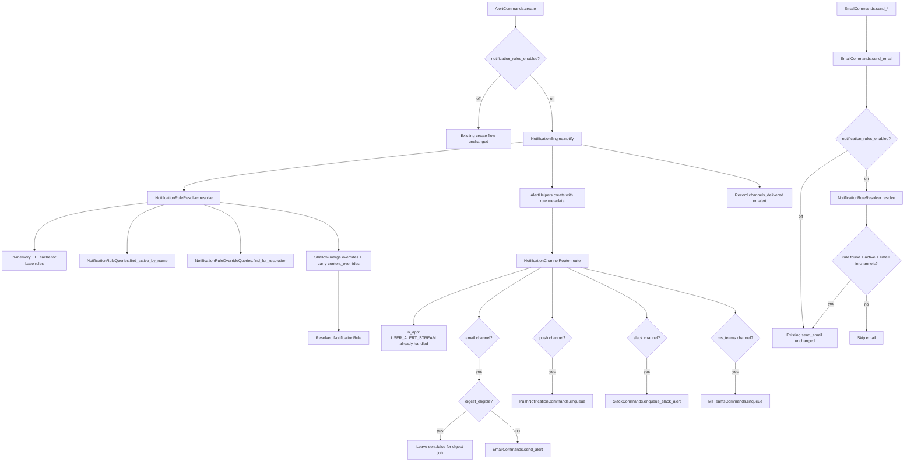

# Phase 2: NotificationEngine -- Rules-First with Feature Flag

## Current Architecture (what we're wrapping)

The existing flow in `AlertCommands.create` does four things sequentially:
1. **Persist** alert to MongoDB via `AlertHelpers.create` -> `Storage::Batch.create_entity`
2. **In-app stream** via `State::Events.add_event(USER_ALERT_STREAM)` (inside AlertHelpers)
3. **Email** -- immediate (`send_immediately`), digest (`group_email` leaves `sent: false`), or skip (`no_email`)
4. **Publish** `AlertPublisher::ALERT_CREATED_EVENT` -> listeners for Push, Slack, MS Teams

Direct emails (password reset, welcome, pitch, etc.) go through a separate path: `EmailCommands.send_*` -> `EmailCommands.send_email` -> enqueue mail job. They do NOT create alert documents.

Phase 2 wraps both flows behind a feature flag. When enabled:
- `NotificationEngine.notify` handles alert-based notifications (resolves rule, enriches alert, routes channels)
- `EmailCommands.send_email` checks rules for direct email types (gating only, no document creation)

When the flag is on, the rules path is authoritative -- there is no fallback to legacy code.

## Architecture



## Key Design Decisions

- **NotificationEngine wraps AlertHelpers, not the other way around.** It calls `AlertHelpers.create` (with enriched attributes including `notification_rule_name`) for persistence + in-app stream, then runs `NotificationChannelRouter` for email/push/slack/teams. It does NOT call `AlertPublisher.publish` -- the router replaces the event-based dispatch for flagged-on traffic.
- **Feature flag:** `Hspt::Features::Manager.enabled_for_domain?(domain_id, "notification_rules_enabled")` -- domain-level on/off.
- **No legacy fallback when flag is on:** When the flag is enabled, the rules path is authoritative. If a rule is not found for a kind, the engine logs a warning and skips the notification entirely (no channel dispatch). This ensures all alert kinds are seeded before the flag is turned on for a domain.
- **Backward compatibility:** The Alert document gets new optional fields (`notification_rule_name`, `notification_priority`, `channels_delivered`) but all existing queries/indexes continue to work. Legacy `level`/`urgent` are still set from ALERT_CONFIG as before.
- **Content overrides passthrough:** The `NotificationRule` entity gets an `attr_accessor :resolved_content_overrides` field. The resolver populates it during override merge. Phase 2 does not read it, but Phases 7 and 9 will use it for content override rendering without re-querying.
- **Direct emails use rule gating only (no NotificationEngine).** Direct emails don't create documents and are email-only. Phase 2 adds a rule check shim at the top of `EmailCommands.send_email`. This is intentionally temporary -- Phase 10 migrates direct emails through `NotificationEngine.notify` for universal notification records.

---

## Files to Create

### 1. `web/common/notifications/notification_rule_resolver.rb`

Resolves the effective rule for a given kind + scope:

```ruby
class NotificationRuleResolver
  CACHE_TTL = 300  # 5 minutes

  # Returns a merged NotificationRule or nil if not found
  def self.resolve(kind, domain_id, user_id = nil)
    rule = find_cached_rule(kind.to_s)
    return nil if rule.nil?

    overrides = NotificationRuleOverrideQueries.find_for_resolution(
      kind.to_s, domain_id: domain_id, user_id: user_id
    )
    return rule if overrides.empty?

    merge_overrides(rule, overrides, domain_id, user_id)
  end

  # In-memory TTL cache for base rules (avoids MongoDB query per notification).
  # Legacy ALERT_CONFIG is an in-memory constant; this keeps parity.
  def self.find_cached_rule(name)
    @rule_cache ||= {}
    entry = @rule_cache[name]
    if entry && (Time.now.utc - entry[:fetched_at]) < CACHE_TTL
      return entry[:rule]
    end
    rule = NotificationRuleQueries.find_active_by_name(name)
    @rule_cache[name] = { rule: rule, fetched_at: Time.now.utc }
    rule
  end

  def self.clear_cache!
    @rule_cache = {}
  end
end
```

**Caching:** Base rules are cached in-memory with a 5-minute TTL. This prevents a performance regression vs the in-memory `ALERT_CONFIG` constant. Override queries are NOT cached (they are scope-specific and vary per domain/user). `clear_cache!` is provided for tests and admin invalidation.

Merge logic: sort overrides by specificity (user+domain > domain > user), shallow-merge `delivery_strategy` fields onto the base rule. **Also carries `content_overrides` through** -- the merged override's `content_overrides` hash is attached to the returned rule via `resolved_content_overrides`. Phase 2 does not use this field, but Phase 7 (email content overrides) and Phase 9 (non-email content overrides) will read it without needing to re-query or change the resolver's return type.

### 2. `web/common/notifications/notification_engine.rb`

Single entry point. Orchestrates resolve -> persist -> route:

```ruby
class NotificationEngine
  def self.notify(kind, domain_id, user_id, attributes, opts = {})
    rule = NotificationRuleResolver.resolve(kind, domain_id, user_id)
    if rule.nil?
      EventLogger.warn("NotificationEngine: no rule found for kind=#{kind}, domain=#{domain_id}. Skipping.")
      return :no_rule
    end

    # Enrich alert attributes with rule metadata
    attributes[:notification_rule_name] = rule.name
    attributes[:notification_priority] = rule.priority

    # Persist (handles in-app stream internally)
    alert = create_alert(domain_id, user_id, attributes, opts)

    # Route to channels based on rule; returns list of channels dispatched
    channels_delivered = NotificationChannelRouter.route(alert, rule, opts)

    # Record which channels were actually dispatched (foundation for Phase 10 audit trail)
    record_channels_delivered(alert, channels_delivered)

    alert
  end
end
```

### 3. `web/common/notifications/notification_channel_router.rb`

Reads `rule.delivery_strategy.channels` and dispatches. Returns `channels_delivered` array.

```ruby
class NotificationChannelRouter
  # Returns an array of channel names that were dispatched
  def self.route(alert, rule, opts = {})
    channels = rule.channels
    from_user = resolve_from_user(alert)
    to_user = resolve_to_user(alert)
    delivered = []

    delivered << "in_app"  # always delivered via AlertHelpers.create -> USER_ALERT_STREAM

    if channels.include?("email")
      delivered << "email" if deliver_email(alert, rule, opts)
    end
    if channels.include?("push")
      deliver_push(alert, from_user, to_user)
      delivered << "push"
    end
    if channels.include?("slack")
      deliver_slack(alert, from_user, to_user)
      delivered << "slack"
    end
    if channels.include?("ms_teams")
      deliver_ms_teams(alert, from_user, to_user)
      delivered << "ms_teams"
    end

    delivered
  end
end
```

`deliver_email` returns `true` for immediate sends, `false` for digest-deferred (since the digest job handles actual delivery later). This distinction matters for `channels_delivered` accuracy.

Push/Slack/Teams dispatch calls the existing enqueue methods directly (same as current listeners do), bypassing `AlertPublisher`.

#### Digest Email Routing (cross-rule check)

There are **two separate rules** that interact when deciding how to send an email for an alert:

1. **Per-kind rule** (e.g., `"item_expiring"`, `"share_item"`) -- one per alert kind. Its `delivery_strategy.channels` array includes `"email"` to indicate the kind can send email. But it does NOT say whether that email should be immediate or batched into a digest.

2. **Digest rule** (name: `"digest"`, type: `"digest"`) -- a single global rule that controls which kinds are eligible for digest batching. It has a top-level field `eligible_alert_kinds` containing an array of kind names. This is the rules-based replacement for the legacy `group_email: true` option.

Here is what the seeded digest rule looks like (from the Phase 1 migration):

```json
{
  "name": "digest",
  "type": "digest",
  "category": "digest",
  "status": "active",
  "delivery_strategy": {
    "channels": ["email"],
    "priority": "informational",
    "batching": {
      "aggregation_type": "time_based",
      "time_window": "1d",
      "min_count": 1
    },
    "email": {
      "renderer": "semantic",
      "builder": "digest"
    }
  },
  "eligible_alert_kinds": [
    "item_expiring", "item_expired", "pitch_expired",
    "digital_room_expired", "item_auto_update", ...
  ]
}
```

The `eligible_alert_kinds` list is at the **top level** of the rule document (not nested under `delivery_strategy.batching`) because it is conceptually a property of the digest rule itself (which alert kinds it consumes), not of the batching config (which describes time/count windows). It is populated during seeding from all legacy `ALERT_CONFIG` entries that have `group_email: true` (and NOT `send_immediately: true`).

`NotificationRule` exposes this via `attr_accessor :eligible_alert_kinds`, so callers use `rule.eligible_alert_kinds` rather than digging into the document.

**Why two rules?** In the legacy system, each alert kind has a `group_email: true` flag baked into `ALERT_CONFIG`. With rules, we chose NOT to put a "batch me" flag on every per-kind rule. Instead, a single digest rule owns the list of eligible kinds. This keeps per-kind rules simple and makes it easy to add/remove kinds from the digest in one place.

**How the router decides (immediate vs digest):**

When `NotificationChannelRouter` routes an alert that has `"email"` in its channels:

1. Load the digest rule (by name `"digest"`)
2. Check if the alert's kind is in the digest rule's `eligible_alert_kinds`
3. If yes: **skip immediate email** -- the alert is persisted with `sent: false` (the default), and the existing `send_alerts_job` batch job will pick it up later and send the digest email
4. If no: **send immediate email** via `EmailCommands.send_alert`

```ruby
def self.deliver_email(alert, rule, opts)
  if digest_eligible?(alert.kind)
    # Alert persisted with sent: false (default).
    # The existing send_alerts_job will pick it up and batch into a digest email.
    return false
  end

  # Not digest-eligible -- send immediately
  EmailCommands.send_alert(to_user, from_users, alert)
  true
end

def self.digest_eligible?(kind)
  digest_rule = NotificationRuleResolver.find_cached_rule("digest")
  if digest_rule.nil?
    EventLogger.warn("NotificationChannelRouter: digest rule not found, sending immediate email")
    return false
  end

  eligible = digest_rule.eligible_alert_kinds || []
  eligible.include?(kind.to_s)
end
```

**What stays the same:** `send_alerts_job.rb` (the digest batch job) is NOT changed. It continues to query `AlertQueries.for_unsent`, group by user/day, and call `EmailCommands.send_alerts`. The only thing that changes: the **routing decision** about whether to suppress immediate email moves from the legacy `group_email` option to the digest rule's `eligible_alert_kinds` list.

### 4. `web/common/notifications/notification_content_registry.rb`

Unified lookup merging alert and direct builders:

```ruby
class NotificationContentRegistry
  def self.builder_for(rule_name)
    SemanticEmailRegistry::ALERT_BUILDERS[rule_name.to_sym] ||
      SemanticEmailRegistry::DIRECT_BUILDERS[rule_name.to_sym]
  end

  def self.supports?(rule_name)
    !builder_for(rule_name).nil?
  end
end
```

Thin wrapper over existing registries. Not heavily used in Phase 2 (email rendering paths remain unchanged), but provides the unified lookup for future phases.

---

## Files to Modify

### 5. `web/common/models/commands/alerts/alert_commands.rb`

Wrap `self.create` with the feature flag check. When flag is on, delegate entirely to `NotificationEngine.notify` and return early -- no fallback to legacy. When flag is off, run legacy path unchanged.

```ruby
def self.create(domain_id, user_id, attributes, ts)
  attributes = attributes.dup
  attributes[:domain_id] = domain_id
  attributes[:user_id] = Plucky.to_object_id(user_id)
  attributes[:created_at] = ts
  attributes[:updated_at] = ts

  if Hspt::Features::Manager.enabled_for_domain?(domain_id, "notification_rules_enabled")
    return NotificationEngine.notify(
      attributes[:kind], domain_id, user_id, attributes,
      skip_toast: should_skip_toast?(...)
    )
  end

  # Legacy path (flag off only)
  # ... existing code unchanged ...
end
```

### 6. `web/common/models/entities/alert.rb`

Add `attr_accessor` for new fields:

```ruby
attr_accessor :notification_rule_name
attr_accessor :notification_priority
attr_accessor :channels_delivered
```

`channels_delivered` is an array of channel name strings (e.g., `["in_app", "email", "push"]`) recording which channels were dispatched. Written after routing completes. Foundation for Phase 10 universal notification records and audit trail.

### 7. `web/common/models/commands/alerts/alert_helpers.rb`

No changes needed -- `AlertHelpers.create` already handles arbitrary attributes passed through, and the new fields will be persisted as-is.

### 8. `web/common/email/email_commands.rb` -- Combined rule gating + MJML rendering decision

The rule check and MJML rendering decision are **combined into a single decision point**. When the rule check returns `:semantic`, the email is both allowed to send AND will be rendered with MJML. There is no separate `SemanticEmailCommands.enabled?` check downstream -- the rule decision drives both gating and rendering.

#### `check_notification_rule(type, to, from, data)` -- 3-state result

Returns one of three symbols:

- **`:legacy`** -- email proceeds with legacy (Velocity) rendering. Returned when:
  - Type is alert-based (`:alert`, `:alerts`, `:semantic_email`) -- already gated upstream by `NotificationEngine` via `AlertCommands.create`
  - FF (`SemanticEmailCommands.enabled?`) is off for this user/domain
  - Cannot resolve a domain context (no `to_user`, `from`, or `data[:domain_id]`)
- **`:semantic`** -- email proceeds with MJML rendering. Returned when:
  - FF is on, rule exists, status is `active`, and `channels` includes `"email"`
- **`:blocked`** -- email is NOT sent. Returned when:
  - FF is on but rule not found for this type
  - FF is on but rule is `inactive`
  - FF is on but rule does not include `"email"` in `channels`

Each outcome emits a granular `G.stats` metric: `notification_rules.email.{skipped|blocked|allowed}.{reason}` with tags `type:`, `domain:`, `rule:`.

#### `send_email` integration

```ruby
def self.send_email(type, to, from, data = {}, referenced = {}, opts = {})
  if !G.email_notify_enabled
    return if !SETTINGS[type][:account]
  end

  # Single decision point: rule gating + rendering choice
  rule_result = check_notification_rule(type, to, from, data)
  return if rule_result == :blocked
  use_semantic = (rule_result == :semantic)

  # ... build email data (tracking, brand, recipient resolution) ...

  # Use semantic rendering only if rule check explicitly chose it
  if use_semantic && type != :semantic_email && type != :alert && type != :alerts
    type = :semantic_email if SemanticEmailCommands.build_semantic_data!(type, data, brand_domain, tracking_tag)
  end

  # ... rest of send_email unchanged ...
end
```

#### `send_alert` and `send_alerts` -- routing entry points (FF + rule existence)

`EmailCommands.send_alert` and `EmailCommands.send_alerts` are routing entry points for the **paths that don't go through `AlertCommands.create`**:

- `send_alert` is called directly by `submitted_lesson_actions.rb` and `expired_pitch.rb` (bypass `AlertCommands.create`).
- `send_alerts` is called by `SendAlertsJob` (the digest cron).

For these paths, there is no upstream rule check, so the routing decision at the top of these methods governs whether to use semantic (MJML) or legacy (Velocity) rendering.

**Semantic rendering requires both FF on AND rule existence.** A rule must exist (active + email channel) for the kind / "digest" before semantic rendering is used. If FF is on but no rule exists, fall back to legacy rendering rather than blocking the email -- the alert is already created and needs to be sent.

The other entry to `send_alert` -- via `AlertCommands.create` (FF on) -> `NotificationEngine` -> `NotificationChannelRouter` -- bypasses `EmailCommands.send_alert` entirely by calling `SemanticEmailCommands.send_alert` directly (rule was already verified upstream).

```ruby
# Sends a single immediate alert email. Routing entry point for callers that
# bypass AlertCommands.create (e.g., submitted_lesson_actions, expired_pitch).
def self.send_alert(to, cc, alert, options = {})
  to_user = get_to_user(to)
  if SemanticEmailCommands.enabled?(alert: alert, to_user: to_user, to_recipients: to) &&
     rule_allows_email?(alert.kind, alert.domain_id, to_user&.id)
    return SemanticEmailCommands.send_alert(to, cc, alert, options)
  end
  # ... legacy Velocity rendering ...
end

# Sends a digest email batching multiple alerts. Routing entry point for SendAlertsJob.
# Digest eligibility is decided earlier by NotificationChannelRouter.digest_eligible?.
def self.send_alerts(to, alerts, time_period)
  to_user = get_to_user(to)
  if SemanticEmailCommands.enabled?(to_user: to_user, kind_or_type: :digest) &&
     rule_allows_email?("digest", to_user&.domain_id, to_user&.id)
    return SemanticEmailCommands.send_alerts(to, alerts, time_period)
  end
  # ... legacy Velocity rendering ...
end

# Helper: returns true if the named rule exists, is active, and has "email" channel.
def self.rule_allows_email?(rule_name, domain_id, user_id)
  return false if domain_id.nil? || rule_name.nil?
  rule = NotificationRuleResolver.resolve(rule_name.to_s, domain_id, user_id)
  rule && rule.status == "active" && rule.channels.include?("email")
end
```

**Key principle:** Semantic rendering requires a rule to exist. Across all paths (`check_notification_rule` for direct emails, `rule_allows_email?` for alerts/digests), the existence + active status + email channel of the rule is the gating criterion for using semantic rendering. The difference is in fallback behavior:

- **Direct emails (`check_notification_rule`)**: FF on + missing/inactive rule -> **block** the email (the email itself is opt-in to rules, no upstream alert was created).
- **Alerts/digests (`rule_allows_email?`)**: FF on + missing/inactive rule -> **fall back to legacy rendering** (alert was already created, must be delivered).

#### Routing summary

| Path | FF State | Rule | Entry Point | Result |
|------|----------|------|-------------|--------|
| **Immediate alert (via AlertCommands)** | ON | active + email | `AlertCommands.create` -> `NotificationEngine` -> `Router` -> `SemanticEmailCommands.send_alert` | MJML |
| **Immediate alert (via AlertCommands)** | ON | missing/inactive | `NotificationEngine` -> blocked (no legacy fallback) | Not sent |
| **Immediate alert (via AlertCommands)** | OFF | -- | `AlertCommands.create` -> legacy `AlertHelpers` -> `EmailCommands.send_alert` -> legacy | Velocity |
| **Immediate alert (direct caller, e.g. submitted_lesson)** | ON | active + email | `EmailCommands.send_alert` -> FF check + `rule_allows_email?` -> `SemanticEmailCommands.send_alert` | MJML |
| **Immediate alert (direct caller)** | ON | missing/inactive | `EmailCommands.send_alert` -> legacy fallback | Velocity |
| **Immediate alert (direct caller)** | OFF | -- | `EmailCommands.send_alert` -> legacy | Velocity |
| **Digest** | ON | digest rule active + email | `SendAlertsJob` -> `EmailCommands.send_alerts` -> FF + `rule_allows_email?("digest")` -> `SemanticEmailCommands.send_alerts` | MJML |
| **Digest** | ON | digest rule missing/inactive | `EmailCommands.send_alerts` -> legacy fallback | Velocity |
| **Digest** | OFF | -- | `EmailCommands.send_alerts` -> legacy | Velocity |
| **Digest eligibility (kinds batched vs immediate)** | ON | -- | `NotificationChannelRouter.digest_eligible?` consults `digest` rule's `eligible_alert_kinds` | -- |
| **Direct email (rule allows)** | ON | active + email | `EmailCommands.send_email` -> `check_notification_rule == :semantic` -> `build_semantic_data!` | MJML |
| **Direct email (rule blocks)** | ON | missing/inactive/no email | `EmailCommands.send_email` -> `check_notification_rule == :blocked` -> early return | Not sent |
| **Direct email** | OFF | -- | `EmailCommands.send_email` -> `check_notification_rule == :legacy` | Velocity |

#### Behavior guarantees

- **FF off:** Complete pass-through. Email always sends. Velocity rendering. Zero behavior change vs. pre-Phase-2.
- **FF on + rule found + active + email channel:** Email sends with MJML rendering. No legacy fallback.
- **FF on + rule blocks:** Email is suppressed. No legacy fallback.
- **FF on + no domain context:** Email sends with Velocity rendering (graceful degradation; warning metric emitted).
- **Account-critical types** (e.g., `password_recovery`, `welcome`): Currently still flow through the same path; account-critical bypass guard is being re-evaluated -- see TODO below.

> **TODO (Phase 2 follow-up):** Re-introduce explicit bypass for `SETTINGS[type][:account]` types so that critical transactional emails (password recovery, welcome) are never blocked even if a rule is misconfigured.

#### Why this design

Combining rule check + rendering choice into a single decision (`check_notification_rule`) eliminates the redundant `SemanticEmailCommands.enabled?` check that previously appeared at multiple points in `send_email`, `send_alert`, and `send_alerts`. There is now exactly one place where "should this email send AND how should it render" is decided per call, and the rules path implies semantic rendering by definition.

**This is intentionally temporary.** In Phase 10, direct emails will be routed through `NotificationEngine.notify` so that every email creates a notification record in MongoDB. The rule gating shim in `EmailCommands.send_email` will be removed at that point.

---

## Honoring Existing Notification Settings in the Rules Path

The legacy alert-sending path (`Notifications.notify` -> `AlertCommands.create_*`) consults exactly two layers: the merged `domain.default_notifications` + `user.settings["notifications"]` per-kind toggle, and the per-channel preferences on `User`. Phase 2 wires both into the rules engine at the appropriate seam without introducing a third gate.

### Legacy opt-out layers (verified by source inspection)

| Scope | Mechanism | Where read |
|-------|-----------|------------|
| Global / system | `G.email_notify_enabled` (env kill switch) | `EmailCommands.send_email` |
| Global / system | `Notifications.with_disabled { ... }` thread-local (`nutella_notification`) | Top of `Notifications.notify` (`return [] if Thread.current[NOTIFICATION_DISABLED_KEY] > 0`) |
| Domain (admin) | `domain.default_user_settings["notifications"][<key>]` | Merged into every user via `domain.default_notifications` -> `user.get_notification_settings` |
| User (per-kind) | `user.settings["notifications"][<key>]` | `user.get_notification_setting(name)` (overlays domain default) |
| User (digest cadence) | `user.settings["notifications"]["summary"]` (`DIGEST_NEVER` / `DIGEST_WEEKLY` / ...) | `digest_send_scheduled_job`, router |
| User (per-channel) | `push_notifications`, `User::OAUTH_TYPE_SLACK`, `User::OAUTH_TYPE_MS_TEAMS` | `User#push_notifications_enabled?`, `slack_notifications_enabled?`, `ms_teams_notifications_enabled?` |
| External recipient (pitch only) | `ExternalContact.unsubscribed`, SFDC/Dynamics opt-out | `bulk_pitch/email_recipient_source` (out of scope for alert engine) |

> **Note on `NotificationsConfig` (the `notification_config` Mongo collection):** Inspection of all callers (`alert_commands.rb`, `user.rb`, `notifications_config_helpers.rb`, `chameleon_sync_job`, `update_notifications_config_job`) shows `NotificationsConfig::Type::*` is used to gate **UI rendering** (insights config sections), **Chameleon SDK** provisioning, **settings-page banners**, and **migration jobs** -- not alert sending. No legacy alert path consults it. The rules engine therefore does **not** consult it either; admins disable per-kind notifications via `domain.default_user_settings["notifications"]` like they always have.

### Placement decision

Per-kind eligibility lives in **`NotificationRuleResolver`**, per-channel preferences live in **`NotificationChannelRouter`**. We do not introduce a third gate.

| Setting | Goes in | Why |
|---------|---------|-----|
| Per-kind merged `domain.default_notifications` + `user.settings["notifications"]` (`follows`, `reviews`, `respots`, `copies`, `added_version`) | Resolver (`user_opted_in_to_kind?`) | If the user (or company default) has opted out of the kind, no rule applies -- `resolve` returns `nil` and the engine blocks |
| Per-channel `user.settings["notifications"]` (`push_notifications`, slack, ms_teams) | Router (`deliver_push/slack/ms_teams`) | Channel preference, not eligibility -- already honored via `User#*_notifications_enabled?` |
| `summary` setting (`DIGEST_NEVER` / `DIGEST_WEEKLY` / ...) | Router (`digest_eligible?`) | Cadence preference; falls through to immediate semantic email when `DIGEST_NEVER` so the alert is delivered, not dropped |

### Resolver: eligibility gate

`NotificationRuleResolver.resolve(kind, domain_id, user_id)` performs:

1. Rule lookup (`find_cached_rule(kind)`) -- unchanged.
2. **User per-kind gate** -- `user_opted_in_to_kind?(rule_name, user_id)`:
   - Maps rule name to setting key via `USER_SETTING_BY_RULE`.
   - Reads `user.get_notification_setting(key)`. That value already merges `User::NOTIFICATION_DEFAULTS` + `domain.default_user_settings.notifications` + `user.settings.notifications`, so this single call covers both the **company-wide admin default** and the **user override** -- exactly mirroring `Notifications.notify` line 1235 (`user.get_notification_setting(setting) && ...`).
   - Returns `false` only when the merged value is explicitly `false`; `nil` (unset) is treated as opt-in (matches legacy truthy check).
   - Fails open on exceptions (logs via `EventLogger.error`).
3. Override merge (`merge_overrides`) -- unchanged.

Mapping table:

```ruby
USER_SETTING_BY_RULE = {
  "review"         => "reviews",
  "respot_spot"    => "respots",
  "respot"         => "respots",
  "copy"           => "copies",
  "following_spot" => "follows",
  "following_you"  => "follows",
  "added_version"  => "added_version"
}.freeze
```

Each entry is verified against legacy `Notifications.notify("<setting>", ...)` callsites:

| Legacy call | Alert kind produced | Setting key |
|-------------|---------------------|-------------|
| `notify("reviews", ...) { create_review }` | `:review` | `reviews` |
| `notify("respots", ...) { create_respot_spot }` | `:respot_spot` | `respots` |
| `notify("respots", ...) { create_respot }` | `:respot` | `respots` |
| `notify("copies", ...) { create_copy }` | `:copy` | `copies` |
| `notify("follows", ...) { create_following_spot }` | `:following_spot` | `follows` |
| `notify("follows", ...) { create_following_you }` | `:following_you` | `follows` |
| `notify("added_version", ...) { create_added_version }` | `:added_version` | `added_version` |

Rules without an entry skip the gate (fall-through), matching legacy alert paths that don't consult `Notifications.notify` (e.g. system alerts, share notifications). Adding a new per-kind-toggleable rule is a one-line addition.

> **Deliberately omitted from the map (and why):**
> - `assessment_notification_of_yours` / `assessment_notification_of_your_direct_reports` -- legacy gates these as **inline `user.settings.dig("notifications", key) != false` checks** that guard *multiple distinct alert kinds* (e.g. `assessment_submitted_for_assessment_of_user`, `assessment_submitted_for_meeting`, `customer_assessment_submitted_for_assessment_of_user`, `self_assessment_submitted_for_direct_manager`, ...). A 1:1 rule->setting mapping isn't possible until those kinds are seeded as rules and the inline guards are migrated -- defer to the phase that introduces those rules.
> - `added_to_group` -- present in `User::NOTIFICATION_DEFAULTS` but **no legacy alert-sending code reads it**. Vestigial; do not introduce a new gate that legacy doesn't enforce.
> - `solution_insights`, `training_insights`, `spot_insights`, `inapp_notifications`, `insights_email_notifications`, `reminder_notifications`, `cs_access_expiry` -- these are `NotificationsConfig::Type::*` categories used for company-settings UI / Chameleon / banners, not alert kinds (see note above).

### Router: channel preferences

| Channel | Helper used by router |
|---------|----------------------|
| Push | `to_user.push_notifications_enabled?` |
| Slack | `to_user.slack_notifications_enabled?` |
| MS Teams | `to_user.ms_teams_notifications_enabled?` |
| Email (digest) | `to_user.get_notification_setting("summary") != User::DIGEST_NEVER` |

`digest_eligible?(kind, to_user)` accepts the recipient and returns `false` when `summary == DIGEST_NEVER` so the email falls through to immediate semantic delivery instead of being queued for a digest the user does not want.

### Behavior matrix

| Layer says | Phase 2 outcome | Reason |
|-----------|-----------------|--------|
| `domain.default_user_settings.notifications.follows = false` and user has no override | Resolver returns `nil` -> Engine blocks | Company-wide admin opt-out, merged into `get_notification_setting` |
| `user.settings.notifications.follows = false` | Resolver returns `nil` -> Engine blocks | User opted out |
| Setting is `nil` / unset | Resolver passes (default-on) | Matches legacy truthy check |
| User has `summary = "never"` and kind is digest-eligible | Router routes immediate semantic email | User wants alerts but not digests |
| User has `User::OAUTH_TYPE_SLACK = false` (default) | Router skips Slack channel only | Channel preference; other channels still deliver |

### Why fail-open on exceptions

A bug in settings retrieval should not silently drop notifications. The helper `rescue StandardError`s and returns `true` (allow), with `EventLogger.error` so we can detect issues without losing alerts.

### Out of scope for Phase 2 (deferred)

- **`Notifications.with_disabled` thread-local kill switch** -- not currently honored at `NotificationEngine.notify` entry. Worth noting; defer to a follow-up so bulk-import / migration code paths that rely on it continue to work transparently.
- **Assessment kind gates** -- migrate when those kinds are seeded as rules.
- **External pitch unsubscribe** -- pitch-specific, separate path.

### Specs added

- `notification_rule_resolver_spec.rb` -- contexts for: user opt-out blocks, user opt-in passes, unmapped rule skips user gate, `.user_opted_in_to_kind?` describe block (mapping coverage, nil inputs, nil setting value, missing user, exception handling).
- `notification_channel_router_spec.rb` -- contexts for `digest_eligible?(kind, to_user)`: `summary == DIGEST_NEVER` returns false, `summary == DIGEST_WEEKLY` returns true.

---

## Final State - Rule Checks and Rendering Decisions (Verified)

End-to-end summary of where each notification path makes its routing decisions, after all Phase 2 changes. Use this as the single reference for "where does the rule check happen" and "when does MJML vs Velocity render".

### Path 1: Immediate alert via `AlertCommands.create` (production hot path)

**File:** `alert_commands.rb` (`self.create`)

```
AlertCommands.create
├─ FF check: SemanticEmailCommands.enabled?(to_user, kind_or_type: kind)
│
├─ FF ON  -> NotificationEngine.notify(kind, ...)
│   ├─ Rule check: NotificationRuleResolver.resolve(kind, domain, user)
│   ├─ No rule    -> :no_rule (alert NOT created, NOT sent)  [BLOCKED]
│   └─ Rule found -> create alert + Router.route(alert, rule)
│       ├─ Email channel?
│       │   ├─ digest_eligible?(kind) via digest rule's eligible_alert_kinds
│       │   │   ├─ YES -> leave alert with sent:false (digest job picks up)
│       │   │   └─ NO  -> SemanticEmailCommands.send_alert (MJML)
│       └─ push / slack / ms_teams (per channel from rule.channels)
│
└─ FF OFF -> legacy AlertHelpers.create
    └─ ALERT_CONFIG flags drive immediate vs digest, EmailCommands.send_alert (Velocity)
```

### Path 2: Immediate alert via direct caller (`submitted_lesson_actions`, `expired_pitch`)

**File:** `email_commands.rb` (`self.send_alert`)

```
EmailCommands.send_alert(to, cc, alert, options)
├─ FF: SemanticEmailCommands.enabled?(alert, to_user, to_recipients) AND
├─ Rule: rule_allows_email?(alert.kind, alert.domain_id, to_user&.id)
│
├─ Both pass    -> SemanticEmailCommands.send_alert (MJML)
└─ Either fails -> legacy Velocity rendering (continues to send_email(:alert, ...))
```

### Path 3: Digest emails via `SendAlertsJob` cron

**File:** `email_commands.rb` (`self.send_alerts`)

```
SendAlertsJob -> AlertQueries.for_unsent -> group by user/day
└─ EmailCommands.send_alerts(user, grouped_alerts, time_period)
    ├─ FF: SemanticEmailCommands.enabled?(to_user, kind_or_type: :digest) AND
    ├─ Rule: rule_allows_email?("digest", to_user&.domain_id, to_user&.id)
    │
    ├─ Both pass    -> SemanticEmailCommands.send_alerts (MJML digest)
    └─ Either fails -> legacy Velocity digest rendering
```

### Path 4: Direct emails via `EmailCommands.send_email`

**File:** `email_commands.rb` (`self.send_email`, `self.check_notification_rule`)

```
EmailCommands.send_email(type, to, from, data, ...)
├─ G.email_notify_enabled check
├─ check_notification_rule(type, to, from, data) returns:
│   ├─ :legacy   -> continue with Velocity rendering
│   │              (alert types, FF off, or no domain context)
│   ├─ :semantic -> use_semantic = true -> SemanticEmailCommands.build_semantic_data! (MJML)
│   │              (rule exists + active + email channel)
│   └─ :blocked  -> early return (email NOT sent)
│                  (rule missing/inactive/no email channel)
```

### Consistent Rule-Existence Principle

| Path | Rule Check Helper | FF on + missing rule |
|------|-------------------|----------------------|
| `AlertCommands.create` (rules path) | `NotificationEngine.notify` (`NotificationRuleResolver.resolve`) | **Block** (no alert, no email) |
| `EmailCommands.send_alert` (direct callers) | `rule_allows_email?(alert.kind, ...)` | Fallback to Velocity (alert exists) |
| `EmailCommands.send_alerts` (digest cron) | `rule_allows_email?("digest", ...)` | Fallback to Velocity (alert exists) |
| `EmailCommands.send_email` (direct emails) | `check_notification_rule` (`:blocked`) | **Block** (email is opt-in) |

### Two-Rule Digest Routing

| Rule | Used By | Decides |
|------|---------|---------|
| **Per-kind rule** (e.g. `share_item`) | `Router.route` | Whether email is allowed (`channels` includes `"email"`) |
| **Digest rule** (`name: "digest"`) | `Router.digest_eligible?` | Which kinds go into the digest queue (`eligible_alert_kinds` top-level field) |

### MJML rendering preconditions (consistent across all paths)

For semantic (MJML) rendering, ALL of these must be true:

1. `mjml_email_templates` FF enabled for the user/domain
2. Builder exists (`SemanticAlertRenderer` for alerts, `SemanticEmailBuilderRegistry` for direct types)
3. **A `NotificationRule` exists, is `active`, and has `"email"` in its `delivery_strategy.channels`**

### No redundant checks

- `AlertCommands.create` (rules path) -> `NotificationEngine` -> `Router` -> `SemanticEmailCommands.send_alert` (no FF/rule re-check)
- `EmailCommands.send_email` -> single `check_notification_rule` decides both gating + rendering
- `EmailCommands.send_alert`/`send_alerts` -> single combined FF + rule check at entry, then commits to one rendering path

### Phase 2 goal coverage

- Rules engine honors all notifications (immediate alerts, digests, direct emails) ✅
- "If rule is off -> don't go to semantic" (rule existence required for MJML) ✅
- "If rule is on -> honor channel routing" (rule's `channels` list controls routing) ✅
- "No legacy fallback when FF on" (for `AlertCommands.create` and direct emails) ✅
- Graceful fallback for paths where alerts are already created (`send_alert`/`send_alerts` direct callers + digest cron) ✅

---

## Spec Files to Create

- `web/spec/unit/common/notifications/notification_rule_resolver_spec.rb` -- test resolve with no rule, base rule only, domain override, user override, user+domain override merge, caching, content_overrides passthrough
- `web/spec/unit/common/notifications/notification_engine_spec.rb` -- test notify enriches attributes, calls router, records channels_delivered, returns :no_rule when rule not found
- `web/spec/unit/common/notifications/notification_channel_router_spec.rb` -- test each channel dispatch, digest_eligible? cross-rule check, channels_delivered return value
- `web/spec/unit/common/notifications/notification_content_registry_spec.rb` -- test builder lookup delegation
- `web/spec/unit/common/models/commands/alerts/alert_commands_notification_engine_spec.rb` -- test feature flag gating in create
- `web/spec/unit/common/email/email_commands_notification_rules_spec.rb` -- test direct email rule gating, account-critical bypass, flag-off passthrough

## CODEOWNERS

Add all new files under `@highspot/app-platform`.

---

## Future Phase Considerations

Phase 2 lays foundation for later-phase capabilities so they don't require reworking Phase 2 code:

### 1. Universal notification records (Phase 10)

**Phase 2 foundation:** `channels_delivered` tracking on every alert document. Direct email rule gating shim in `EmailCommands.send_email`.

**How this evolves:** Direct email call sites migrate from `EmailCommands.send_*` to `NotificationEngine.notify`, creating a notification document before dispatch. The Phase 2 rule gating shim is removed.

### 2. Content overrides (Phases 7, 9)

**Phase 2 foundation:** `resolved_content_overrides` accessor on `NotificationRule` entity, populated by the resolver during override merge. Phase 2 does not read it.

**How this evolves:** Phase 7 reads `rule.resolved_content_overrides` to merge email text overrides. Phase 9 extends to non-email channels. No resolver API changes needed.

### 3. Configurable batching windows (Phase 8)

**Phase 2 foundation:** Router's `digest_eligible?` check decides WHETHER to batch. The `delivery_strategy.batching` schema has room for `aggregation_window`.

**How this evolves:** Phase 8 adds `aggregation_window` to the digest rule and updates `send_alerts_job` to respect it. The router's digest check is unchanged.

### 4. Performance at scale (Phase 11)

**Phase 2 foundation:** In-memory TTL cache (5 min) in the resolver for base rule lookups, matching the performance profile of the in-memory `ALERT_CONFIG` constant it replaces.

**How this evolves:** Phase 11 can swap in Redis or tiered caching without changing the resolver's public API.

---

## Risks and Mitigations

- **Risk:** An unseeded kind is encountered when the flag is on -- notification is silently dropped. **Mitigation:** Engine logs a warning for missing rules. All kinds must be seeded (Phase 1) before the flag is enabled for any domain. Add a pre-flight check or dashboard to verify seeding completeness.
- **Risk:** Email sent twice (once by engine, once by legacy path). **Mitigation:** When flag is on, `AlertCommands.create` returns immediately after the engine call -- legacy email/publish code is never reached.
- **Risk:** Digest behavior breaks. **Mitigation:** Router checks the digest rule's `eligible_alert_kinds` to decide immediate vs. digest. If the digest rule is missing, the router logs a warning and sends immediate email (safe default for the user, but ensures no silent drop).
- **Risk:** Direct email suppression for account-critical types. **Mitigation:** `SETTINGS[type][:account]` types (password recovery, welcome, new_user) bypass rule gating entirely, same as the existing `G.email_notify_enabled` bypass pattern.
- **Risk:** Domain ID resolution for direct emails -- some direct emails sent without a clear `from` user. **Mitigation:** Extract domain_id from `data[:domain_id]` as fallback; if still nil, skip rule check and send (safe default).
