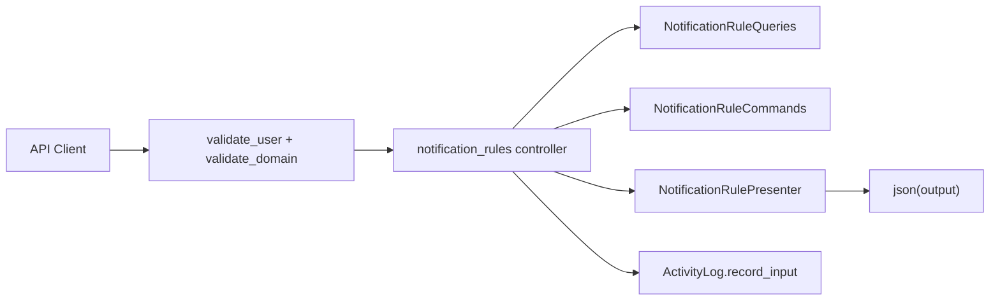

# Phase 3: REST API -- Manage Notification Rules

## Architecture

Follows the established Padrino API patterns in the nutella codebase:
- Controller under `web/api/controllers/` using `Api.controllers :name, provides: :json`
- Routes via `map: "v1/..."` 
- Auth via `validate_user`, `validate_domain(user, :manage)`, `halt 403`
- Responses via Presenter classes with `to_list_output` / `to_detail_output`
- Validation via `parse_json_body` + custom helpers
- Audit via `Logging::ActivityLog.record_input`



## Endpoints

### Notification Rules

| Method | Route | Description | Auth |
|--------|-------|-------------|------|
| `GET` | `v1/notification-rules` | List rules. Filters: `category`, `channel`, `status`, `type`. Pagination: `page`, `per_page`. | `validate_user` |
| `GET` | `v1/notification-rules/:name` | Get a single rule by name | `validate_user` |
| `PUT` | `v1/notification-rules/:name` | Update a rule (partial update of `delivery_strategy`, `status`, `description`) | `validate_domain(user, :manage)` |
| `POST` | `v1/notification-rules` | Create a custom rule (non-seeded) | `validate_domain(user, :manage)` |
| `DELETE` | `v1/notification-rules/:name` | Deactivate a rule (soft delete, sets `status: "inactive"`) | `validate_domain(user, :manage)` |

### Notification Rule Overrides

| Method | Route | Description | Auth |
|--------|-------|-------------|------|
| `GET` | `v1/notification-rules/:name/overrides` | List overrides for a rule | `validate_user` |
| `POST` | `v1/notification-rules/:name/overrides` | Create a domain/user override | `validate_domain(user, :manage)` |
| `PUT` | `v1/notification-rules/:name/overrides/:id` | Update an override | `validate_domain(user, :manage)` |
| `DELETE` | `v1/notification-rules/:name/overrides/:id` | Delete an override | `validate_domain(user, :manage)` |

## Files to Create

### 1. `web/api/controllers/notification_rules.rb`

```ruby
Api.controllers :notification_rules, provides: :json do
  get :index, map: "v1/notification-rules" do
    user = validate_user
    rules = NotificationRuleQueries.all_active
    # filtering
    rules = filter_by_params(rules, params)
    # pagination
    paginated = paginate(rules, params[:page], params[:per_page])
    json({
      "data" => paginated.map { |r| NotificationRulePresenter.new(r).to_list_output },
      "total_count" => rules.count
    })
  end

  get :show, map: "v1/notification-rules/:name" do
    user = validate_user
    rule = NotificationRuleQueries.find_by_name(params[:name])
    halt 404, json({ "error" => "Rule not found" }) if rule.nil?
    json({ "data" => NotificationRulePresenter.new(rule).to_detail_output })
  end

  put :update, map: "v1/notification-rules/:name" do
    user = validate_user
    domain = validate_domain(user, :manage)
    input = parse_json_body
    validate_rule_update_input(input)
    Logging::ActivityLog.record_input(request, input)

    rule = NotificationRuleQueries.find_by_name(params[:name])
    halt 404, json({ "error" => "Rule not found" }) if rule.nil?

    NotificationRuleCommands.update_by_name(params[:name], input)
    NotificationRuleResolver.clear_cache!

    updated = NotificationRuleQueries.find_by_name(params[:name])
    json({ "data" => NotificationRulePresenter.new(updated).to_detail_output })
  end

  post :create, map: "v1/notification-rules" do
    user = validate_user
    domain = validate_domain(user, :manage)
    input = parse_json_body
    validate_rule_create_input(input)
    Logging::ActivityLog.record_input(request, input)

    existing = NotificationRuleQueries.find_by_name(input["name"])
    halt 409, json({ "error" => "Rule already exists" }) if existing

    NotificationRuleCommands.create(input)
    rule = NotificationRuleQueries.find_by_name(input["name"])
    halt 201, json({ "data" => NotificationRulePresenter.new(rule).to_detail_output })
  end

  delete :destroy, map: "v1/notification-rules/:name" do
    user = validate_user
    domain = validate_domain(user, :manage)
    Logging::ActivityLog.record_input(request, { "name" => params[:name], "action" => "deactivate" })

    rule = NotificationRuleQueries.find_by_name(params[:name])
    halt 404, json({ "error" => "Rule not found" }) if rule.nil?

    NotificationRuleCommands.deactivate(params[:name])
    NotificationRuleResolver.clear_cache!
    halt 204
  end

  # --- helpers ---
  def parse_json_body
    JSON.parse(request.body.read)
  rescue JSON::ParserError
    halt 400, json({ "error" => "Invalid JSON body" })
  end

  def validate_rule_update_input(input)
    errors = []
    allowed_keys = %w[delivery_strategy status description]
    unknown = input.keys - allowed_keys
    errors << "Unknown fields: #{unknown.join(', ')}" if unknown.any?
    errors << "status must be 'active' or 'inactive'" if input["status"] && !%w[active inactive].include?(input["status"])
    halt 400, json({ "errors" => errors }) if errors.any?
  end

  def validate_rule_create_input(input)
    errors = []
    errors << "name is required" if input["name"].nil? || input["name"].empty?
    errors << "type is required" if input["type"].nil?
    halt 400, json({ "errors" => errors }) if errors.any?
  end

  def filter_by_params(rules, params)
    rules = rules.select { |r| r.category == params[:category] } if params[:category]
    rules = rules.select { |r| r.channels.include?(params[:channel]) } if params[:channel]
    rules = rules.select { |r| r.status == params[:status] } if params[:status]
    rules = rules.select { |r| r.type == params[:type] } if params[:type]
    rules
  end

  def paginate(items, page, per_page)
    page = (page || 1).to_i
    per_page = (per_page || 50).to_i
    items.drop((page - 1) * per_page).take(per_page)
  end
end
```

### 2. `web/api/controllers/notification_rule_overrides.rb`

```ruby
Api.controllers :notification_rule_overrides, provides: :json do
  get :index, map: "v1/notification-rules/:rule_name/overrides" do
    user = validate_user
    overrides = NotificationRuleOverrideQueries.find_by_rule_name(params[:rule_name])
    json({ "data" => overrides.map { |o| NotificationRuleOverridePresenter.new(o).to_output } })
  end

  post :create, map: "v1/notification-rules/:rule_name/overrides" do
    user = validate_user
    domain = validate_domain(user, :manage)
    input = parse_json_body
    Logging::ActivityLog.record_input(request, input)

    NotificationRuleOverrideCommands.upsert(
      params[:rule_name],
      domain_id: input.dig("scope", "domain_id"),
      user_id: input.dig("scope", "user_id"),
      overrides: input.except("scope"),
      created_by: user.id.to_s
    )
    halt 201, json({ "status" => "created" })
  end

  put :update, map: "v1/notification-rules/:rule_name/overrides/:id" do
    user = validate_user
    domain = validate_domain(user, :manage)
    input = parse_json_body
    Logging::ActivityLog.record_input(request, input)
    # update override by id
    halt 200, json({ "status" => "updated" })
  end

  delete :destroy, map: "v1/notification-rules/:rule_name/overrides/:id" do
    user = validate_user
    domain = validate_domain(user, :manage)
    NotificationRuleOverrideCommands.delete(params[:id])
    halt 204
  end
end
```

### 3. `web/api/presenters/notification_rule_presenter.rb`

```ruby
class NotificationRulePresenter
  def initialize(rule)
    @rule = rule
  end

  def to_list_output
    {
      "name" => @rule.name,
      "type" => @rule.type,
      "status" => @rule.status,
      "category" => @rule.category,
      "channels" => @rule.channels,
      "priority" => @rule.priority,
      "description" => @rule.description,
      "created_at" => @rule.created_at&.iso8601,
      "updated_at" => @rule.updated_at&.iso8601
    }
  end

  def to_detail_output
    to_list_output.merge(
      "version" => @rule.version,
      "trigger" => @rule.trigger,
      "delivery_strategy" => @rule.delivery_strategy,
      "metadata" => @rule.metadata
    )
  end
end
```

### 4. `web/api/presenters/notification_rule_override_presenter.rb`

```ruby
class NotificationRuleOverridePresenter
  def initialize(override)
    @override = override
  end

  def to_output
    {
      "id" => @override.id.to_s,
      "rule_name" => @override.rule_name,
      "scope" => @override.scope,
      "delivery_strategy" => @override.delivery_strategy,
      "content_overrides" => @override.content_overrides,
      "metadata" => @override.metadata
    }
  end
end
```

## Spec Files to Create

- `web/spec/unit/api/controllers/notification_rules_spec.rb` -- test all CRUD endpoints, auth, validation, pagination, filtering
- `web/spec/unit/api/controllers/notification_rule_overrides_spec.rb` -- test override CRUD endpoints
- `web/spec/unit/api/presenters/notification_rule_presenter_spec.rb` -- test list and detail output formats
- `web/spec/unit/api/presenters/notification_rule_override_presenter_spec.rb` -- test output format

## CODEOWNERS

Add all new files under `@highspot/app-platform`.

## Cross-Phase Dependencies

- **Phase 2 (prerequisite):** Resolver's `clear_cache!` is called after mutations to invalidate stale rules.
- **Phase 4 (downstream):** The send endpoint references rule names validated via this API's queries.
- **Phase 5 (independent):** Admin UI (Magma entities page) reads MongoDB directly; does not depend on this API.

## Risks and Mitigations

- **Risk:** Cache invalidation after API mutations -- stale rules served for up to 5 minutes. **Mitigation:** Call `NotificationRuleResolver.clear_cache!` after every create/update/delete. Phase 11 can add more sophisticated invalidation.
- **Risk:** Concurrent updates to the same rule. **Mitigation:** `update_by_name` uses MongoDB `update_one` which is atomic. No optimistic locking in Phase 3 (can add `version` field check in a later phase if needed).
- **Risk:** Unauthorized override creation. **Mitigation:** `validate_domain(user, :manage)` ensures only domain admins can create overrides. Domain scoping enforced at the query level.
