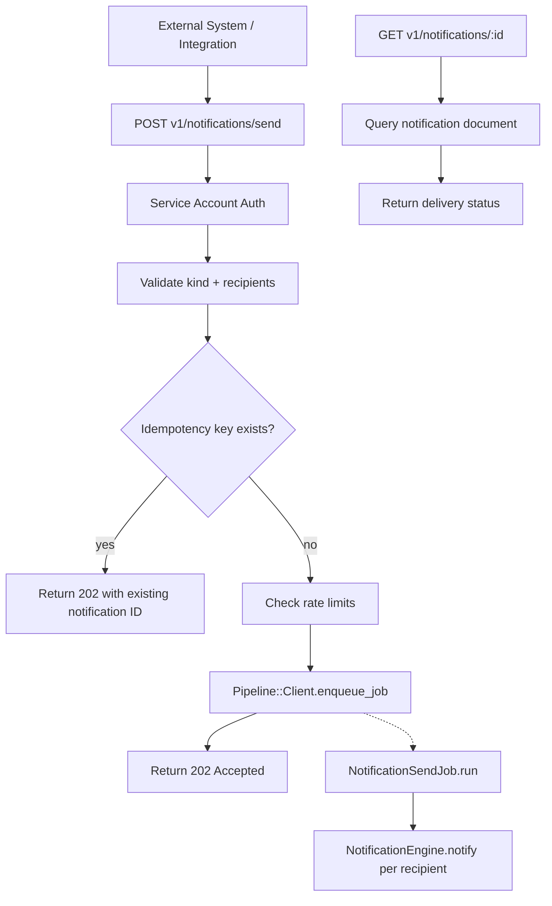

# Phase 4: REST API -- Send Notifications

## Architecture



## Endpoints

| Method | Route | Description | Auth |
|--------|-------|-------------|------|
| `POST` | `v1/notifications/send` | Trigger a notification send | Service account only (S2S) |
| `GET` | `v1/notifications/:id` | Get notification delivery status | Service account only |

### Request Schema (POST)

```json
{
  "kind": "share_item",
  "data": { "item_id": "abc", "spot_id": "xyz" },
  "to": ["user_id_1", "user_id_2"],
  "opts": { "cc": [], "bcc": [] },
  "idempotency_key": "unique-request-id"
}
```

### Response (202 Accepted)

```json
{
  "status": "accepted",
  "notification_ids": ["id_1", "id_2"],
  "idempotency_key": "unique-request-id"
}
```

## Files to Create

### 1. `web/api/controllers/notifications.rb`

```ruby
Api.controllers :notifications, provides: :json do
  post :send, map: "v1/notifications/send" do
    validate_service_account!
    input = parse_json_body
    validate_send_input(input)

    # Idempotency check
    if input["idempotency_key"]
      existing = check_idempotency(input["idempotency_key"])
      if existing
        halt 202, json(existing)
      end
    end

    # Rate limiting
    check_rate_limit!(current_service_identity, input["kind"])

    # Enqueue async processing
    job_id = NotificationApiService.enqueue_send(input, current_service_identity)

    # Store idempotency key
    store_idempotency(input["idempotency_key"], { "status" => "accepted", "job_id" => job_id }) if input["idempotency_key"]

    halt 202, json({ "status" => "accepted", "job_id" => job_id })
  end

  get :status, map: "v1/notifications/:id" do
    validate_service_account!
    # Query alert document by ID
    alert = AlertQueries.find_by_id(params[:id])
    halt 404, json({ "error" => "Notification not found" }) if alert.nil?

    json({
      "id" => alert.id.to_s,
      "kind" => alert.kind,
      "status" => alert.notification_rule_name ? "delivered" : "pending",
      "channels_delivered" => alert.channels_delivered || [],
      "created_at" => alert.created_at&.iso8601
    })
  end

  # --- helpers ---
  def validate_service_account!
    halt 401, json({ "error" => "Unauthorized" }) unless current_service_identity
  end

  def validate_send_input(input)
    errors = []
    errors << "kind is required" if input["kind"].nil?
    errors << "to is required and must be an array" unless input["to"].is_a?(Array) && input["to"].any?
    errors << "to must not exceed 100 recipients" if input["to"]&.length.to_i > 100
    halt 400, json({ "errors" => errors }) if errors.any?

    # Validate kind has an active rule
    rule = NotificationRuleQueries.find_active_by_name(input["kind"])
    halt 422, json({ "error" => "No active rule for kind: #{input['kind']}" }) if rule.nil?
  end

  def check_idempotency(key)
    cached = CacheHelper.get_from_cache(key, "notification_idempotency")
    cached ? JSON.parse(cached) : nil
  end

  def store_idempotency(key, value)
    CacheHelper.set_in_cache(key, value.to_json, "notification_idempotency", 86400) # 24h TTL
  end

  def check_rate_limit!(identity, kind)
    # Use existing Hspt::Http::RateLimiter pattern
    # Per-caller, per-kind limits
  end
end
```

### 2. `web/common/notifications/notification_api_service.rb`

```ruby
class NotificationApiService
  MAX_RECIPIENTS_PER_REQUEST = 100

  def self.enqueue_send(input, service_identity)
    Pipeline::Client.enqueue_job(
      "notification_api_send",
      service_identity.to_s,
      {
        "kind" => input["kind"],
        "data" => input["data"],
        "to" => input["to"],
        "opts" => input["opts"] || {},
        "requested_by" => service_identity.to_s,
        "requested_at" => Time.now.utc.iso8601
      }
    )
  end
end
```

### 3. `web/common/jobs/notifications/notification_send_job.rb`

```ruby
class NotificationSendJob
  def job_type
    "notification_api_send"
  end

  def task_types
    ["start"]
  end

  def run(worker)
    params = worker.parameters
    kind = params["kind"]
    data = params["data"]
    recipients = params["to"]
    opts = params["opts"]

    recipients.each do |user_id|
      domain_id = resolve_domain_for_user(user_id)
      attributes = { kind: kind, data: data }.merge(opts.symbolize_keys)
      NotificationEngine.notify(kind, domain_id, user_id, attributes, opts)
    end

    worker.complete("Sent to #{recipients.length} recipients")
  rescue StandardError => e
    EventLogger.error("NotificationSendJob failed", e)
    raise
  end
end
```

## Spec Files to Create

- `web/spec/unit/api/controllers/notifications_spec.rb` -- test send endpoint, auth, validation, idempotency, rate limiting
- `web/spec/unit/common/notifications/notification_api_service_spec.rb` -- test enqueue
- `web/spec/unit/common/jobs/notifications/notification_send_job_spec.rb` -- test multi-recipient delivery

## Cross-Phase Dependencies

- **Phase 2 (prerequisite):** Delegates to `NotificationEngine.notify`.
- **Phase 3 (prerequisite):** Validates `kind` against active rules using `NotificationRuleQueries`.
- **Phase 8 (downstream):** Guard evaluation (throttle, dedup) applies to API-triggered notifications the same as UI-triggered ones.

## Risks and Mitigations

- **Risk:** Abuse from unauthenticated callers. **Mitigation:** S2S auth only (`service_identity`); no user-facing API.
- **Risk:** Bulk sends overwhelming the system. **Mitigation:** 100-recipient cap per request; rate limiting per caller per kind; async processing via Pipeline.
- **Risk:** Duplicate sends on retry. **Mitigation:** `idempotency_key` with 24h Redis TTL.
- **Risk:** Domain resolution for user_id. **Mitigation:** Look up user to get domain_id; skip with warning if user not found.
