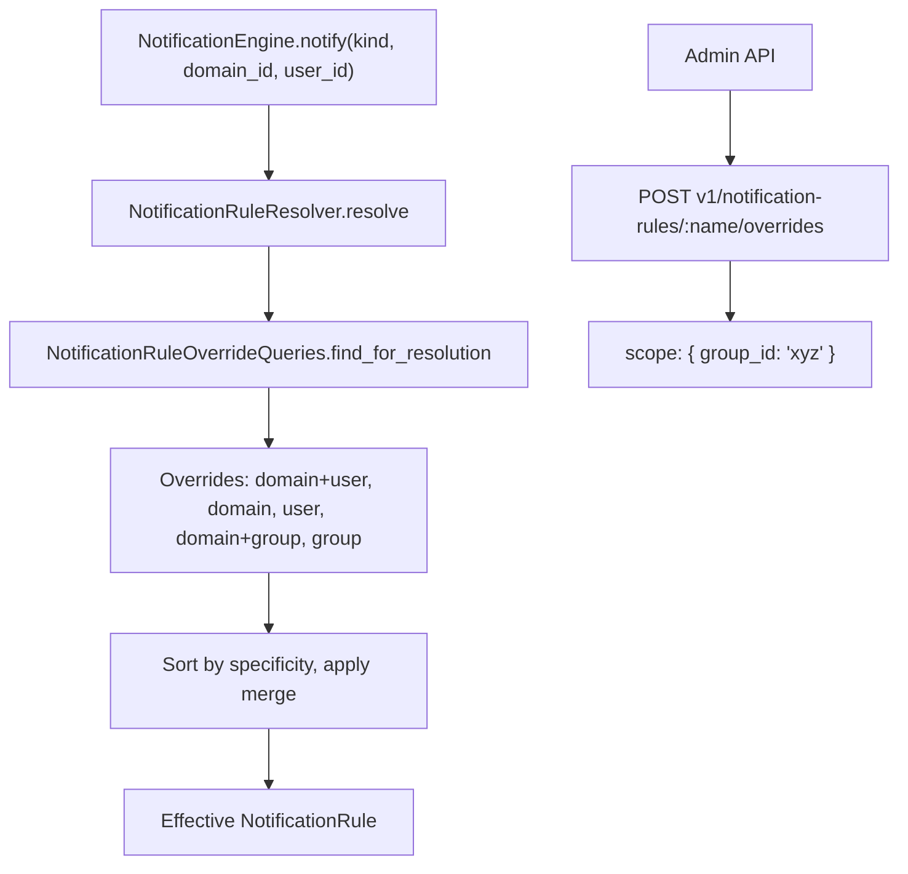

# Phase 6: Group-Based Notification Rules

## Motivation

Currently, `notification_rule_overrides` can target a specific `user_id` or a `domain_id`. This phase adds `group_id` scoping so admins can configure notification behavior for entire teams or departments without creating per-user overrides.

## Architecture



## Override Specificity Order (Updated)

When resolving overrides, the resolver applies them from least specific to most specific (last wins):

1. Domain-only (`domain_id` set, `user_id` nil, `group_id` nil)
2. Group-only (`group_id` set, `user_id` nil)
3. Domain + Group (`domain_id` + `group_id` set, `user_id` nil)
4. User-only (`user_id` set, `domain_id` nil, `group_id` nil)
5. Domain + User (`domain_id` + `user_id` set) -- most specific, highest priority

## Schema Changes

### `notification_rule_overrides` -- scope extension

```json
{
  "scope": {
    "domain_id": "optional",
    "user_id": "optional",
    "group_id": "optional"
  }
}
```

### New Index

```ruby
# In migration
collection.indexes.create_one(
  { "scope.group_id" => 1 },
  { name: "idx_group_id", sparse: true }
)
```

## Files to Modify

### 1. `web/common/models/entities/notification_rule_override.rb`

Add `group_id` accessor:

```ruby
def group_id
  scope&.dig("group_id")
end
```

### 2. `web/common/models/queries/notification_rule_override_queries.rb`

Update `find_for_resolution` to include group-scoped overrides:

```ruby
def self.find_for_resolution(rule_name, domain_id:, user_id:, group_ids: [])
  conditions = [
    { "scope.domain_id" => domain_id, "scope.user_id" => user_id, "scope.group_id" => nil },
    { "scope.domain_id" => domain_id, "scope.user_id" => nil, "scope.group_id" => nil },
    { "scope.domain_id" => nil, "scope.user_id" => user_id, "scope.group_id" => nil }
  ]

  group_ids.each do |gid|
    conditions << { "scope.group_id" => gid, "scope.user_id" => nil, "scope.domain_id" => nil }
    conditions << { "scope.group_id" => gid, "scope.domain_id" => domain_id, "scope.user_id" => nil }
  end

  selector = { :rule_name => rule_name, :$or => conditions }
  Mongo.find(self.collection, selector) { |cursor| cursor.map { |doc| NotificationRuleOverride.from_mongo(doc) } }
end
```

### 3. `web/common/notifications/notification_rule_resolver.rb`

Update `resolve` to fetch user's groups and pass `group_ids`:

```ruby
def self.resolve(kind, domain_id, user_id = nil)
  rule = find_cached_rule(kind.to_s)
  return nil if rule.nil?

  group_ids = user_id ? fetch_group_ids(user_id) : []
  overrides = NotificationRuleOverrideQueries.find_for_resolution(
    kind.to_s, domain_id: domain_id, user_id: user_id, group_ids: group_ids
  )
  return rule if overrides.empty?

  merge_overrides(rule, overrides, domain_id, user_id, group_ids)
end

def self.fetch_group_ids(user_id)
  @group_cache ||= {}
  entry = @group_cache[user_id]
  if entry && (Time.now.utc - entry[:fetched_at]) < CACHE_TTL
    return entry[:ids]
  end

  groups = GroupQueries.for_user(user_id)
  ids = groups.map(&:id).map(&:to_s)
  @group_cache[user_id] = { ids: ids, fetched_at: Time.now.utc }
  ids
end
```

### 4. `web/common/notifications/notification_rule_resolver.rb` -- merge_overrides

Update specificity sorting:

```ruby
def self.merge_overrides(rule, overrides, domain_id, user_id, group_ids = [])
  sorted = overrides.sort_by do |o|
    specificity_score(o, domain_id, user_id, group_ids)
  end

  merged = rule.dup
  sorted.each do |override|
    merged.delivery_strategy = (merged.delivery_strategy || {}).deep_merge(override.delivery_strategy) if override.delivery_strategy
  end

  if sorted.any? { |o| o.content_overrides.present? }
    merged.resolved_content_overrides = sorted.map(&:content_overrides).compact.reduce({}, :deep_merge)
  end

  merged
end

def self.specificity_score(override, domain_id, user_id, group_ids)
  case
  when override.user_id && override.domain_id then 5
  when override.user_id then 4
  when override.group_id && override.domain_id then 3
  when override.group_id then 2
  when override.domain_id then 1
  else 0
  end
end
```

### 5. API / Overrides Controller Updates

Phase 3 override endpoints already accept freeform `scope`. Add validation:

```ruby
def validate_override_scope(scope)
  errors = []
  unless scope.is_a?(Hash)
    errors << "scope must be an object"
    return errors
  end
  identifiers = [scope["domain_id"], scope["user_id"], scope["group_id"]].compact
  errors << "scope must contain at least one of domain_id, user_id, or group_id" if identifiers.empty?
  errors
end
```

## Migration

```ruby
class AddGroupIdIndexToOverrides < DatabaseMigration
  def change
    collection = DatabaseCommands.get_collection("notification_rule_overrides")
    collection.indexes.create_one(
      { "scope.group_id" => 1 },
      { name: "idx_group_id", sparse: true }
    )
  end
end
```

## Spec Files to Create / Update

- `web/spec/unit/common/notifications/notification_rule_resolver_spec.rb` -- add group-scoped override scenarios (group-only, domain+group, user overrides group)
- `web/spec/unit/common/models/queries/notification_rule_override_queries_spec.rb` -- add `group_ids` parameter tests
- `web/spec/unit/api/controllers/notification_rule_overrides_spec.rb` -- add group scope validation tests

## Cross-Phase Dependencies

- **Phase 2 (prerequisite):** Resolver and override resolution must exist.
- **Phase 3 (prerequisite):** Override CRUD API must exist for creating group-scoped overrides.
- **Phase 11 (downstream):** Group membership caching needs to be efficient at scale. Phase 6 starts with an in-memory TTL cache; Phase 11 may move to Redis.

## Risks and Mitigations

- **Risk:** Users in many groups produce too many `$or` conditions. **Mitigation:** Cap at 20 groups per user for override resolution. Log warning if exceeded.
- **Risk:** Group membership changes not reflected immediately. **Mitigation:** TTL cache (5 min) ensures eventual consistency. `clear_cache!` can be called explicitly after bulk membership changes.
- **Risk:** Conflicting group overrides (user in multiple groups with different overrides). **Mitigation:** The specificity sort is deterministic -- domain+group beats group-only. For two group-only overrides at the same level, later merge wins (alphabetical group_id for determinism).
