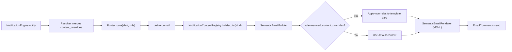

# Phase 7: Email Content Overrides

## Motivation

Currently, email content is hardcoded in SETTINGS templates and semantic email builders. Content overrides allow domains to customize subjects, body text, CTAs, and branding without code changes.

## Architecture

Phase 2 already passes `resolved_content_overrides` through the resolver into the effective rule. Phase 7 wires this into the email rendering pipeline.



## Override Schema

Override documents can include a `content_overrides` field:

```json
{
  "rule_name": "share_item",
  "scope": { "domain_id": "domain123" },
  "content_overrides": {
    "email": {
      "subject_template": "{{from_user}} shared content with you via {{company_name}}",
      "header_text": "New content shared",
      "cta_text": "View Shared Content",
      "cta_url_template": "{{base_url}}/items/{{item_id}}",
      "footer_text": "You are receiving this because sharing notifications are enabled.",
      "logo_url": "https://cdn.example.com/logos/custom-logo.png"
    }
  }
}
```

## Files to Modify

### 1. `web/common/email/semantic/builders/alert/immediate/*_builder.rb`

Each builder needs to check for content overrides and apply them. Add a shared concern:

```ruby
module NotificationContentOverridable
  def apply_content_overrides(vars, content_overrides)
    return vars unless content_overrides&.dig("email")
    email_overrides = content_overrides["email"]

    vars[:subject] = interpolate(email_overrides["subject_template"], vars) if email_overrides["subject_template"]
    vars[:header_text] = email_overrides["header_text"] if email_overrides["header_text"]
    vars[:cta_text] = email_overrides["cta_text"] if email_overrides["cta_text"]
    vars[:cta_url] = interpolate(email_overrides["cta_url_template"], vars) if email_overrides["cta_url_template"]
    vars[:footer_text] = email_overrides["footer_text"] if email_overrides["footer_text"]
    vars[:logo_url] = email_overrides["logo_url"] if email_overrides["logo_url"]
    vars
  end

  def interpolate(template, vars)
    template.gsub(/\{\{(\w+)\}\}/) { |_| vars[$1.to_sym] || vars[$1] || "" }
  end
end
```

### 2. Integrate into builder base class

```ruby
class EmailContentBuilder::Base
  include NotificationContentOverridable

  def build(alert, rule = nil)
    vars = build_template_vars(alert)
    if rule&.resolved_content_overrides
      vars = apply_content_overrides(vars, rule.resolved_content_overrides)
    end
    render(vars)
  end
end
```

### 3. `web/common/notifications/notification_channel_router.rb`

Pass the rule to email builders:

```ruby
def self.deliver_email(alert, rule, opts)
  if digest_eligible?(alert.kind)
    return false
  end

  builder = NotificationContentRegistry.builder_for(alert.kind)
  if builder
    builder.build(alert, rule)
  else
    EmailCommands.send_alert(to_user, from_users, alert)
  end
  true
end
```

### 4. `web/common/notifications/notification_content_registry.rb`

Already created in Phase 2. Used here without modification.

## Files to Create

### `web/common/email/semantic/notification_content_overridable.rb`

The shared concern module (code above).

## Spec Files

- `web/spec/unit/common/email/semantic/notification_content_overridable_spec.rb` -- test interpolation, partial overrides, missing keys
- `web/spec/unit/common/email/semantic/builders/alert/immediate/*_spec.rb` -- update existing builder specs to test with content overrides
- Integration test: seed a rule with `content_overrides`, trigger notification, verify email content reflects overrides

## Supported Override Fields

| Field | Description | Default Source |
|-------|-------------|----------------|
| `subject_template` | Email subject with `{{variable}}` interpolation | Builder's default subject |
| `header_text` | Header text in email body | Builder's default |
| `cta_text` | Call-to-action button text | Builder's default |
| `cta_url_template` | CTA URL with `{{variable}}` interpolation | Builder's default |
| `footer_text` | Footer/explanation text | Builder's default |
| `logo_url` | Logo image URL | Domain default or Highspot logo |

## Cross-Phase Dependencies

- **Phase 2 (prerequisite):** `resolved_content_overrides` passthrough is already in the resolver.
- **Phase 3 (prerequisite):** API to create/update overrides with `content_overrides` field.
- **Phase 9 (downstream):** Same pattern extends to push, Slack, and MS Teams content overrides.

## Risks and Mitigations

- **Risk:** Malicious content in override templates (XSS). **Mitigation:** Sanitize all interpolated values before rendering. MJML output is inherently email-safe (no JS execution). Add a template validation step.
- **Risk:** Broken templates (missing variables). **Mitigation:** `interpolate` replaces missing variables with empty string rather than raising. Log a warning for missing variables.
- **Risk:** Override precedence confusion (domain vs user override content). **Mitigation:** Content overrides follow the same merge order as delivery_strategy -- `deep_merge` from least to most specific. Document this in API docs.
