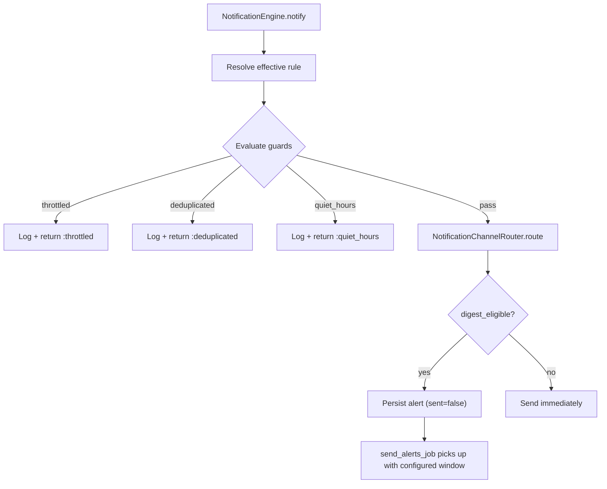

# Phase 8: Delivery Guards and Configurable Batching Windows

## Motivation

Prevent notification fatigue through:
1. **Throttling:** Limit how many notifications of a given kind a user receives per time window.
2. **Deduplication:** Suppress duplicate notifications for the same entity within a window.
3. **Quiet hours:** Suppress non-critical notifications during off-hours.
4. **Configurable batching windows:** Allow the digest email aggregation interval to vary by rule or domain rather than using a single fixed interval.

## Architecture



## Rule Schema Extensions

### delivery_strategy.guards

```json
{
  "delivery_strategy": {
    "guards": {
      "throttle": {
        "max_per_window": 5,
        "window_seconds": 3600
      },
      "dedup": {
        "key_fields": ["item_id", "spot_id"],
        "window_seconds": 300
      },
      "quiet_hours": {
        "enabled": true,
        "defer_until_active": true
      }
    },
    "batching": {
      "eligible_alert_kinds": ["content_added", "spot_activity"],
      "aggregation_window": 3600
    }
  }
}
```

## Files to Create

### 1. `web/common/notifications/notification_guard.rb`

```ruby
class NotificationGuard
  THROTTLE_PREFIX = "notif_throttle"
  DEDUP_PREFIX = "notif_dedup"

  # Returns :pass, :throttled, :deduplicated, or :quiet_hours
  def self.evaluate(rule, domain_id, user_id, attributes)
    guards = rule.delivery_strategy&.dig("guards")
    return :pass if guards.nil?

    # Throttle check
    if guards["throttle"]
      return :throttled if throttled?(rule.name, user_id, guards["throttle"])
    end

    # Dedup check
    if guards["dedup"]
      return :deduplicated if duplicate?(rule.name, user_id, attributes, guards["dedup"])
    end

    # Quiet hours check
    if guards["quiet_hours"]&.fetch("enabled", false)
      return :quiet_hours if in_quiet_hours?(user_id, domain_id)
    end

    :pass
  end

  def self.throttled?(rule_name, user_id, config)
    key = "#{THROTTLE_PREFIX}:#{rule_name}:#{user_id}"
    count = RedisCache.incr(key)
    RedisCache.expire(key, config["window_seconds"]) if count == 1
    count > config["max_per_window"]
  end

  def self.duplicate?(rule_name, user_id, attributes, config)
    key_parts = config["key_fields"].map { |f| attributes[f.to_sym] || attributes[f] }.compact
    return false if key_parts.empty?

    key = "#{DEDUP_PREFIX}:#{rule_name}:#{user_id}:#{key_parts.join(':')}"
    already_seen = RedisCache.get(key)
    return true if already_seen

    RedisCache.setex(key, config["window_seconds"], "1")
    false
  end

  def self.in_quiet_hours?(user_id, domain_id)
    # Phase 8 v1: Use domain-level quiet hours config
    # User timezone from user preferences
    user_prefs = UserPreferencesQueries.find_by_user_id(user_id)
    timezone = user_prefs&.timezone || "UTC"
    local_hour = Time.now.in_time_zone(timezone).hour
    # Default quiet hours: 10 PM to 7 AM
    local_hour >= 22 || local_hour < 7
  end
end
```

### 2. `web/common/notifications/notification_engine.rb` -- update

Add guard evaluation before routing:

```ruby
def self.notify(kind, domain_id, user_id, attributes, opts = {})
  rule = NotificationRuleResolver.resolve(kind, domain_id, user_id)
  if rule.nil?
    EventLogger.warn("NotificationEngine: no rule found for kind=#{kind}, domain=#{domain_id}. Skipping.")
    return :no_rule
  end

  # Guard evaluation
  guard_result = NotificationGuard.evaluate(rule, domain_id, user_id, attributes)
  if guard_result != :pass
    EventLogger.info("NotificationEngine: notification #{kind} for user #{user_id} was #{guard_result}")
    return guard_result
  end

  # ... rest of notify (persist, route, record channels)
end
```

## Configurable Batching Windows

### Current State

`send_alerts_job.rb` runs on a fixed recurring interval and sends all unsent alerts as digest emails. The interval is the same for all alert kinds.

### Changes

#### 1. `web/common/jobs/alerts/send_alerts_job.rb` -- update

```ruby
class SendAlertsJob < BaseRecurringJob
  def run(worker)
    # Fetch digest rule for batching config
    digest_rule = NotificationRuleQueries.find_active_by_name("digest")
    default_window = digest_rule&.delivery_strategy&.dig("batching", "aggregation_window") || 3600

    # Fetch per-kind windows from individual rules
    eligible_kinds = digest_rule&.delivery_strategy&.dig("batching", "eligible_alert_kinds") || []

    eligible_kinds.each do |kind|
      kind_rule = NotificationRuleQueries.find_active_by_name(kind)
      window = kind_rule&.delivery_strategy&.dig("batching", "aggregation_window") || default_window

      # Only batch alerts older than the window
      cutoff = Time.now.utc - window
      alerts = AlertQueries.for_unsent_by_kind(kind, before: cutoff)
      next if alerts.empty?

      # Group by user and send
      alerts.group_by(&:user_id).each do |user_id, user_alerts|
        EmailCommands.send_alerts(user_id, user_alerts)
        mark_sent(user_alerts)
      end
    end
  end
end
```

#### 2. `web/common/models/queries/alert_queries.rb` -- add

```ruby
def self.for_unsent_by_kind(kind, before:)
  selector = {
    :kind => kind,
    :sent => { :$ne => true },
    :created_at => { :$lt => before }
  }
  Mongo.find(collection, selector) { |cursor| cursor.map { |doc| Alert.from_mongo(doc) } }
end
```

## Spec Files to Create

- `web/spec/unit/common/notifications/notification_guard_spec.rb` -- throttle, dedup, quiet hours, combined guards
- Update `web/spec/unit/common/notifications/notification_engine_spec.rb` -- guard integration
- Update `web/spec/unit/common/jobs/alerts/send_alerts_job_spec.rb` -- configurable window tests

## Cross-Phase Dependencies

- **Phase 2 (prerequisite):** Guard evaluation plugs into the engine's notify flow.
- **Phase 4 (prerequisite):** API-triggered notifications also pass through guards.
- **Phase 6 (optional):** Group overrides can customize guard thresholds per group.
- **Phase 11 (downstream):** Redis key expiration and scan performance at scale.

## Risks and Mitigations

- **Risk:** Redis key explosion from throttle/dedup keys. **Mitigation:** All keys have TTL; keys are scoped to rule+user and auto-expire. Monitor key count via New Relic.
- **Risk:** Quiet hours defer notifications but never send them. **Mitigation:** If `defer_until_active` is true, deferred notifications are re-queued. If false, they are dropped. Default: defer.
- **Risk:** Clock skew between servers causes inconsistent throttle counts. **Mitigation:** Redis `INCR` is atomic. TTLs are approximate, not precise. Acceptable for notification throttling.
- **Risk:** Per-kind batching windows add query complexity to the digest job. **Mitigation:** Index on `kind` + `sent` + `created_at` in the Alert collection. Start with a few kinds and expand.
