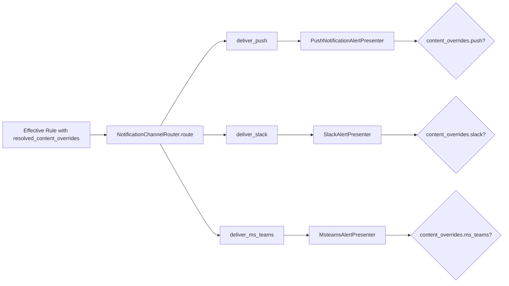

# Phase 9: Non-Email Content Overrides

## Motivation

Phase 7 enables email content overrides. Phase 9 applies the same pattern to the remaining channels: push notifications, Slack, and MS Teams. Domain admins can customize notification text, titles, and formatting for each channel independently.

## Architecture



## Override Schema (Extended)

```json
{
  "content_overrides": {
    "email": { "..." : "Phase 7" },
    "push": {
      "title_template": "{{from_user}} shared a document",
      "body_template": "Check out {{item_title}} in {{spot_name}}",
      "badge_count": true
    },
    "slack": {
      "title_template": "New share from {{from_user}}",
      "body_template": "{{from_user}} shared *{{item_title}}* with you",
      "cta_text": "Open in Highspot",
      "include_preview": true
    },
    "ms_teams": {
      "title_template": "Content shared with you",
      "body_template": "{{from_user}} shared {{item_title}}",
      "card_style": "hero"
    }
  }
}
```

## Files to Modify

### 1. `web/common/notifications/notification_channel_router.rb`

Pass the rule to all channel presenters:

```ruby
def self.deliver_push(alert, rule, from_user, to_user)
  overrides = rule&.resolved_content_overrides&.dig("push")
  presenter = PushNotificationAlertPresenter.new(alert, from_user, to_user, content_overrides: overrides)
  # ... existing push delivery
end

def self.deliver_slack(alert, rule, from_user, to_user)
  overrides = rule&.resolved_content_overrides&.dig("slack")
  presenter = SlackAlertPresenter.new(alert, from_user, to_user, content_overrides: overrides)
  # ... existing Slack delivery
end

def self.deliver_ms_teams(alert, rule, from_user, to_user)
  overrides = rule&.resolved_content_overrides&.dig("ms_teams")
  presenter = MsteamsAlertPresenter.new(alert, from_user, to_user, content_overrides: overrides)
  # ... existing MS Teams delivery
end
```

### 2. `web/common/models/presenters/push_notification_alert_presenter.rb`

```ruby
class PushNotificationAlertPresenter
  include NotificationContentOverridable

  def initialize(alert, from_user, to_user, content_overrides: nil)
    @alert = alert
    @from_user = from_user
    @to_user = to_user
    @content_overrides = content_overrides
  end

  def title
    if @content_overrides&.dig("title_template")
      interpolate(@content_overrides["title_template"], template_vars)
    else
      default_title
    end
  end

  def body
    if @content_overrides&.dig("body_template")
      interpolate(@content_overrides["body_template"], template_vars)
    else
      default_body
    end
  end
end
```

### 3. `web/common/models/presenters/slack_alert_presenter.rb`

```ruby
class SlackAlertPresenter
  include NotificationContentOverridable

  def initialize(alert, from_user, to_user, content_overrides: nil)
    @alert = alert
    @from_user = from_user
    @to_user = to_user
    @content_overrides = content_overrides
  end

  def title
    if @content_overrides&.dig("title_template")
      interpolate(@content_overrides["title_template"], template_vars)
    else
      default_title
    end
  end

  def body_blocks
    if @content_overrides&.dig("body_template")
      custom_blocks(interpolate(@content_overrides["body_template"], template_vars))
    else
      default_blocks
    end
  end
end
```

### 4. `web/common/models/presenters/msteams_alert_presenter.rb`

Same pattern as Slack, with MS Teams Adaptive Card format.

## NotificationContentOverridable Module

Reuse the same module from Phase 7 (`web/common/email/semantic/notification_content_overridable.rb`). The `interpolate` method and override application pattern are channel-agnostic.

Consider moving the module to a more central location:

```ruby
# web/common/notifications/notification_content_overridable.rb
module NotificationContentOverridable
  def apply_content_overrides(vars, content_overrides)
    return vars unless content_overrides
    content_overrides.each do |key, value|
      if key.end_with?("_template")
        var_name = key.sub("_template", "").to_sym
        vars[var_name] = interpolate(value, vars)
      else
        vars[key.to_sym] = value
      end
    end
    vars
  end

  def interpolate(template, vars)
    template.gsub(/\{\{(\w+)\}\}/) { |_| vars[$1.to_sym] || vars[$1] || "" }
  end
end
```

## Spec Files

- `web/spec/unit/common/models/presenters/push_notification_alert_presenter_spec.rb` -- override title/body
- `web/spec/unit/common/models/presenters/slack_alert_presenter_spec.rb` -- override title/body/blocks
- `web/spec/unit/common/models/presenters/msteams_alert_presenter_spec.rb` -- override title/card
- Update router spec for passing overrides to presenters

## Cross-Phase Dependencies

- **Phase 2 (prerequisite):** `resolved_content_overrides` on the effective rule.
- **Phase 7 (prerequisite):** `NotificationContentOverridable` module and the email override pattern.
- **Phase 3 (prerequisite):** API to create overrides with channel-specific `content_overrides`.

## Risks and Mitigations

- **Risk:** Channel-specific override format differences (Slack uses markdown, MS Teams uses Adaptive Cards). **Mitigation:** Each presenter handles its own formatting. The override schema is channel-scoped so admins provide content in the right format.
- **Risk:** Backward compatibility -- presenters currently don't accept overrides. **Mitigation:** `content_overrides` parameter is optional with a default of `nil`. When nil, presenter uses default behavior.
- **Risk:** Override interpolation inconsistency across channels. **Mitigation:** All channels use the same `NotificationContentOverridable` module for interpolation.
