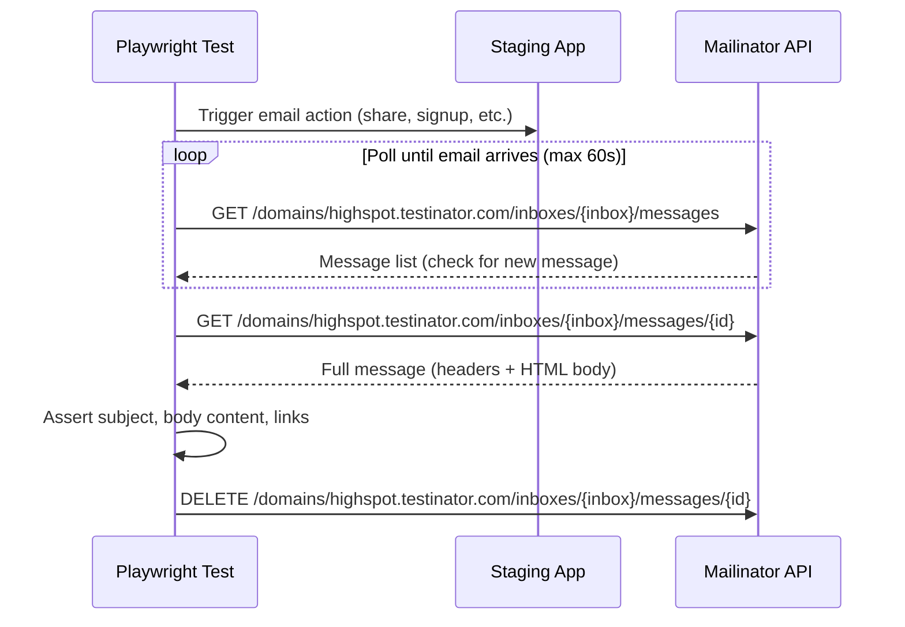

# Semantic Email E2E Test Plan (Mailinator + Playwright)

## 1. Overview and Objective

**Feature:** Semantic Email (MJML-based email rendering) -- E2E verification

**What is being tested:** Verify that semantic emails rendered via MJML are correctly received, visually correct, contain working links, and fall back gracefully when the feature flag is off. This plan complements the [unit/integration test plan](semantic_email_test_plan_0fe90847.plan.md) which covers code-level logic.

**Scope:**
- In scope: Actual email delivery and content verification via Mailinator for semantic email types (alerts, digests, direct emails)
- Out of scope: Code-level unit/integration tests (covered in separate plan), SendGrid delivery infrastructure, email deliverability/spam scoring

**Related ticket:** HS-157765

**Reference:** [Email Verification Tests (Confluence)](https://highspot.atlassian.net/wiki/spaces/ENGDOCS/pages/3494739978/Email+Verification+Tests)

---

## 2. Test Strategy

- **Tool:** Mailinator (private domain: `highspot.testinator.com`) + Playwright
- **Pattern:** Trigger email via app action or API, poll Mailinator inbox via API/SDK, assert on email content
- **Environment:** `latest-su1` (or equivalent staging environment with feature flag control)
- **Existing examples to follow:**
  - Testcafe: `testcafe/tests/iam/emailVerificationTests/signupE2Etest.js` (signup flow)
  - Testcafe: `testcafe/tests/training/emailVerificationTests/verifyLPEnrollmentEmailE2ETest.js` (LP enrollment)
  - Playwright: `test_automation_playwright/playwright/tests/buyersEngagement/Allowlist/Allowlist.spec.ts`
  - Playwright: `playwright/tests/iam/emailVerificationTests`
- **Mailinator SDK:** [mailinator-javascript-client](https://github.com/manybrain/mailinator-javascript-client)
- **API key:** Mailinator API Key in 1Password "E2E testing" vault (previously Testcafe vault)
- **Rate limits:** 20 emails/sec, 100k emails/month -- not suitable for performance testing

---

## 3. Test Environment Setup

**Prerequisites:**
- `mjml_email_templates` feature flag available in staging
- Mailinator private domain `highspot.testinator.com` configured as approved email domain for the test org
- Test users created with `@highspot.testinator.com` inboxes
- Inbox reservation: add semantic email inboxes to the shared inbox registry (e.g., `testcafe/helpers/mailinatorInboxes/index.js` or Playwright equivalent) to avoid cross-team conflicts

**Suggested inbox reservations:**
- `semantic-alert-immediate` -- for immediate alert tests
- `semantic-alert-digest` -- for digest tests
- `semantic-direct-signup` -- for signup/welcome flow tests
- `semantic-direct-invite` -- for invite flow tests
- `semantic-fallback` -- for fallback verification tests

**Domain setup (latest-su1):**
```
signin:set_approved_email_domains[<test-domain>, [highspot.testinator.com]]
```

**User creation:**
```
user:create_employee[<test-domain>,semantic-alert-immediate@highspot.testinator.com,<PASSWORD>,Semantic,AlertTest,true]
```

---

## 4. E2E Test Scenarios

### 4.1 Immediate Alert Emails (FF on)

**Trigger:** Perform an action that generates an alert (e.g., share an item, give feedback, request access)

| Scenario | Trigger Action | Verify in Mailinator |
|----------|---------------|---------------------|
| Share item alert | Share a Spot item with test user | Email received, subject correct, body contains item name/link, MJML-rendered HTML (no Velocity artifacts), links are not broken |
| Feedback alert | Submit feedback on a pitch to test user | Email received, body contains feedback content, sender name, item link |
| Spot access request | Request access to a restricted Spot | Email received, contains Spot name, requester info, approve/deny links work |
| Send failed alert | Trigger a pitch send failure | Email received, contains failure details, retry/troubleshoot links |

**Assertions for each:**
- Email arrives within expected timeframe (poll Mailinator, timeout ~60s)
- Subject line matches expected format
- HTML body is well-formed (no raw MJML tags, no `{{velocity_variable}}` placeholders)
- All links in email body return 200 (no broken links)
- Email contains expected branding (logo, colors from domain brand)
- Unsubscribe link present and functional

### 4.2 Digest Alert Emails (FF on)

**Trigger:** Configure test user for digest delivery, trigger multiple alerts, wait for digest batch

| Scenario | Trigger Action | Verify in Mailinator |
|----------|---------------|---------------------|
| Multi-alert digest | Generate 3+ alerts of different kinds for digest user | Single digest email received, contains all alert entries as cards, each with correct content and links |
| Mixed-kind digest | Generate alerts of supported and unsupported kinds | Digest renders correctly with both semantic and legacy-style entries |

**Assertions:**
- Single digest email (not individual alerts)
- All alert entries present with correct content
- Card layout renders correctly (semantic cards vs. legacy text entries)
- Links in each card work

### 4.3 Direct Email Types (FF on)

**Trigger:** Perform actions that generate direct (non-alert) emails

| Scenario | Trigger Action | Verify in Mailinator |
|----------|---------------|---------------------|
| Signup email | Create new user with Mailinator inbox | Signup email received, contains registration link, link works |
| Welcome email | Complete user registration | Welcome email received, well-formatted, links work |
| Password reset | Request password reset for test user | Reset email received, contains reset link, link works and leads to reset page |
| Invite email | Admin invites new user via Mailinator address | Invite email received, contains invite link, link works |
| MFA verification | Enable MFA for test user | MFA code email received, code is present and usable |

**Assertions:**
- Email content matches semantic template (MJML-rendered HTML)
- No Velocity template artifacts (`$variable`, `#if`, etc.)
- Action links (signup, reset, invite) are functional
- MFA codes are extractable and valid

### 4.4 Fallback Verification (FF off)

**Trigger:** Turn off `mjml_email_templates` FF for test user/domain, repeat key scenarios

| Scenario | FF State | Verify |
|----------|----------|--------|
| Share item alert (FF off) | Off | Email still received, uses legacy Velocity template (different HTML structure), content is correct |
| Signup email (FF off) | Off | Email still received via legacy path, functional |
| Digest (FF off) | Off | Digest still received via legacy path |

**Key assertion:** Emails are always delivered regardless of FF state -- no silent drops.

### 4.5 Visual Comparison (optional, stretch goal)

| Scenario | Verify |
|----------|--------|
| Semantic vs. legacy side-by-side | Capture screenshots of semantic and legacy emails for the same trigger, compare for visual regressions |
| Cross-client rendering | Forward semantic email to Gmail, Outlook, Apple Mail -- verify no rendering issues (manual or via Litmus/Email on Acid if available) |

---

## 5. Mailinator API Usage Pattern



**API endpoints (from [Mailinator docs](https://www.mailinator.com/docs/index.html#message-api)):**
- List messages: `GET /v2/domains/{domain}/inboxes/{inbox}`
- Get message: `GET /v2/domains/{domain}/inboxes/{inbox}/messages/{id}`
- Delete message: `DELETE /v2/domains/{domain}/inboxes/{inbox}/messages/{id}`
- Auth header: `Authorization: <API_KEY>`

**Cleanup:** Delete messages after each test to stay within 50MB storage limit.

---

## 6. Risks and Considerations

- **Rate limiting:** 20 emails/sec, 100k/month. Avoid running these tests in tight loops or as part of performance suites.
- **Timing:** Email delivery is asynchronous. Tests must poll with appropriate timeouts (recommend 60s with 2s intervals).
- **Inbox collision:** Reserve dedicated inboxes per test scenario to avoid cross-test interference. Register them in the shared inbox index.
- **Storage:** 50MB permanent storage, oldest messages evicted when full. Clean up after tests.
- **Flakiness:** Email delivery delays can cause test flakiness. Use generous timeouts and retry logic.
- **FF propagation:** Feature flag changes may take time to propagate. Allow warm-up time after toggling.

---

## 7. Entry and Exit Criteria

**Entry criteria:**
- Semantic email code deployed to staging environment
- Feature flag `mjml_email_templates` available and configurable per user/domain
- Mailinator API key accessible
- Test users created with `@highspot.testinator.com` inboxes
- At least one alert builder and one direct builder registered and functional

**Exit criteria:**
- All P0 scenarios pass (emails delivered with correct content for both FF on and FF off)
- No broken links in semantic emails
- No Velocity artifacts in semantic-rendered emails
- Fallback tests confirm email delivery when FF is off

---

## 8. Local E2E Testing Tools

### 8.1 Preview E2E: Render + Send + Verify in Mailpit

**File:** `scripts/notifications-migration/test_email_previews.py`

For each preview link on the index page: renders, sends, and verifies delivery in mailpit.

```bash
# Render-only (verify all previews render without error)
python test_email_previews.py -c "rack.session=..."

# Render + send + verify in mailpit
python test_email_previews.py -c "rack.session=..." --send

# Legacy previews
python test_email_previews.py -c "rack.session=..." --legacy --send

# Specific kind
python test_email_previews.py -c "rack.session=..." --send --kind share_item

# Send but skip mailpit verification
python test_email_previews.py -c "rack.session=..." --send --no-verify
```

**What it covers:** All preview types (immediate + digest) via `EmailCommands.send_email(:semantic_email, ...)`.

**What it does NOT cover:** `EmailCommands.send_alert` and `EmailCommands.send_alerts` (see 8.2).

### 8.2 Higher-Level Entry Points: send_alert / send_alerts / send_email

**File:** `tasks/semantic_email_test.rake`

Tests the actual production entry points that the preview script bypasses.

```bash
# Immediate: EmailCommands.send_alert
rake semantic_email:send_immediate[user@domain.com]
rake semantic_email:send_immediate[user@domain.com,share_item]

# Digest: EmailCommands.send_alerts
rake semantic_email:send_digest[user@domain.com]

# Direct: EmailCommands.send_email
rake semantic_email:send_direct[user@domain.com]
rake semantic_email:send_direct[user@domain.com,signup]

# All three flows
rake semantic_email:send_all[user@domain.com]
```

### 8.3 RSpec Pipeline Integration (CI)

**File:** `spec/unit/common/email/semantic_email_pipeline_spec.rb`

```bash
bundle exec rspec spec/unit/common/email/semantic_email_pipeline_spec.rb
```

Tests the three flows end-to-end with real builders and MJML rendering. Stubs only at the delivery boundary (`Pipeline::Client.enqueue_mail_job`). Runs in CI.

### Coverage Matrix

| Flow | Preview E2E (8.1) | Rake Tasks (8.2) | RSpec CI (8.3) |
|------|:-:|:-:|:-:|
| Preview renders | ✅ | — | — |
| `EmailCommands.send_email` | ✅ | ✅ | ✅ |
| `EmailCommands.send_alert` | — | ✅ | ✅ |
| `EmailCommands.send_alerts` | — | ✅ | ✅ |
| Mailpit delivery | ✅ | ✅ | — |
| Legacy previews | ✅ | — | — |
| Automated in CI | — | — | ✅ |

---

## 9. Ownership

- **Scenario design:** Content Platform team
- **Implementation:** QA team (using existing Playwright infrastructure)
- **Slack channel for questions:** #temp-testcafe-mailinator-verification-tests