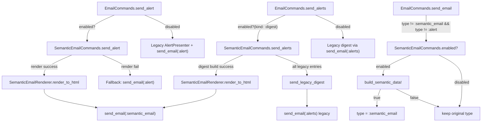
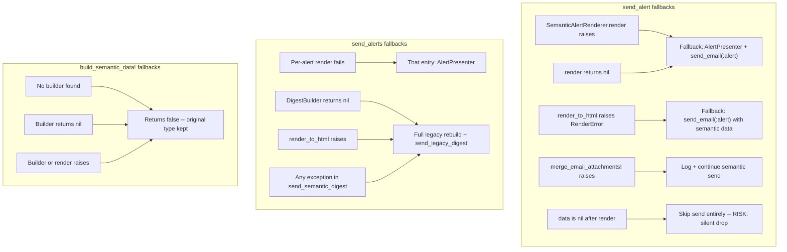

# Semantic Email Workflow Test Plan

## 1. Overview and Objective

**Feature:** Semantic Email (MJML-based email rendering)

**What is being tested:** The semantic email workflow replaces legacy Velocity-based email rendering with MJML templates. This test plan covers the three entry points (`send_alert`, `send_alerts`, `send_email`), the feature flag gating (`SemanticEmailCommands.enabled?`), the builder/registry system, the MJML rendering pipeline, and all fallback paths.

**Scope:**
- In scope: `SemanticEmailCommands`, `EmailCommands` semantic dispatch, `SemanticAlertRenderer`, `SemanticEmailBuilderRegistry`, `SemanticEmailRenderer`, `EmailMetrics` for semantic paths
- Out of scope: Downstream mail worker handling of `:semantic_email` payloads, SendGrid delivery, individual builder business logic (covered by builder-specific specs)

**Related ticket:** HS-157765

---

## 2. Test Strategy

- **Unit tests (Part A):** Test each method in isolation with all external dependencies mocked (`instance_double`, `class_double`, `allow/expect`). Focus on branching logic, error handling, and side effects (metrics, logging).
- **Integration tests (Part B):** Test complete workflows from `EmailCommands` entry points through real builders, real registry, and real MJML rendering. Only external services (feature flag service, mail enqueue) are stubbed.
- **Priority:** P0 = fallback safety (emails must always send), P1 = feature flag correctness, P2 = metrics accuracy

---

## 3. Test Environment and Prerequisites

**How to run:**

```bash
cd /Users/kiran.bachu/Codebase/latest/nutella/web

# All semantic email unit tests
bundle exec rspec spec/unit/common/email/semantic_email_commands_spec.rb

# Email commands dispatch tests
bundle exec rspec spec/unit/common/email/email_commands_spec.rb

# Integration tests
bundle exec rspec spec/unit/common/email/semantic_email_integration_spec.rb

# All semantic email specs at once
bundle exec rspec spec/unit/common/email/semantic_email_*_spec.rb spec/unit/common/email/email_commands_spec.rb
```

**CI:** Tests run via Buildkite (`run_rb_unit_isolated.sh` and `run_rb_unit_full_env.sh`), which execute `rspec spec/unit` in the `web/` directory.

**Dependencies:**
- `mrml` gem (MJML-to-HTML compilation, no Node.js required)
- `EventLogger` is globally stubbed in `spec/unit/spec_helper.rb` (info/warn/error/debug)
- `WebMock` is enabled around examples (no real HTTP calls)

**Test data patterns (established conventions):**
- `instance_double(User, id: ..., domain_id: ...)` for user objects, with `allow(user).to receive(:is_a?).with(User).and_return(true)`
- `instance_double("Alert", kind: ..., domain_id: ..., data: {})` for alerts
- `allow(Hspt::Features::FlagService).to receive(:enabled_for_user?).and_return(false)` for feature flags
- `allow(DynamicConfigCache).to receive(:get).with("semantic_email_disabled_kinds").and_return([...])` for kill switch
- `expect(EmailMetrics).to receive(:emit_...).with(...)` (expect-before-call pattern) for metrics verification
- Integration tests use real `SemanticEmailBuilderRegistry.builder_for(:type).call(type, data, tracking_tag)` with stubbed `EmailContentBuilder::Base.build_email_header_and_footer`

---

## 4. Entry and Exit Criteria

**Entry criteria:**
- Code merged to `notifications/semantic-email-integration` branch
- `bundle install` succeeds (all gems available)
- Existing tests pass: `bundle exec rspec spec/unit/common/email/` green

**Exit criteria:**
- All P0 scenarios (fallback safety) pass -- no code path drops an email silently
- All P1 scenarios (FF gating) pass -- semantic path only activates when FF is on
- All P2 scenarios (metrics) pass or are documented as known gaps
- No regressions in existing `email_commands_spec.rb` tests

---

## 5. Risks and Mitigations

**R1: RenderError fallback sends semantic-shaped data to legacy template**
- In `send_alert`, if `render_to_html` raises `RenderError`, the code switches `email_type` to `:alert` but does NOT rebuild data with `AlertPresenter`. The downstream `:alert` Velocity template may receive semantic-shaped payloads.
- Mitigation: Test that the fallback path produces data compatible with the legacy template, or that data is rebuilt.
- Priority: P0

**R2: DynamicConfig kill switch fails open**
- If `DynamicConfigCache.get("semantic_email_disabled_kinds")` raises, `semantic_kind_disabled?` returns `false` (kind is NOT disabled). This means a broken config cannot kill semantic email.
- Mitigation: Test this behavior explicitly. Consider whether fail-open is the correct design.
- Priority: P1

**R3: No global semantic email kill switch**
- There is no single config or flag to disable ALL semantic email. Disabling requires either turning off the `mjml_email_templates` FF for all users/domains or adding every kind to `semantic_email_disabled_kinds`.
- Mitigation: Document this limitation. Consider adding a global disable in DynamicConfig.
- Priority: P2 (informational)

**R4: Circular dependency between EmailCommands and SemanticEmailCommands**
- `email_commands.rb` requires `semantic_email_commands.rb`. `SemanticEmailCommands` references `EmailCommands` in method bodies (not at load time). This works because `EmailCommands` is defined before its methods are called, but is fragile.
- Mitigation: Test that require order is correct. The circular dependency was previously resolved by removing `require_project "common/email/email_commands"` from `semantic_email_commands.rb`.
- Priority: P2

**R5: Registry accessed before finalization**
- `SemanticEmailRegistry.finalize!` runs at file load time. If a test partially loads the registry, builders may be missing. `warn_if_not_finalized` logs a warning but does not raise.
- Mitigation: Integration tests should verify registry is finalized. Unit tests stub the registry.
- Priority: P2

---

## 6. Regression Impact

**Existing behavior that must not break:**
- Legacy email flow (FF off): `send_alert` → `AlertPresenter` → `send_email(:alert)` must be unchanged
- Legacy digest flow (FF off): `send_alerts` → `AlertPresenter` per alert → `send_email(:alerts)` must be unchanged
- Legacy direct email flow (FF off): `send_email(:signup)` etc. must pass through without modification
- All existing tests in `email_commands_spec.rb` must continue to pass (stubs prevent semantic dispatch from firing via `allow(SemanticEmailCommands).to receive(:enabled?).and_return(false)`)

**Files with existing test coverage that must remain green:**
- `email_commands_spec.rb` -- existing send_alert, send_alerts, send_email tests
- `semantic_alert_renderer_spec.rb` -- renderer unit tests
- `semantic_email_renderer_spec.rb` -- MJML rendering tests
- `semantic_email_builder_registry_spec.rb` -- registry tests
- `semantic_email_integration_spec.rb` -- builder pipeline tests

---

## 7. Architecture Overview



---

## 8. Test Scenarios

### Test type definitions

- **Unit tests**: Test a single method in isolation. All external dependencies (renderers, registries, flag services, metrics) are mocked/stubbed. Verify inputs, outputs, and side effects.
- **Integration tests**: Test a complete workflow from entry point through real builders, real registry, real MJML rendering. Only external services (flag service, mail enqueue) are stubbed.

---

### Part A: Unit Tests

All unit tests mock external dependencies and test individual methods in isolation.

Spec file: [semantic_email_commands_spec.rb](nutella/web/spec/unit/common/email/semantic_email_commands_spec.rb)

#### A1. Feature Flag Gating (`enabled?`) -- already partially covered

Existing tests cover: nil kind, DynamicConfig disabled kind, no builder, user FF, domain FF, exceptions, and direct type routing (`:semantic_email`, `:alert` exclusion, registry support, user/domain FF).

**New tests to add:**

- FF disabled for `to_user` but enabled for a `User` in `to_recipients` array -- returns `true`
- `to_user` nil, resolved from `alert.data[:to]` via `EntityFetch.user` -- returns `true`
- `to_user` nil, resolved from email string in `to_recipients` via `UserQueries.find_by_email` -- returns `true`
- All user checks fail, fallback to `alert.domain_id` FF -- returns `true`
- Direct path: `to_user` nil, fallback to `from` user via `flag_enabled_for_user?` -- returns `true`
- Metrics: verify `EmailMetrics.emit_semantic_email_flag_check` called with correct `(kind, result, reason)` for each outcome

#### A2. `send_alert` -- already partially covered

Existing tests cover: semantic success with MJML render, MJML failure fallback to `:alert`, nil render fallback to legacy, render raise fallback.

**New tests to add:**

- Attachment handling success: `merge_email_attachments!` merges attachments into data, verify attachments present in `send_email` call
- Attachment handling failure: `merge_email_attachments!` raises, verify fallback to legacy, `emit_alert_immediate_fallback(..., "attachment_error")` emitted
- CC recipients: verify CC is passed through to `EmailCommands.send_email`
- Options hash: verify options forwarded to `EmailCommands.send_email`
- Metrics: `emit_alert_render_latency` emitted on success and failure, `emit_alert_email_send_count` with correct pipeline/mode/kind/outcome

#### A3. `send_alerts` -- already partially covered

Existing tests cover: all-legacy path, semantic digest success.

**New tests to add:**

- Mixed entries: some alerts have semantic builders (rendered via `render_for_digest`), others don't (via `AlertPresenter`), digest still assembled semantically
- Per-alert render failure: one alert's `render_for_digest` raises, that entry falls back to `AlertPresenter`, rest remain semantic
- `DigestBuilder.build_digest_email` returns nil: full legacy rebuild via `send_legacy_digest`, `emit_alert_digest_fallback("all", "build_nil")`
- `render_to_html` raises `RenderError`: full legacy rebuild, `emit_alert_digest_fallback("all", "render_error")`
- Unexpected exception in `send_semantic_digest`: full legacy rebuild, `emit_alert_digest_fallback("all", "exception")`
- Metrics: per-entry and digest-level fallback counters, render latency histogram

#### A4. `build_semantic_data!` -- NEW (currently untested)

- **Success**: `SemanticEmailBuilderRegistry.builder_for` returns a builder, builder returns semantic data hash, `SemanticEmailRenderer.render_to_html` returns HTML. Verify: `data` hash mutated with merged semantic data, `data[:brand]` set via `DomainBrandPresenter`, `data[:body_html]` set, returns `true`
- **No builder**: `builder_for` returns nil. Verify: `data` unchanged, returns `false`
- **Builder returns nil**: Builder callable returns nil. Verify: `data` unchanged, returns `false`
- **Builder raises**: Builder callable raises `StandardError`. Verify: `EventLogger.error` called with message containing type, `data` unchanged, returns `false`
- **Render raises**: `render_to_html` raises any error. Verify: `EventLogger.error` called, returns `false`

Spec file: [email_commands_spec.rb](nutella/web/spec/unit/common/email/email_commands_spec.rb)

#### A5. `send_email` type guard -- NEW (currently untested)

- `type == :semantic_email`: verify `SemanticEmailCommands.enabled?` is NOT called
- `type == :alert`: verify `SemanticEmailCommands.enabled?` is NOT called
- `type == :signup` with `enabled?` returning true and `build_semantic_data!` returning true: verify type is changed to `:semantic_email` in the enqueue call
- `type == :signup` with `enabled?` returning true and `build_semantic_data!` returning false: verify type remains `:signup`
- `type == :signup` with `enabled?` returning false: verify `build_semantic_data!` is NOT called, type remains `:signup`

#### A6. `send_alert` / `send_alerts` dispatch -- already covered

Existing tests verify delegation to `SemanticEmailCommands` when `enabled?` is true and legacy path when false.

**New test to add:**

- Verify `send_alert` forwards `options` hash (4th argument) to `SemanticEmailCommands.send_alert` (this was a recent bug fix)

---

### Part B: Integration Tests

Integration tests use real builders, real registry, real MJML rendering. Only external services are stubbed.

**Spec files:**
- [semantic_email_integration_spec.rb](nutella/web/spec/unit/common/email/semantic_email_integration_spec.rb) - existing direct builder pipeline tests
- [semantic_email_pipeline_spec.rb](nutella/web/spec/unit/common/email/semantic_email_pipeline_spec.rb) - **NEW: three email flow tests (B1, B2, B3)**

**Run pipeline tests:**
```bash
bundle exec rspec spec/unit/common/email/semantic_email_pipeline_spec.rb
```

#### B1. Immediate alert end-to-end ✅ IMPLEMENTED

Tests in `semantic_email_pipeline_spec.rb`:
- `describe "Immediate Alert Pipeline (Part B1)"` - tests 12+ alert kinds
- Each kind tested: `share_item`, `share_spot`, `share_feedback`, `item_expiring`, `course_assigned`, `course_completed`, `pitch_ownership_transfer`, `spot_access_granted`, `spot_access_revoked`, `group_access_granted`, `send_failed`, `restricted_template_updated`
- Verifies: email structure, MJML rendering, no MJML artifacts in output
- Exhaustive test: iterates all `SemanticEmailRegistry::ALERT_BUILDERS` keys

#### B2. Digest alert end-to-end ✅ IMPLEMENTED

Tests in `semantic_email_pipeline_spec.rb`:
- `describe "Digest Alert Pipeline (Part B2)"` - multi-alert digest assembly
- Tests: `item_expiring`, `share_item`, `share_feedback`, `course_overdue` combined into digest
- Verifies: sections rendered, digest assembled, MJML renders to valid HTML

#### B3. Direct email conversion end-to-end ✅ IMPLEMENTED

Tests in `semantic_email_pipeline_spec.rb`:
- `describe "Direct Email Pipeline (Part B3)"` - tests 12+ direct types
- Each type tested: `signup`, `password_recovery`, `pitch_viewed`, `pitch_downloaded`, `comment_notification_template`, `reply_notification_template`, `weekly_meeting_digest`, `bulk_nudge`, `analytics_report_subscription`, `user_deleted`, `user_email_updated`, `user_mfa_verification_code`
- Content verification: signup URL, recovery URL, MFA code in rendered HTML


---

### Part C: Existing Test Coverage Summary

Already covered in [semantic_email_commands_spec.rb](nutella/web/spec/unit/common/email/semantic_email_commands_spec.rb)
- `enabled?`: nil kind, DynamicConfig, no builder, user/domain FF, `:semantic_email`/`:alert` exclusion, direct type routing, exceptions
- `send_alert`: semantic success, MJML failure fallback, nil render fallback, render raise fallback
- `send_alerts`: all-legacy path, semantic digest success

Already covered in [email_commands_spec.rb](nutella/web/spec/unit/common/email/email_commands_spec.rb)
- `send_alert` dispatch (enabled → delegates, disabled → legacy)
- `send_alerts` dispatch (enabled → delegates, disabled → legacy)

Already covered in other spec files
- [semantic_email_builder_registry_spec.rb](nutella/web/spec/unit/common/email/semantic_email_builder_registry_spec.rb): `supports?` for all direct categories, false for `:alert`/`:semantic_email`
- [semantic_alert_renderer_spec.rb](nutella/web/spec/unit/common/email/semantic_alert_renderer_spec.rb): `supports?`, `render` with header/footer merge, unsupported kind, builder errors
- [semantic_email_renderer_spec.rb](nutella/web/spec/unit/common/email/semantic_email_renderer_spec.rb): `render_to_html`, sanitization, error cases
- [semantic_email_integration_spec.rb](nutella/web/spec/unit/common/email/semantic_email_integration_spec.rb): builder-to-render pipeline for representative types

---

### Part D: Gaps Summary (what to implement)

Unit test gaps (Part A new items)
1. `enabled?` -- recipient iteration, user resolution, domain fallback, `from` fallback, metrics verification
2. `send_alert` -- attachment success/failure, CC forwarding, options forwarding, metrics
3. `send_alerts` -- mixed entries, per-alert failure, DigestBuilder nil, render error, digest exception, metrics
4. `build_semantic_data!` -- all scenarios (entirely new)
5. `send_email` type guard -- all scenarios (entirely new)
6. `send_alert` dispatch -- options forwarding fix

Integration test gaps (Part B) — **✅ IMPLEMENTED in `semantic_email_pipeline_spec.rb`**
1. ~~Immediate alert end-to-end with FF on/off~~ ✅ Implemented
2. ~~Digest end-to-end with FF on/off and mixed kinds~~ ✅ Implemented
3. ~~Direct email conversion end-to-end with FF on/off~~ ✅ Implemented

**Remaining gaps (FF toggle scenarios):**
- Tests currently verify builder → render pipeline works
- FF on/off toggle tests (verifying `EmailCommands` dispatch) remain in Part A unit tests

---

## 9. Fallback Safety Matrix (P0)

Every fallback path must be tested to ensure emails are never silently dropped.

