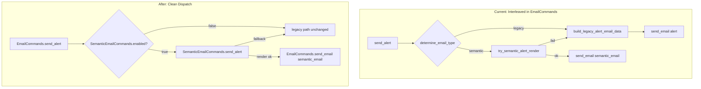

# Separate Semantic Email Commands from EmailCommands

## Problem

The `notifications/semantic-email-integration` commit added ~450 lines of semantic branching directly into [email_commands.rb](nutella/web/common/email/email_commands.rb) (lines 380-865, 2207-2234). This interleaves semantic rendering, fallback logic, and FF checks with the legacy flow, making both harder to reason about.

## Approach

Create [web/common/email/semantic_email_commands.rb](nutella/web/common/email/semantic_email_commands.rb) mirroring the legacy method names. `EmailCommands` becomes a thin dispatcher: FF off = legacy runs untouched; FF on = `SemanticEmailCommands` owns the full lifecycle.

## Flow (before vs after)



## New file: `web/common/email/semantic_email_commands.rb`

`SemanticEmailCommands` class with these methods (all `self.` class methods, matching legacy naming):

- **`enabled?`** -- moved from `EmailCommands.semantic_email_enabled?` with all supporting helpers:
  - `flag_enabled_for_user?`
  - `builder_exists?`
  - `resolve_user_from_context`
  - `emit_and_return`
  - `semantic_kind_disabled?`

- **`send_alert(to, cc, alert, options = {})`** -- semantic immediate path, extracted from lines 389-430. Calls `render_alert_email_data`, handles metrics, fallback to legacy via `EmailCommands.send_alert_legacy`. Delegates to `EmailCommands.send_email` for actual delivery.

- **`send_alerts(to, alerts, time_period)`** -- semantic digest path, extracted from lines 536-576. Includes:
  - `render_digest_entries`
  - `render_single_digest_entry`
  - `send_semantic_digest`
  - `rebuild_presented_entries`

- **`send_email(type, to, from, data, ...)`** -- non-alert semantic type conversion, extracted from lines 2207-2234. Builder lookup, data merge, then delegates to `EmailCommands.send_email` with `type = :semantic_email`.

- Supporting private methods moved over:
  - `try_semantic_alert_render`
  - `render_alert_email_data`
  - `merge_email_attachments!`
  - `build_legacy_alert_email_data` (needed for fallback within semantic path)

## Changes to `email_commands.rb`

### `send_alert` (line 389) -- becomes dispatcher

```ruby
def self.send_alert(to, cc, alert, options = {})
  if SemanticEmailCommands.enabled?(alert: alert, to_user: get_to_user(to), to_recipients: to)
    return SemanticEmailCommands.send_alert(to, cc, alert, options)
  end
  send_alert_legacy(to, cc, alert, options)
end
```

The current legacy body (AlertPresenter path) gets renamed to `send_alert_legacy` -- same code, just renamed to make it callable from both the dispatcher and `SemanticEmailCommands` fallback.

### `send_alerts` (line 536) -- becomes dispatcher

```ruby
def self.send_alerts(to, alerts, time_period)
  if SemanticEmailCommands.enabled?(to_user: get_to_user(to), kind_or_type: :digest)
    return SemanticEmailCommands.send_alerts(to, alerts, time_period)
  end
  send_alerts_legacy(to, alerts, time_period)
end
```

`send_alerts_legacy` already exists (line 826). The current body above it that does per-entry semantic/legacy branching moves to `SemanticEmailCommands`.

### `send_email` interception (line 2207) -- becomes dispatcher

```ruby
# In send_email, replace lines 2207-2234 with:
if type != :semantic_email && SemanticEmailCommands.enabled?(kind_or_type: type, to_user: get_to_user(to), to_recipients: to, from: from)
  return SemanticEmailCommands.send_email(type, to, from, data, details, opts)
end
```

### Remove from `email_commands.rb`

All of these private methods (lines 432-818) are removed since they move to `SemanticEmailCommands`:
- `render_alert_email_data`
- `try_semantic_alert_render`
- `merge_email_attachments!`
- `determine_email_type`
- `render_digest_entries`
- `render_single_digest_entry`
- `send_semantic_digest`
- `rebuild_presented_entries`
- `semantic_email_enabled?`
- `flag_enabled_for_user?`
- `builder_exists?`
- `resolve_user_from_context`
- `emit_and_return`
- `semantic_kind_disabled?`

Keep in `email_commands.rb`:
- `send_alert_legacy` (renamed from current legacy body)
- `build_legacy_alert_email_data` (stays as it's part of the legacy path; `SemanticEmailCommands` can also call it for fallback)
- `send_alerts_legacy` (already exists at line 826)
- `resolve_alert_from_user`, `build_alert_email_options` (shared helpers)
- `send_email` (the actual delivery method, both paths use it)

## Spec changes

- **[email_commands_type_routing_spec.rb](nutella/web/spec/unit/common/email/email_commands_type_routing_spec.rb)** -- Update to test `SemanticEmailCommands.enabled?` instead of `EmailCommands.send(:semantic_email_enabled?, ...)`
- **[email_commands_spec.rb](nutella/web/spec/unit/common/email/email_commands_spec.rb)** -- Verify dispatch: when `SemanticEmailCommands.enabled?` returns true, `SemanticEmailCommands.send_alert` is called; when false, legacy path runs
- **New: `semantic_email_commands_spec.rb`** -- Tests for the extracted methods (render, fallback, digest assembly)

## Key design decisions

- **Fallback stays inside `SemanticEmailCommands`**: When semantic rendering fails, `SemanticEmailCommands.send_alert` calls back to `EmailCommands.send_alert_legacy`. This keeps the fallback explicit rather than requiring the dispatcher to handle it.
- **`EmailCommands.send_email` remains the single delivery point**: Both paths converge on `send_email` for actual mail delivery. `SemanticEmailCommands` does not duplicate the delivery infrastructure.
- **Metrics stay with the code they measure**: Semantic pipeline metrics move to `SemanticEmailCommands`. Legacy metrics stay in `EmailCommands`.
- **MJML rendering** (lines 2228-2234, `SemanticEmailRenderer.render_to_html`) stays in `EmailCommands.send_email` since it applies to any `:semantic_email` type regardless of entry point.
